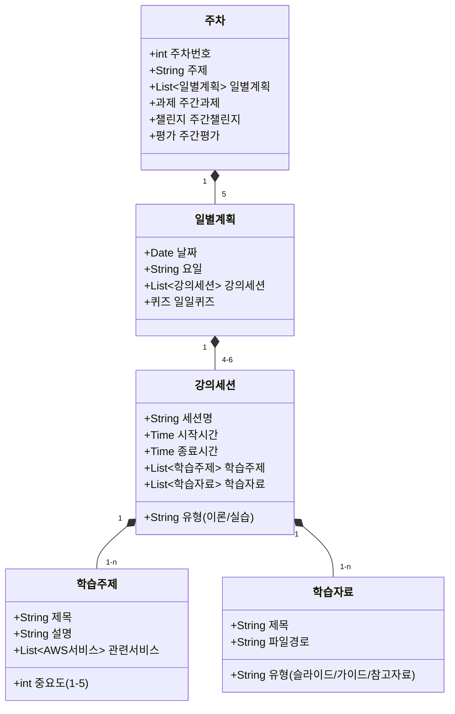
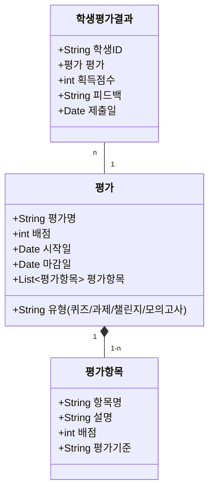
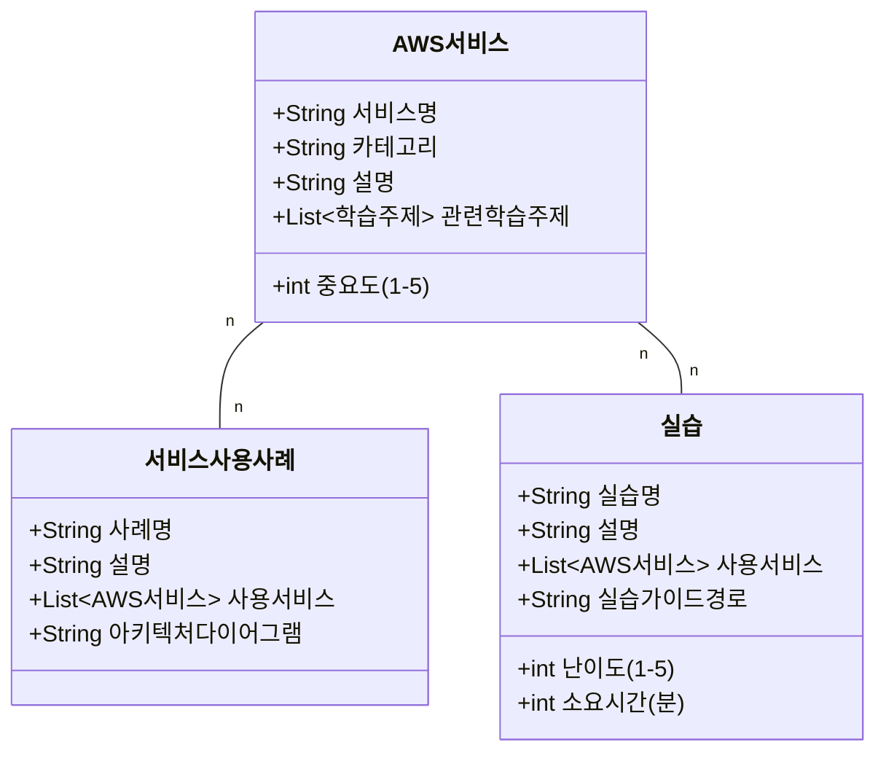

# Design Document

## Overview

이 문서는 컴퓨터공학 1학년 수준의 대학생들을 대상으로 하는 AWS Certified Solutions Architect - Associate (SAA-C03) 5주 교육과정의 설계 문서입니다. 이 교육과정은 학생들이 AWS 클라우드 서비스에 대한 기본 개념부터 시작하여 SAA 시험에 합격할 수 있는 수준까지 지식과 실무 능력을 향상시키는 것을 목표로 합니다.

## Architecture

### 교육 과정 구조

교육 과정은 다음과 같은 계층적 구조로 설계되었습니다:

```
AWS SAA 5주 교육과정
├── 주차별 커리큘럼 (1-5주차)
│   ├── 일별 강의 계획 (월-금)
│   │   ├── 오전 세션 (09:00-12:00)
│   │   │   ├── 이론 강의 (1시간)
│   │   │   └── 실습 (2시간)
│   │   ├── 점심 시간 (12:00-13:00)
│   │   └── 오후 세션 (13:00-18:00)
│   │       ├── 이론 강의 (2시간)
│   │       └── 실습 및 Q&A (3시간)
│   ├── 주간 과제
│   └── 주간 챌린지
└── 학습 자료
    ├── 강의 슬라이드
    ├── 실습 가이드
    ├── 참고 자료
    └── 평가 자료
```

### 학습 방법론

교육 과정은 다음과 같은 학습 방법론을 기반으로 설계되었습니다:

1. **개념 소개**: 비유와 쉬운 설명을 통해 AWS 서비스 개념 소개
2. **시각화**: 다이어그램과 그림을 활용한 아키텍처 이해
3. **실습 중심**: 이론 학습 후 바로 실습을 통한 개념 강화
4. **프로젝트 기반 학습**: 실제 시나리오를 기반으로 한 프로젝트 수행
5. **반복 학습**: 핵심 개념의 반복 학습을 통한 기억 강화
6. **피어 러닝**: 팀 활동을 통한 협업 및 지식 공유
7. **평가 및 피드백**: 정기적인 퀴즈와 과제를 통한 학습 진행 상황 평가

## Components and Interfaces

### 1. 강의 컴포넌트

#### 1.1 이론 강의
- **목적**: AWS 서비스 및 아키텍처 개념 이해
- **형식**: 슬라이드 기반 강의, 비유와 예시를 활용한 설명
- **시간 배분**: 일일 3시간 (오전 1시간, 오후 2시간)
- **인터페이스**: 강의 슬라이드, 화이트보드, 데모 시연

#### 1.2 실습 세션
- **목적**: 이론 개념의 실제 적용 및 기술 습득
- **형식**: 단계별 가이드를 따라 AWS 콘솔에서 직접 실습
- **시간 배분**: 일일 5시간 (오전 2시간, 오후 3시간)
- **인터페이스**: 실습 가이드 문서, AWS 콘솔, AWS CLI

#### 1.3 Q&A 및 토론
- **목적**: 개념 명확화 및 심화 학습
- **형식**: 질의응답, 그룹 토론
- **시간 배분**: 오후 실습 시간 내 포함
- **인터페이스**: 토론 주제, 질문 목록

### 2. 평가 컴포넌트

#### 2.1 일일 퀴즈
- **목적**: 당일 학습 내용 이해도 확인
- **형식**: 5-10문항의 객관식/주관식 퀴즈
- **시간 배분**: 일일 15-20분
- **인터페이스**: 온라인 퀴즈 플랫폼

#### 2.2 주간 과제
- **목적**: 주간 학습 내용 적용 및 실무 능력 향상
- **형식**: AWS 서비스를 활용한 기본 실습 과제
- **제출 방식**: GitHub 저장소
- **인터페이스**: 과제 명세서, 평가 루브릭

#### 2.3 주간 챌린지
- **목적**: 응용력 및 문제 해결 능력 향상
- **형식**: 복잡한 시나리오 기반 심화 과제
- **제출 방식**: GitHub 저장소
- **인터페이스**: 챌린지 명세서, 평가 루브릭

#### 2.4 모의고사
- **목적**: SAA 시험 대비 및 취약점 파악
- **형식**: 실제 시험과 유사한 형식의 문제
- **시간 배분**: 5주차에 2회 실시
- **인터페이스**: 온라인 시험 플랫폼

### 3. 학습 자료 컴포넌트

#### 3.1 강의 슬라이드
- **목적**: 이론 강의 지원
- **형식**: PowerPoint 슬라이드
- **구성**: 개념 설명, 다이어그램, 예시, 핵심 포인트
- **인터페이스**: 슬라이드 파일, 인쇄물

#### 3.2 실습 가이드
- **목적**: 단계별 실습 안내
- **형식**: Markdown 문서
- **구성**: 목표, 사전 요구사항, 단계별 지침, 스크린샷, 문제 해결 팁
- **인터페이스**: GitHub 저장소, PDF 문서

#### 3.3 참고 자료
- **목적**: 추가 학습 및 심화 학습 지원
- **형식**: 링크 모음, PDF 문서
- **구성**: AWS 공식 문서, 블로그 포스트, 튜토리얼, 비디오
- **인터페이스**: 웹 페이지, PDF 문서

## Data Models

### 1. 학습 진도 모델



### 2. 평가 모델



### 3. AWS 서비스 모델



## Error Handling

### 1. 학습 진행 중 발생 가능한 문제 및 대응 방안

#### 1.1 학습 진도 지연
- **문제**: 계획된 일일 강의 내용을 모두 다루지 못하는 경우
- **대응 방안**:
  - 핵심 내용과 부가 내용을 구분하여 핵심 내용 우선 진행
  - 실습 시간을 조정하여 이론 강의 시간 확보
  - 추가 보충 자료 제공으로 자율 학습 유도
  - 주간 계획 재조정으로 중요 내용 보장

#### 1.2 학생 이해도 차이
- **문제**: 학생들 간의 이해도와 진도 차이 발생
- **대응 방안**:
  - 수준별 실습 과제 제공 (기본/심화)
  - 학습 도우미 제도 운영 (잘하는 학생이 어려워하는 학생 지원)
  - 추가 Q&A 세션 운영
  - 개인별 맞춤 피드백 제공

#### 1.3 AWS 서비스 접근 문제
- **문제**: AWS 계정 문제, 서비스 제한, 권한 문제 등
- **대응 방안**:
  - 사전 계정 설정 가이드 제공
  - 공통 문제에 대한 트러블슈팅 가이드 준비
  - 백업 데모 환경 준비
  - AWS Educate/Academy 활용 방안 안내

### 2. 평가 관련 문제 및 대응 방안

#### 2.1 과제/챌린지 제출 문제
- **문제**: GitHub 제출 오류, 마감 시간 초과 등
- **대응 방안**:
  - 명확한 제출 가이드 제공
  - 제출 연습 세션 운영
  - 유연한 마감 정책 (지각 제출 허용 조건 명시)
  - 대체 제출 방법 준비

#### 2.2 평가 결과 불만
- **문제**: 평가 결과에 대한 이의 제기
- **대응 방안**:
  - 명확한 평가 기준 사전 공개
  - 상세한 피드백 제공
  - 이의 제기 절차 마련
  - 재평가 기회 제공

### 3. 기술적 문제 및 대응 방안

#### 3.1 AWS 서비스 장애
- **문제**: AWS 서비스 일시적 장애로 실습 불가
- **대응 방안**:
  - 대체 실습 시나리오 준비
  - AWS 상태 페이지 모니터링
  - 이론 강의 순서 조정
  - 로컬 시뮬레이션 환경 활용

#### 3.2 네트워크/인프라 문제
- **문제**: 교육장 네트워크 문제, 학생 장비 문제
- **대응 방안**:
  - 오프라인 학습 자료 준비
  - 최소 사양 장비 요구사항 사전 안내
  - 공용 장비 준비
  - 대체 네트워크 접속 방안 마련

## Testing Strategy

### 1. 학습 내용 이해도 테스트

#### 1.1 일일 퀴즈
- **목적**: 당일 학습 내용 즉각적 피드백
- **형식**: 5-10문항 객관식/주관식
- **빈도**: 매일 강의 종료 전
- **평가 방법**: 자동 채점 및 즉시 피드백
- **활용**: 다음 날 강의 시작 시 오답 문항 리뷰

#### 1.2 주간 복습 테스트
- **목적**: 주간 학습 내용 종합 이해도 평가
- **형식**: 20문항 객관식/주관식
- **빈도**: 매주 금요일
- **평가 방법**: 자동 채점 및 상세 피드백
- **활용**: 다음 주 보충 학습 계획 수립

### 2. 실무 능력 테스트

#### 2.1 주간 과제
- **목적**: 기본 개념 적용 능력 평가
- **형식**: 가이드라인에 따른 AWS 서비스 구성
- **빈도**: 매주 출제, 다음 주 월요일 제출
- **평가 방법**: 루브릭 기반 평가, 코드 리뷰
- **활용**: 개인별 피드백 제공

#### 2.2 주간 챌린지
- **목적**: 응용력 및 문제 해결 능력 평가
- **형식**: 시나리오 기반 복합 문제
- **빈도**: 매주 출제, 다음 주 수요일 제출
- **평가 방법**: 루브릭 기반 평가, 결과 발표
- **활용**: 우수 사례 공유 및 토론

### 3. SAA 시험 대비 테스트

#### 3.1 도메인별 모의고사
- **목적**: 각 도메인별 이해도 평가
- **형식**: SAA 시험 형식 문제 (도메인별 15-20문항)
- **빈도**: 각 주차 마지막 날
- **평가 방법**: 자동 채점 및 상세 해설
- **활용**: 취약 영역 파악 및 보완

#### 3.2 종합 모의고사
- **목적**: 실제 시험 환경 시뮬레이션
- **형식**: SAA 시험과 동일한 형식 (65문항, 130분)
- **빈도**: 5주차에 2회 실시
- **평가 방법**: 자동 채점 및 상세 해설
- **활용**: 최종 취약점 보완 및 시험 전략 수립

### 4. 실습 환경 테스트

#### 4.1 사전 환경 점검
- **목적**: 학생 AWS 계정 및 권한 설정 확인
- **형식**: 체크리스트 기반 점검
- **빈도**: 교육 시작 전 및 주요 실습 전
- **평가 방법**: 자동화된 스크립트 및 수동 확인
- **활용**: 문제 발생 시 즉시 해결 지원

#### 4.2 실습 결과 검증
- **목적**: 학생 실습 결과의 정확성 확인
- **형식**: 검증 스크립트 실행
- **빈도**: 주요 실습 완료 후
- **평가 방법**: 자동화된 검증 및 수동 확인
- **활용**: 오류 패턴 파악 및 추가 지도

## 주차별 커리큘럼 상세 설계

### 1주차: 클라우드 기초 및 보안 아키텍처 설계 (40시간)

#### 학습 목표
- 클라우드 컴퓨팅의 기본 개념 이해
- AWS 글로벌 인프라 및 핵심 서비스 파악
- AWS 보안 모델 및 IAM 서비스 활용 방법 습득
- 안전한 네트워크 설계 원칙 이해
- 데이터 보안 제어 방법 학습

#### 일별 주제
1. **월요일**: 클라우드 컴퓨팅 기초 및 AWS 소개
2. **화요일**: AWS 글로벌 인프라 및 IAM 기초
3. **수요일**: IAM 심화 및 다중 계정 전략
4. **목요일**: VPC 및 네트워크 보안
5. **금요일**: 데이터 보안 및 암호화

#### 주간 과제
- AWS 계정 설정 및 보안 강화 (MFA, 사용자/그룹 구성, 정책 설정)
- 안전한 VPC 환경 구축 (서브넷, 보안 그룹, NACL 구성)

#### 주간 챌린지
- 다중 계정 환경에서 교차 계정 액세스 구현
- 암호화된 데이터 파이프라인 설계 및 구현

### 2주차: 복원력을 갖춘 아키텍처 설계 (40시간)

#### 학습 목표
- 고가용성 및 내결함성 설계 원칙 이해
- 확장 가능한 아키텍처 설계 방법 습득
- AWS의 다양한 컴퓨팅 서비스 활용 방법 학습
- 서버리스 아키텍처 및 컨테이너 기술 이해
- 재해 복구 전략 수립 방법 습득

#### 일별 주제
1. **월요일**: 고가용성 설계 원칙 및 EC2 기초
2. **화요일**: Auto Scaling 및 로드 밸런싱
3. **수요일**: 서버리스 아키텍처 (Lambda, API Gateway)
4. **목요일**: 컨테이너 서비스 (ECS, EKS)
5. **금요일**: 재해 복구 전략 및 백업 솔루션

#### 주간 과제
- 고가용성 웹 애플리케이션 배포 (EC2, Auto Scaling, ELB)
- 서버리스 API 구축 (Lambda, API Gateway, DynamoDB)

#### 주간 챌린지
- 멀티 리전 재해 복구 솔루션 구현
- 컨테이너 기반 마이크로서비스 아키텍처 설계 및 배포

### 3주차: 고성능 아키텍처 설계 (40시간)

#### 학습 목표
- 고성능 스토리지 솔루션 설계 방법 이해
- 탄력적인 컴퓨팅 솔루션 구성 방법 습득
- 다양한 데이터베이스 서비스 활용 방법 학습
- 고성능 네트워크 아키텍처 설계 원칙 이해
- 데이터 수집 및 처리 파이프라인 구축 방법 습득

#### 일별 주제
1. **월요일**: 스토리지 서비스 (S3, EBS, EFS)
2. **화요일**: 데이터베이스 서비스 (RDS, DynamoDB)
3. **수요일**: 고급 데이터베이스 및 캐싱 (Aurora, ElastiCache)
4. **목요일**: 네트워크 성능 최적화 (CloudFront, Global Accelerator)
5. **금요일**: 데이터 처리 서비스 (Kinesis, EMR, Glue)

#### 주간 과제
- 다양한 스토리지 서비스를 활용한 데이터 관리 시스템 구축
- 고성능 데이터베이스 솔루션 구현 (읽기 복제본, 캐싱)

#### 주간 챌린지
- 실시간 데이터 처리 파이프라인 구축
- 글로벌 콘텐츠 배포 네트워크 설계 및 구현

### 4주차: 비용에 최적화된 아키텍처 설계 (40시간)

#### 학습 목표
- AWS 비용 관리 도구 및 서비스 이해
- 비용 효율적인 스토리지 전략 수립 방법 습득
- 비용 최적화된 컴퓨팅 솔루션 설계 방법 학습
- 비용 효율적인 데이터베이스 및 네트워크 구성 방법 이해
- 비용 모니터링 및 최적화 프로세스 수립 방법 습득

#### 일별 주제
1. **월요일**: AWS 비용 관리 도구 (Cost Explorer, Budgets)
2. **화요일**: 비용 최적화된 스토리지 솔루션
3. **수요일**: 비용 효율적인 컴퓨팅 (Spot Instances, Savings Plans)
4. **목요일**: 데이터베이스 및 네트워크 비용 최적화
5. **금요일**: 종합 비용 최적화 전략 및 Well-Architected Framework

#### 주간 과제
- AWS 비용 분석 및 예산 설정
- 비용 최적화된 인프라 설계 및 구현

#### 주간 챌린지
- 기존 아키텍처의 비용 최적화 리팩토링
- Well-Architected Framework 기반 아키텍처 검토 및 개선

### 5주차: 통합 실습 및 시험 준비 (40시간)

#### 학습 목표
- 4개 도메인 지식 통합 및 응용
- 실제 시험 환경 및 문제 유형 적응
- 취약 영역 보완 및 시험 전략 수립
- 실무 사례 분석을 통한 응용력 향상

#### 일별 주제
1. **월요일**: 종합 아키텍처 설계 실습 (1)
2. **화요일**: 종합 아키텍처 설계 실습 (2)
3. **수요일**: 모의고사 (1) 및 해설
4. **목요일**: 취약 영역 보완 및 심화 학습
5. **금요일**: 모의고사 (2) 및 최종 시험 전략

#### 주간 과제
- 종합 아키텍처 설계 프로젝트 완성

#### 주간 챌린지
- 실제 기업 사례 기반 아키텍처 설계 및 발표

## 학습 자료 설계

### 1. 강의 슬라이드 템플릿

각 강의 슬라이드는 다음 구조를 따릅니다:

1. **표지**: 주제, 날짜, 강사 정보
2. **학습 목표**: 해당 세션에서 달성할 목표
3. **개요**: 다룰 내용 요약
4. **핵심 개념**: 비유와 그림을 활용한 개념 설명
5. **서비스 소개**: AWS 서비스 기능 및 사용 사례
6. **아키텍처 다이어그램**: 시각적 구성도
7. **실습 미리보기**: 실습에서 구현할 내용 소개
8. **핵심 요약**: 중요 포인트 정리
9. **다음 단계**: 추가 학습 자료 및 다음 세션 안내

### 2. 실습 가이드 템플릿

각 실습 가이드는 다음 구조를 따릅니다:

1. **제목**: 실습 주제
2. **개요**: 실습 목적 및 학습 목표
3. **사전 요구사항**: 필요한 AWS 계정, 권한, 도구
4. **아키텍처 다이어그램**: 구현할 아키텍처 시각화
5. **단계별 지침**:
   - 각 단계별 상세 설명
   - 스크린샷 및 코드 예제
   - 예상 결과
6. **검증 단계**: 구현 결과 확인 방법
7. **문제 해결**: 일반적인 오류 및 해결 방법
8. **정리**: 생성된 리소스 삭제 방법
9. **추가 도전 과제**: 심화 학습을 위한 추가 작업

### 3. 평가 자료 설계

#### 3.1 퀴즈 템플릿
- 객관식, 주관식, 참/거짓 문항 혼합
- 각 문항은 특정 학습 목표와 연계
- 난이도 표시 (기본/중급/고급)
- 상세한 해설 및 참고 자료 링크

#### 3.2 과제 평가 루브릭
- 기능 구현 완성도 (40%)
- 아키텍처 설계 품질 (30%)
- 보안 및 모범 사례 준수 (20%)
- 문서화 및 발표 품질 (10%)

#### 3.3 모의고사 설계
- SAA 시험과 동일한 형식 (65문항)
- 도메인별 가중치 반영
- 시간 제한 설정 (130분)
- 상세한 해설 및 참고 자료

## 학습 환경 설계

### 1. AWS 계정 설정

- AWS Educate/Academy 활용
- 학생별 개인 계정 또는 교육용 계정 제공
- 비용 한도 설정 및 모니터링
- 필요 서비스에 대한 권한 설정

### 2. 개발 환경

- 클라우드 IDE 또는 로컬 개발 환경 구성
- AWS CLI 및 SDK 설치
- 필요한 도구 및 라이브러리 설정
- 코드 저장소 및 버전 관리 시스템 구성

### 3. 협업 도구

- GitHub 저장소 구성
- 실시간 질의응답 플랫폼
- 학습 자료 공유 시스템
- 피드백 및 평가 시스템

## 부하 테스트 및 모의 해킹 가이드

### 1. 로컬 환경에서 소규모 아키텍처 구현

- Docker 및 LocalStack을 활용한 AWS 서비스 시뮬레이션
- 테스트 데이터 생성 및 관리 방법
- 로컬 환경과 AWS 환경 간 차이점 이해
- 로컬 테스트 결과의 실제 환경 적용 방법

### 2. 부하 테스트 방법론

- Apache JMeter를 활용한 부하 테스트 설계
- AWS CloudWatch 지표 모니터링 방법
- 점진적 부하 증가 전략
- 병목 현상 식별 및 해결 방법
- 테스트 결과 분석 및 보고서 작성

### 3. AutoScaling 기능 테스트

- 트래픽 생성 도구 활용 방법
- 스케일 아웃/인 트리거 설정 및 테스트
- 스케일링 정책 최적화 방법
- 스케일링 이벤트 모니터링 및 분석
- 비용 효율적인 AutoScaling 구성 방법

### 4. 보안 취약점 점검

- AWS Config 및 Security Hub 활용 방법
- 일반적인 보안 취약점 식별 방법
- 권한 설정 검증 및 최소 권한 원칙 적용
- 네트워크 보안 검증 방법
- 데이터 보안 및 암호화 검증 방법