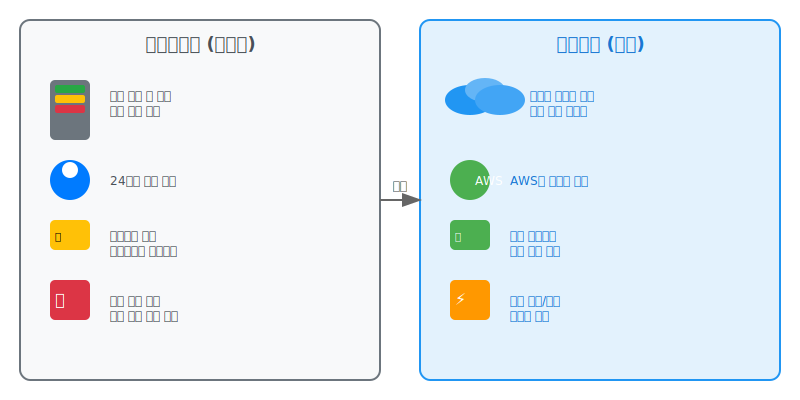
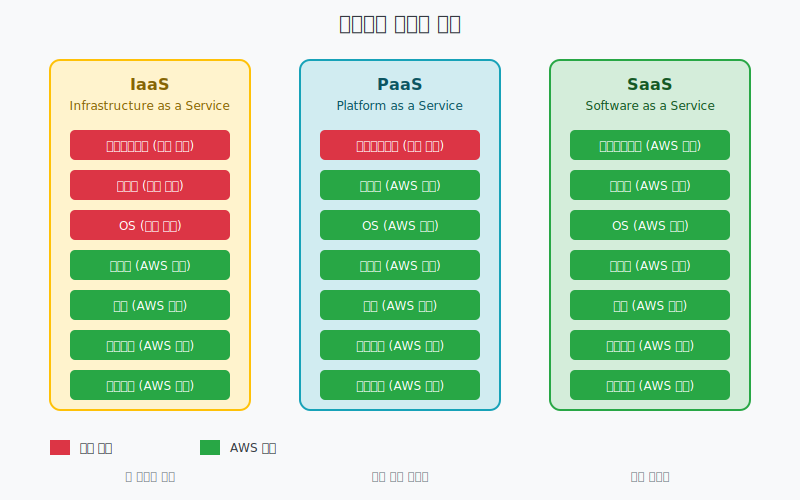

# Day 1-1: 오리엔테이션 & 클라우드 컴퓨팅 기초

## 📚 학습 목표
- 5주 커리큘럼 전체 이해
- AWS 자격증 취득의 의미와 가치 파악
- 온프레미스와 클라우드 컴퓨팅의 차이점 이해
- 클라우드 컴퓨팅의 핵심 장점 습득

---

## 🎯 오리엔테이션 (30분)

### 5주 커리큘럼 개요
```
Week 1: 클라우드 기초 + 보안 아키텍처 (30%)
├── 클라우드 컴퓨팅 기초
├── AWS 글로벌 인프라
├── IAM (사용자, 그룹, 역할, 정책)
└── VPC 네트워크 보안

Week 2: 복원력 + 고성능 아키텍처 (50%)
├── EC2 & Auto Scaling
├── 서버리스 & 컨테이너
├── 스토리지 최적화
├── 데이터베이스 성능
└── 네트워크 & CDN

Week 3: 비용 최적화 + 종합 정리 (20%)
├── 컴퓨팅 비용 최적화
├── 스토리지 & DB 비용 최적화
├── Well-Architected Framework
└── 종합 정리

Week 4: 집중 문제풀이
├── 도메인별 문제풀이
├── 모의고사
└── 시험 전략
```

### AWS 자격증의 가치
- **기초 실무 역량**: 이론만이 아닌 실습을 통한 기본 활용 능력
- **취업 경쟁력**: 클라우드 역량으로 차별화된 이력서
- **성장 발판**: 클라우드 분야 진입을 위한 첫걸음
- **글로벌 인정**: 전 세계에서 통용되는 기술 역량 증명

---

## 💡 클라우드 컴퓨팅 기초 (60분)

### 온프레미스 vs 클라우드 비교



#### 온프레미스 (자가용)
```
초기 투자: 서버 구매 (수천만원)
         ↓
운영 인력: 24시간 관리 인력 필요
         ↓
유지보수: 하드웨어 교체, 소프트웨어 업데이트
         ↓
확장성: 미리 예측해서 용량 계획
```

#### 클라우드 (택시)
```
초기 투자: 사용한 만큼만 지불
         ↓
운영 관리: AWS가 인프라 관리
         ↓
자동 업데이트: 최신 기술 자동 적용
         ↓
탄력적 확장: 필요할 때 즉시 확장/축소
```

### 클라우드 컴퓨팅의 핵심 장점

#### 1. 비용 효율성
- **CAPEX → OPEX**: 자본 지출을 운영 비용으로 전환
- **사용량 기반**: 실제 사용한 리소스만 지불
- **규모의 경제**: AWS의 대규모 인프라로 비용 절감

#### 2. 확장성 (Scalability)
- **수직 확장**: 서버 성능 업그레이드 (Scale Up)
- **수평 확장**: 서버 개수 증가 (Scale Out)
- **자동 확장**: 트래픽에 따른 자동 리소스 조정

#### 3. 탄력성 (Elasticity)
- **즉시 확장**: 몇 분 내에 리소스 추가
- **즉시 축소**: 불필요한 리소스 즉시 제거
- **비용 최적화**: 필요한 만큼만 사용

#### 4. 안정성 (Reliability)
- **고가용성**: 99.99% 가동률 보장
- **장애 복구**: 자동 장애 감지 및 복구
- **백업**: 자동화된 백업 및 복원

#### 5. 보안 (Security)
- **전문 보안팀**: 24/7 보안 모니터링
- **규정 준수**: 각종 보안 인증 획득
- **암호화**: 데이터 전송 및 저장 암호화

#### 6. 글로벌 접근성
- **전 세계 배포**: 몇 분 내에 글로벌 서비스
- **지연 시간 최소화**: 사용자와 가까운 위치에서 서비스
- **재해 복구**: 여러 지역에 분산된 인프라

---

## 🏢 기업들의 클라우드 전환 사례

### 스타트업의 선택
```
문제: 초기 투자 자금 부족
해결: 클라우드로 최소 비용 시작
결과: 서비스 성장에 따라 인프라 확장
```

### 중견기업의 고민
```
문제: 기존 인프라 유지비용 증가
해결: 클라우드로 30-50% 비용 절감
결과: IT 운영비를 사업 투자로 전환
```

### 대기업의 전략
```
문제: 글로벌 확장 시 현지 인프라 구축 부담
해결: 클라우드로 전 세계 즉시 서비스
결과: 빠른 시장 진입과 비용 효율성
```

---

## 🌐 클라우드 서비스 모델



### IaaS (Infrastructure as a Service)
- **제공**: 가상 서버, 스토리지, 네트워크
- **관리**: 운영체제부터 애플리케이션까지 직접 관리
- **예시**: Amazon EC2, Google Compute Engine
- **비유**: 빈 사무실 임대 (인테리어는 직접)

### PaaS (Platform as a Service)
- **제공**: 개발 플랫폼과 런타임 환경
- **관리**: 애플리케이션 코드만 관리
- **예시**: AWS Elastic Beanstalk, Google App Engine
- **비유**: 가구 갖춘 사무실 임대 (업무만 하면 됨)

### SaaS (Software as a Service)
- **제공**: 완성된 소프트웨어 서비스
- **관리**: 사용만 하면 됨
- **예시**: Gmail, Office 365, Salesforce
- **비유**: 호텔 (모든 서비스 제공)

---

## 🔧 실습: 클라우드 개념 이해

### 실습 1: 비용 비교 계산
```
시나리오: 웹 서비스 운영 (월 1만 사용자)

온프레미스 비용:
- 서버 구매: 3,000만원
- 월 전기료: 50만원
- 월 인건비: 300만원
- 연간 총비용: 4,200만원

클라우드 비용:
- EC2 인스턴스: 월 30만원
- 스토리지: 월 10만원
- 네트워크: 월 20만원
- 연간 총비용: 720만원

절약 효과: 3,480만원 (83% 절약)
```

### 실습 2: 확장성 시나리오
```
상황: 갑작스런 트래픽 10배 증가

온프레미스:
1. 서버 주문 (2-4주 소요)
2. 설치 및 설정 (1주 소요)
3. 총 5주 후 대응 가능
4. 트래픽 감소 후에도 고정비용

클라우드:
1. Auto Scaling 설정 (5분)
2. 자동으로 서버 10배 증가
3. 트래픽 감소 시 자동 축소
4. 사용한 만큼만 비용 지불
```

---

## 📝 핵심 정리

### 클라우드 컴퓨팅의 핵심 특징
1. **온디맨드 셀프서비스**: 필요할 때 즉시 리소스 할당
2. **광범위한 네트워크 접근**: 어디서나 인터넷으로 접근
3. **리소스 풀링**: 여러 사용자가 리소스 공유
4. **빠른 탄력성**: 신속한 확장과 축소
5. **측정 가능한 서비스**: 사용량 기반 과금

### 클라우드 도입 시 고려사항
- **보안**: 데이터 보호 및 규정 준수
- **비용**: 예상 사용량과 비용 계획
- **성능**: 서비스 요구사항 충족
- **종속성**: 특정 클라우드 업체 의존도
- **마이그레이션**: 기존 시스템 이전 계획

---

## 🤔 토론 주제

1. **우리 회사/프로젝트에서 클라우드를 도입한다면?**
   - 어떤 장점이 있을까?
   - 어떤 우려사항이 있을까?

2. **온프레미스가 더 적합한 경우는?**
   - 어떤 상황에서는 온프레미스가 나을까?
   - 하이브리드 클라우드는 언제 사용할까?

---

## 📚 다음 시간 예고

**AWS 글로벌 인프라 & 계정 설정**
- AWS 리전과 가용영역의 개념
- AWS 계정 생성 및 기본 설정
- 프리티어 활용법과 비용 관리
- 강사 접근 권한 설정

---

> 💡 **오늘의 핵심**: 클라우드는 선택이 아닌 필수! 하지만 무작정 도입하는 것이 아니라 비즈니스 요구사항에 맞는 전략적 접근이 중요합니다.