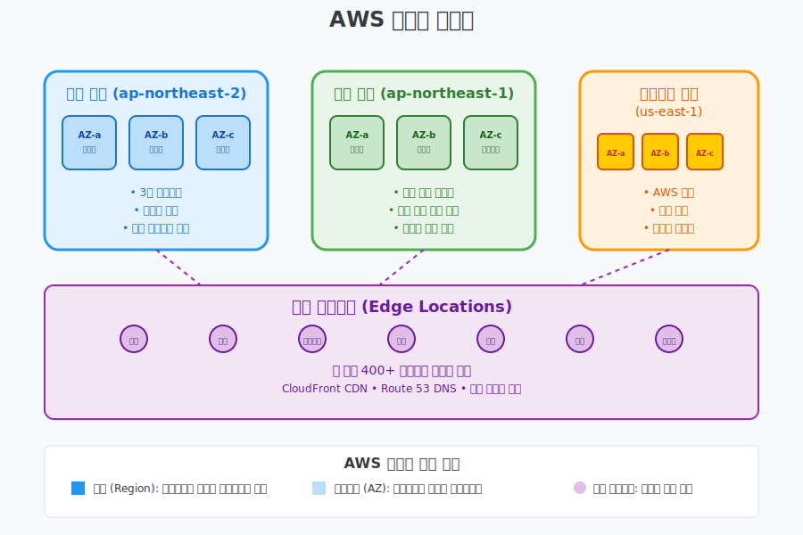

# Day 1-2: AWS 글로벌 인프라 & 계정 설정

## 📚 학습 목표
- AWS 글로벌 인프라 구조 이해 (리전, 가용영역, 엣지 로케이션)
- AWS 계정 생성 및 기본 설정 완료
- 프리티어 활용법과 비용 관리 방법 습득
- AWS 콘솔 기본 사용법 익히기

---

## 🌍 AWS 글로벌 인프라 (45분)



### AWS 인프라 = 전국 체인점 네트워크

#### 리전 (Region) = 지역 본부
```
서울 리전 (ap-northeast-2)
├── 강남 데이터센터 (AZ-a)
├── 서초 데이터센터 (AZ-b)  
└── 송파 데이터센터 (AZ-c)

도쿄 리전 (ap-northeast-1)
├── 시부야 데이터센터 (AZ-a)
├── 신주쿠 데이터센터 (AZ-b)
└── 하라주쿠 데이터센터 (AZ-c)
```

### 1. 리전 (Region)

#### 리전이란?
- **정의**: 지리적으로 분리된 AWS 데이터센터 집합
- **구성**: 최소 3개 이상의 가용영역으로 구성
- **독립성**: 각 리전은 완전히 독립적으로 운영

#### 주요 리전 현황 (2024년 기준)
```
아시아 태평양:
- 서울 (ap-northeast-2) ⭐ 우리가 주로 사용
- 도쿄 (ap-northeast-1)
- 싱가포르 (ap-southeast-1)
- 시드니 (ap-southeast-2)

북미:
- 버지니아 북부 (us-east-1) ⭐ 가장 많은 서비스
- 오하이오 (us-east-2)
- 캘리포니아 북부 (us-west-1)
- 오레곤 (us-west-2)

유럽:
- 아일랜드 (eu-west-1)
- 프랑크푸르트 (eu-central-1)
- 런던 (eu-west-2)
```

#### 리전 선택 기준
1. **지연 시간 (Latency)**: 사용자와 가까운 리전
2. **규정 준수 (Compliance)**: 데이터 보관 법규
3. **서비스 가용성**: 필요한 서비스 제공 여부
4. **비용**: 리전별 요금 차이

### 2. 가용영역 (Availability Zone, AZ)

#### 가용영역이란?
- **정의**: 하나 이상의 데이터센터로 구성된 논리적 단위
- **분리**: 물리적으로 분리되어 있어 장애 격리
- **연결**: 고속 네트워크로 연결 (지연시간 < 10ms)

#### 가용영역의 특징
```
서울 리전 예시:
ap-northeast-2a (강남구 소재)
├── 데이터센터 1
├── 데이터센터 2
└── 독립적인 전력, 냉각, 네트워크

ap-northeast-2b (서초구 소재)  
├── 데이터센터 3
├── 데이터센터 4
└── 독립적인 전력, 냉각, 네트워크

ap-northeast-2c (송파구 소재)
├── 데이터센터 5
├── 데이터센터 6
└── 독립적인 전력, 냉각, 네트워크
```

#### 고가용성 설계
```
단일 AZ 배포:
서버 → AZ-a만 사용
위험: AZ-a 장애 시 서비스 중단

다중 AZ 배포:
서버 → AZ-a, AZ-b, AZ-c 분산
안전: 하나의 AZ 장애 시에도 서비스 지속
```

### 3. 엣지 로케이션 (Edge Location)

#### 엣지 로케이션이란?
- **정의**: 콘텐츠를 캐싱하는 지점
- **목적**: 사용자에게 더 빠른 콘텐츠 전송
- **서비스**: CloudFront CDN, Route 53 DNS

#### 전 세계 엣지 로케이션
```
전 세계 400+ 지점:
- 한국: 서울 (6개 지점)
- 일본: 도쿄, 오사카
- 미국: 뉴욕, LA, 시카고 등
- 유럽: 런던, 파리, 프랑크푸르트 등

사용자 → 가장 가까운 엣지 → 빠른 응답
```

---

## 🔧 실습: AWS 계정 생성 (30분)

### 계정 생성 단계별 가이드

#### 1단계: AWS 웹사이트 접속
```
URL: https://aws.amazon.com
버튼: "AWS 계정 생성" 클릭
```

#### 2단계: 기본 정보 입력
```
이메일 주소: 개인 이메일 사용 권장
계정 이름: saa-study-[your-name]
비밀번호: 강력한 비밀번호 (대소문자, 숫자, 특수문자)
```

#### 3단계: 연락처 정보
```
계정 유형: 개인 (Personal) 선택
이름: 실명 입력
전화번호: 본인 휴대폰 번호
주소: 정확한 주소 입력
```

#### 4단계: 결제 정보
```
카드 정보: 체크카드 또는 신용카드
주의사항: 프리티어 사용 시에도 카드 등록 필수
확인: $1 임시 결제 후 취소됨
```

#### 5단계: 본인 확인
```
전화 인증:
1. SMS 또는 음성통화 선택
2. 인증번호 4자리 입력
3. 본인 확인 완료
```

#### 6단계: 지원 플랜 선택
```
기본 지원 (무료): 선택
- 24/7 고객 서비스
- 문서 및 백서 접근
- 지원 포럼 이용
```

### 계정 생성 완료 확인
```
이메일 확인:
1. 가입 완료 이메일 수신
2. 계정 활성화 확인
3. AWS 콘솔 로그인 테스트
```

---

## 💰 프리티어 활용 및 비용 관리 (30분)

### AWS 프리티어 이해

#### 프리티어 유형
```
12개월 무료:
- EC2: t2.micro 인스턴스 월 750시간
- S3: 5GB 스토리지
- RDS: db.t2.micro 월 750시간
- Lambda: 월 100만 요청

항상 무료:
- DynamoDB: 25GB 스토리지
- Lambda: 월 100만 요청
- SNS: 월 100만 게시

12개월 후 유료:
- CloudFront: 50GB 데이터 전송
- Elastic Load Balancer: 750시간
```

#### 프리티어 모니터링
```
AWS Budgets 설정:
1. 월 예산 $10 설정
2. 80% 도달 시 이메일 알림
3. 100% 도달 시 이메일 알림

CloudWatch 비용 알림:
1. 일일 비용 $5 초과 시 알림
2. 월 누적 비용 $20 초과 시 알림
```

### 비용 관리 도구

#### 1. AWS Cost Explorer
```
기능:
- 월별/일별 비용 분석
- 서비스별 비용 분해
- 예상 비용 예측

사용법:
AWS 콘솔 → Billing → Cost Explorer
```

#### 2. AWS Budgets
```
기능:
- 예산 설정 및 알림
- 비용 임계값 모니터링
- 자동 알림 이메일

설정:
AWS 콘솔 → Billing → Budgets
```

#### 3. 비용 및 사용량 보고서
```
기능:
- 상세한 비용 분석
- CSV 파일 다운로드
- 태그별 비용 분석

활용:
월말 비용 정산 및 분석
```

---

## 🖥️ AWS 콘솔 기본 사용법 (30분)

### 콘솔 로그인 및 기본 구조

#### 로그인 과정
```
1. https://console.aws.amazon.com 접속
2. 이메일 주소 입력
3. 비밀번호 입력
4. 콘솔 메인 화면 진입
```

#### 콘솔 화면 구성
```
상단 메뉴:
- Services: 모든 AWS 서비스 목록
- 리전 선택: 현재 작업 중인 리전
- 계정 메뉴: 계정 설정, 로그아웃

좌측 메뉴:
- Recently visited: 최근 사용한 서비스
- Favorites: 즐겨찾기 서비스

메인 화면:
- 서비스 검색
- 주요 서비스 바로가기
- 비용 및 사용량 요약
```

### 주요 서비스 위치 파악

#### 컴퓨팅 서비스
```
EC2: Compute → EC2
Lambda: Compute → Lambda
Elastic Beanstalk: Compute → Elastic Beanstalk
```

#### 스토리지 서비스
```
S3: Storage → S3
EBS: EC2 → Elastic Block Store
EFS: Storage → EFS
```

#### 네트워킹 서비스
```
VPC: Networking & Content Delivery → VPC
CloudFront: Networking & Content Delivery → CloudFront
Route 53: Networking & Content Delivery → Route 53
```

#### 보안 서비스
```
IAM: Security, Identity & Compliance → IAM
KMS: Security, Identity & Compliance → Key Management Service
```

### 콘솔 사용 팁

#### 1. 서비스 검색 활용
```
방법: 상단 검색창에 서비스명 입력
예시: "EC2" 입력 → EC2 서비스 바로 이동
장점: 메뉴 구조를 외울 필요 없음
```

#### 2. 즐겨찾기 설정
```
방법: 자주 사용하는 서비스 옆 별표 클릭
결과: 좌측 Favorites 메뉴에 추가
추천: EC2, S3, IAM, VPC 즐겨찾기 추가
```

#### 3. 리전 확인 습관
```
중요: 서비스 사용 전 항상 리전 확인
위치: 상단 우측 리전 표시
권장: ap-northeast-2 (서울) 사용
주의: 리전별로 리소스가 분리됨
```

---

## 🔧 실습: 콘솔 탐색 (15분)

### 실습 1: 서비스 찾기
```
과제: 다음 서비스들을 찾아보세요
1. EC2 (가상 서버)
2. S3 (객체 스토리지)
3. IAM (권한 관리)
4. VPC (가상 네트워크)
5. CloudWatch (모니터링)

방법: 검색 또는 메뉴 탐색
```

### 실습 2: 리전별 서비스 확인
```
과제: 서울 리전과 도쿄 리전 비교
1. 서울 리전(ap-northeast-2)으로 설정
2. EC2 대시보드에서 가용영역 확인
3. 도쿄 리전(ap-northeast-1)으로 변경
4. 가용영역 차이 확인
```

### 실습 3: 비용 대시보드 확인
```
과제: 현재 사용 비용 확인
1. Billing 대시보드 접속
2. 이번 달 비용 확인 (아직 $0.00)
3. 프리티어 사용량 확인
4. 예산 알림 설정 (선택사항)
```

---

## 📝 핵심 정리

### AWS 글로벌 인프라 3단계
1. **리전**: 지리적으로 분리된 데이터센터 집합
2. **가용영역**: 리전 내 물리적으로 분리된 데이터센터
3. **엣지 로케이션**: 콘텐츠 캐싱을 위한 전 세계 지점

### 고가용성 설계 원칙
- **다중 AZ**: 여러 가용영역에 리소스 분산
- **리전 간 복제**: 재해 복구를 위한 다른 리전 활용
- **자동 장애 조치**: AWS 서비스의 자동 복구 기능 활용

### 비용 관리 핵심
- **프리티어 활용**: 12개월 무료 한도 최대 활용
- **모니터링**: 예산 설정 및 알림으로 비용 통제
- **리소스 정리**: 사용하지 않는 리소스 즉시 삭제

---

## 🤔 토론 주제

1. **우리나라에서 서울 리전을 사용하는 이유는?**
   - 지연시간, 데이터 주권, 규정 준수 관점에서

2. **다중 AZ 배포의 장단점은?**
   - 비용 vs 안정성의 트레이드오프

---

## 📚 다음 시간 예고

**AWS 공동 책임 모델 & 핵심 서비스**
- AWS와 고객의 보안 책임 분담
- 주요 AWS 서비스 개요
- 클라우드 경제학과 요금 모델

---

> 💡 **오늘의 핵심**: AWS는 전 세계에 분산된 인프라로 고가용성과 확장성을 제공합니다. 리전과 가용영역의 개념을 이해하는 것이 AWS 아키텍처 설계의 첫걸음입니다!