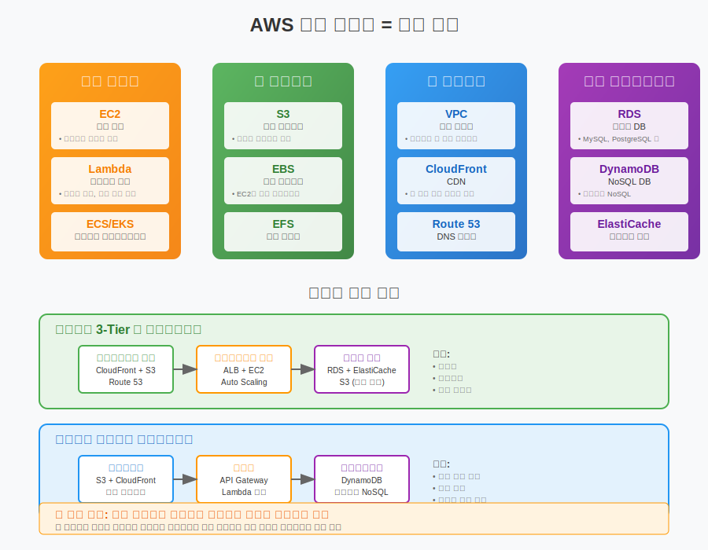
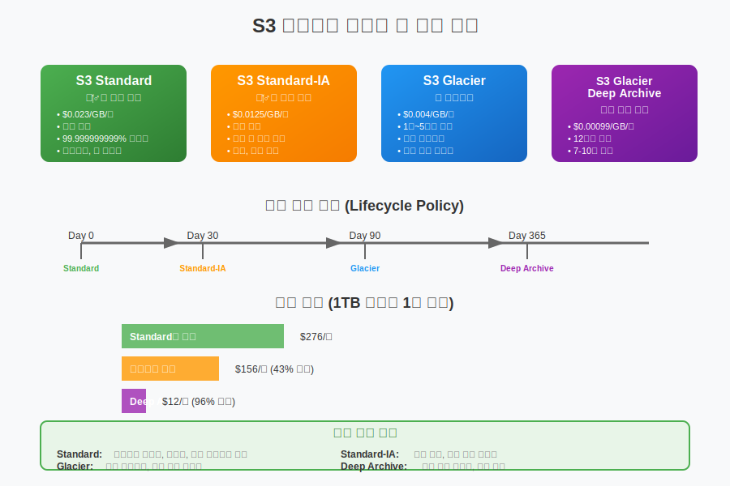

# Day 1-3: AWS 핵심 서비스 개요

## 📚 학습 목표
- AWS의 주요 서비스 카테고리 이해
- 컴퓨팅, 스토리지, 네트워킹, 데이터베이스 서비스 기본 개념 습득
- 서비스 간 연관성과 아키텍처 구성 방법 파악
- 실제 비즈니스 시나리오에서의 서비스 활용 사례 이해

---

## 🖥️ 컴퓨팅 서비스 (30분)



### EC2 (Elastic Compute Cloud) = 클라우드 컴퓨터

#### EC2란?
```
정의: 클라우드에서 제공하는 가상 서버
비유: 컴퓨터 대여 서비스
특징:
- 필요한 만큼 서버 생성
- 다양한 운영체제 지원
- 사용한 시간만큼 과금
```

#### EC2 인스턴스 유형
```
범용 (General Purpose):
- t3.micro, t3.small (웹 서버, 소규모 DB)
- m5.large, m5.xlarge (일반적인 워크로드)

컴퓨팅 최적화 (Compute Optimized):
- c5.large, c5.xlarge (CPU 집약적 작업)
- 과학 계산, 게임 서버, 머신러닝

메모리 최적화 (Memory Optimized):
- r5.large, r5.xlarge (메모리 집약적 작업)
- 인메모리 데이터베이스, 빅데이터 분석

스토리지 최적화 (Storage Optimized):
- i3.large, i3.xlarge (고성능 스토리지)
- NoSQL 데이터베이스, 분산 파일 시스템
```

### Lambda = 서버리스 컴퓨팅

#### Lambda란?
```
정의: 서버 관리 없이 코드만 실행
비유: 택시 (필요할 때만 호출)
특징:
- 서버 관리 불필요
- 이벤트 기반 실행
- 실행 시간만큼만 과금
```

#### Lambda 사용 사례
```
웹 애플리케이션:
- API Gateway + Lambda
- 사용자 요청 처리
- 자동 확장

데이터 처리:
- S3 파일 업로드 시 자동 처리
- 이미지 리사이징
- 로그 분석

스케줄링:
- 정기적 백업 작업
- 데이터베이스 정리
- 리포트 생성
```

---

## 💾 스토리지 서비스 (30분)

### S3 (Simple Storage Service) = 클라우드 창고



#### S3란?
```
정의: 인터넷을 통해 접근 가능한 객체 스토리지
비유: 무제한 창고 서비스
특징:
- 무제한 용량
- 99.999999999% (11 9's) 내구성
- 웹에서 직접 접근 가능
```

#### S3 사용 사례
```
웹사이트 호스팅:
- 정적 웹사이트 (HTML, CSS, JS)
- 이미지, 동영상 파일 저장
- CDN과 연동

백업 및 아카이브:
- 데이터베이스 백업
- 로그 파일 장기 보관
- 재해 복구용 데이터

빅데이터 분석:
- 데이터 레이크 구축
- 분석용 원본 데이터 저장
- 머신러닝 데이터셋
```

### EBS (Elastic Block Store) = 하드디스크

#### EBS란?
```
정의: EC2 인스턴스에 연결하는 블록 스토리지
비유: 외장 하드디스크
특징:
- EC2와 독립적 존재
- 스냅샷 백업 가능
- 다양한 성능 옵션
```

#### EBS 볼륨 유형
```
범용 SSD (gp3):
- 일반적인 워크로드
- 균형잡힌 성능과 비용

프로비저닝된 IOPS SSD (io2):
- 고성능 데이터베이스
- I/O 집약적 애플리케이션

처리량 최적화 HDD (st1):
- 빅데이터 처리
- 로그 처리

콜드 HDD (sc1):
- 자주 접근하지 않는 데이터
- 백업 용도
```

---

## 🌐 네트워킹 서비스 (30분)

### VPC (Virtual Private Cloud) = 가상 사설망

#### VPC란?
```
정의: AWS 클라우드 내 논리적으로 격리된 네트워크
비유: 아파트 단지 (외부와 분리된 독립 공간)
특징:
- 완전한 네트워크 제어
- 보안 그룹으로 방화벽 설정
- 인터넷 게이트웨이로 외부 연결
```

#### VPC 구성 요소
```
서브넷 (Subnet):
- 퍼블릭 서브넷: 인터넷 접근 가능
- 프라이빗 서브넷: 내부 통신만

라우팅 테이블:
- 네트워크 트래픽 경로 설정
- 인터넷 게이트웨이 연결

보안 그룹:
- 인스턴스 레벨 방화벽
- 허용 규칙만 설정 (화이트리스트)

네트워크 ACL:
- 서브넷 레벨 방화벽
- 허용/거부 규칙 모두 설정
```

### CloudFront = CDN (콘텐츠 배포 네트워크)

#### CloudFront란?
```
정의: 전 세계에 콘텐츠를 빠르게 배포하는 서비스
비유: 피자 배달 네트워크 (가까운 지점에서 배달)
특징:
- 전 세계 엣지 로케이션 활용
- 캐싱으로 빠른 응답
- DDoS 공격 방어
```

---

## 🗄️ 데이터베이스 서비스 (30분)

### RDS (Relational Database Service) = 관리형 관계형 DB

#### RDS란?
```
정의: AWS에서 관리하는 관계형 데이터베이스
비유: 호텔 (관리 서비스 포함)
지원 엔진:
- MySQL, PostgreSQL
- MariaDB, Oracle
- SQL Server, Aurora
```

#### RDS 장점
```
관리 자동화:
- 백업 자동화
- 소프트웨어 패치
- 모니터링 및 알림

고가용성:
- Multi-AZ 배포
- 자동 장애 조치
- 읽기 복제본

확장성:
- 수직 확장 (인스턴스 크기)
- 수평 확장 (읽기 복제본)
```

### DynamoDB = NoSQL 데이터베이스

#### DynamoDB란?
```
정의: 완전 관리형 NoSQL 데이터베이스
비유: 자동화된 창고 시스템
특징:
- 서버리스 (서버 관리 불필요)
- 밀리초 단위 응답 시간
- 자동 확장
```

#### DynamoDB 사용 사례
```
웹 애플리케이션:
- 사용자 세션 저장
- 쇼핑카트 데이터
- 게임 점수 저장

IoT 애플리케이션:
- 센서 데이터 저장
- 실시간 분석
- 대용량 로그 처리

모바일 앱:
- 사용자 프로필
- 채팅 메시지
- 위치 데이터
```

---

## 🔗 서비스 간 연관성 (30분)

### 3-Tier 아키텍처 예시

#### 전통적인 웹 애플리케이션
```
프레젠테이션 계층 (Web Tier):
- CloudFront (CDN)
- S3 (정적 콘텐츠)
- Route 53 (DNS)

애플리케이션 계층 (App Tier):
- Application Load Balancer
- EC2 인스턴스 (웹 서버)
- Auto Scaling Group

데이터 계층 (DB Tier):
- RDS (관계형 데이터)
- ElastiCache (캐시)
- S3 (파일 저장)
```

### 서버리스 아키텍처 예시

#### 현대적인 서버리스 애플리케이션
```
프론트엔드:
- S3 + CloudFront (정적 웹사이트)
- Route 53 (도메인)

백엔드:
- API Gateway (API 관리)
- Lambda (비즈니스 로직)
- DynamoDB (데이터 저장)

인증:
- Cognito (사용자 인증)
- IAM (권한 관리)
```

---

## 🏗️ 실제 비즈니스 시나리오 (30분)

### 시나리오 1: 스타트업 웹 서비스

#### 요구사항
```
비즈니스:
- 온라인 쇼핑몰 운영
- 초기 사용자 1,000명
- 빠른 성장 예상

기술적 요구사항:
- 웹사이트 호스팅
- 사용자 데이터 저장
- 상품 이미지 관리
- 주문 처리 시스템
```

#### AWS 솔루션
```
웹 호스팅:
- S3 + CloudFront (정적 콘텐츠)
- EC2 + ALB (동적 콘텐츠)

데이터 저장:
- RDS (사용자, 주문 데이터)
- S3 (상품 이미지)

확장성:
- Auto Scaling (트래픽 증가 대응)
- ElastiCache (성능 향상)
```

### 시나리오 2: 기업 데이터 분석

#### 요구사항
```
비즈니스:
- 대량의 로그 데이터 분석
- 실시간 대시보드 제공
- 비용 효율적 솔루션

기술적 요구사항:
- 로그 데이터 수집
- 배치 처리
- 실시간 분석
- 시각화
```

#### AWS 솔루션
```
데이터 수집:
- Kinesis (실시간 스트리밍)
- S3 (데이터 레이크)

데이터 처리:
- Lambda (실시간 처리)
- EMR (배치 처리)

분석 및 시각화:
- Athena (쿼리 엔진)
- QuickSight (대시보드)
```

---

## 📝 핵심 정리

### AWS 서비스 카테고리
1. **컴퓨팅**: EC2, Lambda, ECS, EKS
2. **스토리지**: S3, EBS, EFS, Glacier
3. **네트워킹**: VPC, CloudFront, Route 53, ELB
4. **데이터베이스**: RDS, DynamoDB, ElastiCache, Redshift

### 서비스 선택 기준
- **성능 요구사항**: 응답 시간, 처리량
- **확장성 요구사항**: 예상 성장률, 트래픽 패턴
- **비용 고려사항**: 초기 비용, 운영 비용
- **관리 복잡성**: 운영 인력, 전문성

### 아키텍처 설계 원칙
- **느슨한 결합**: 서비스 간 독립성 유지
- **확장성**: 수요 변화에 대응 가능
- **내결함성**: 장애 시에도 서비스 지속
- **보안**: 다층 보안 체계 구축

---

## 🤔 토론 주제

1. **우리가 만들고 싶은 서비스에는 어떤 AWS 서비스가 필요할까?**
   - 각자의 아이디어를 AWS 서비스로 매핑해보기

2. **전통적인 서버 vs 서버리스, 언제 무엇을 선택할까?**
   - 각각의 장단점과 적용 시나리오

---

## 📚 다음 시간 예고

**클라우드 경제학 & 요금 모델**
- AWS 요금 체계 이해
- 온디맨드, 예약 인스턴스, 스팟 인스턴스
- AWS 요금 계산기 활용
- 비용 최적화 전략

---

> 💡 **오늘의 핵심**: AWS는 다양한 서비스를 레고 블록처럼 조합하여 원하는 아키텍처를 구성할 수 있습니다. 각 서비스의 특성을 이해하고 비즈니스 요구사항에 맞게 조합하는 것이 솔루션 아키텍트의 핵심 역량입니다!