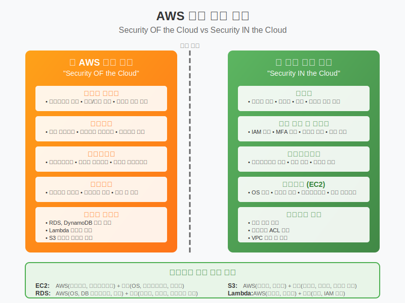

# Day 1-5: AWS 공동 책임 모델

## 📚 학습 목표
- AWS 공동 책임 모델의 개념과 중요성 이해
- AWS와 고객 간의 보안 책임 분담 구조 파악
- 서비스 유형별 책임 범위 차이점 습득
- 실제 보안 사고 사례를 통한 책임 구분 이해

---

## 🛡️ 공동 책임 모델 개념 (30분)



### 공동 책임 모델이란?

#### 아파트 관리 비유
```
아파트 관리사무소 (AWS):
- 건물 구조 안전성
- 엘리베이터 관리
- 공용 전기/수도 시설
- 보안 시스템 (CCTV, 출입통제)
- 소방 시설

세대주 (고객):
- 집 안 보안 (문단속)
- 개인 물품 관리
- 가전제품 관리
- 방문자 관리
- 집 안 청소
```

#### 클라우드에서의 적용
```
AWS 책임 (클라우드의 보안):
- 물리적 인프라 보안
- 하드웨어 관리
- 네트워크 인프라
- 하이퍼바이저 관리
- 서비스 운영

고객 책임 (클라우드에서의 보안):
- 데이터 암호화
- 네트워크 트래픽 보호
- 운영체제 패치
- 애플리케이션 보안
- 접근 권한 관리
```

---

## 🔍 AWS 책임 영역 (30분)

### 1. 물리적 보안
```
데이터센터 보안:
- 24/7 보안 요원
- 생체 인식 출입 통제
- 감시 카메라 시스템
- 물리적 접근 제한

환경 제어:
- 온도 및 습도 관리
- 화재 진압 시스템
- 정전 대비 백업 전원
- 자연재해 대비책
```

### 2. 인프라 보안
```
하드웨어 관리:
- 서버 하드웨어 유지보수
- 네트워크 장비 관리
- 스토리지 시스템 관리
- 하드웨어 폐기 시 데이터 완전 삭제

네트워크 인프라:
- 네트워크 분리 및 격리
- DDoS 공격 방어
- 네트워크 모니터링
- 트래픽 필터링
```

### 3. 서비스 운영
```
플랫폼 관리:
- 하이퍼바이저 보안
- 서비스 소프트웨어 업데이트
- 취약점 패치 적용
- 서비스 가용성 보장

규정 준수:
- SOC 1/2/3 인증
- ISO 27001 인증
- PCI DSS 준수
- GDPR 준수
```

---

## 👤 고객 책임 영역 (30분)

### 1. 데이터 보호
```
데이터 분류:
- 민감 데이터 식별
- 데이터 분류 체계 수립
- 보관 정책 수립
- 삭제 정책 수립

암호화:
- 저장 데이터 암호화
- 전송 중 데이터 암호화
- 키 관리
- 암호화 정책 수립
```

### 2. 접근 권한 관리
```
사용자 관리:
- 사용자 계정 생성/삭제
- 권한 부여/회수
- 정기적 권한 검토
- 임시 계정 관리

인증 강화:
- 다중 인증(MFA) 설정
- 강력한 비밀번호 정책
- 정기적 비밀번호 변경
- 접근 로그 모니터링
```

### 3. 네트워크 보안
```
네트워크 설정:
- 보안 그룹 설정
- 네트워크 ACL 설정
- VPC 설계
- 서브넷 분리

트래픽 제어:
- 방화벽 규칙 설정
- 불필요한 포트 차단
- 네트워크 모니터링
- 침입 탐지 시스템
```

### 4. 운영체제 및 애플리케이션
```
OS 관리:
- 운영체제 패치
- 보안 업데이트 적용
- 불필요한 서비스 제거
- 로그 모니터링

애플리케이션 보안:
- 애플리케이션 취약점 점검
- 보안 코딩 가이드라인
- 정기적 보안 테스트
- 로그 분석
```

---

## 📊 서비스별 책임 분담 (45분)

### 1. IaaS (EC2) - 고객 책임 많음
```
AWS 책임:
├── 물리적 인프라
├── 하이퍼바이저
├── 네트워크 인프라
└── 하드웨어 관리

고객 책임:
├── 운영체제 (Windows/Linux)
├── 애플리케이션
├── 데이터
├── 네트워크 설정 (보안그룹)
├── 방화벽 설정
└── 암호화
```

### 2. PaaS (RDS) - 책임 분담
```
AWS 책임:
├── 물리적 인프라
├── 운영체제
├── 데이터베이스 소프트웨어
├── 패치 및 업데이트
└── 백업 (자동)

고객 책임:
├── 데이터
├── 데이터베이스 사용자 관리
├── 네트워크 설정
├── 암호화 설정
└── 접근 권한 관리
```

### 3. SaaS (WorkMail) - AWS 책임 많음
```
AWS 책임:
├── 물리적 인프라
├── 운영체제
├── 애플리케이션
├── 패치 및 업데이트
├── 가용성 관리
└── 백업

고객 책임:
├── 사용자 데이터
├── 사용자 계정 관리
├── 접근 권한 설정
└── 사용 정책 수립
```

---

## 🚨 실제 보안 사고 사례 분석 (30분)

### 사례 1: S3 버킷 공개 설정
```
사고 내용:
- 고객이 S3 버킷을 실수로 공개 설정
- 민감한 고객 데이터 유출
- 언론 보도 및 평판 손상

책임 분석:
AWS: S3 서비스 안정적 운영 ✅
고객: 버킷 권한 설정 실수 ❌

교훈:
- 버킷 정책 정기 검토 필요
- 자동화된 보안 점검 도구 활용
- 최소 권한 원칙 적용
```

### 사례 2: EC2 인스턴스 해킹
```
사고 내용:
- 고객이 EC2 보안 그룹을 0.0.0.0/0으로 설정
- SSH 포트(22) 전체 공개
- 무차별 대입 공격으로 침입

책임 분석:
AWS: EC2 인프라 보안 ✅
고객: 보안 그룹 설정 실수 ❌

교훈:
- 필요한 IP만 허용
- 키 기반 인증 사용
- 정기적 보안 점검
```

### 사례 3: IAM 권한 과다 부여
```
사고 내용:
- 개발자에게 관리자 권한 부여
- 실수로 프로덕션 데이터베이스 삭제
- 서비스 중단 및 데이터 손실

책임 분석:
AWS: IAM 서비스 정상 작동 ✅
고객: 권한 관리 정책 미흡 ❌

교훈:
- 최소 권한 원칙 적용
- 역할 기반 접근 제어
- 중요 작업 승인 프로세스
```

---

## 🔧 실습: 책임 분담 시나리오 (15분)

### 실습 1: 책임 구분하기
```
시나리오: 웹 애플리케이션 운영

다음 중 누구의 책임인지 구분하세요:

1. EC2 인스턴스 하드웨어 장애 → AWS
2. 웹 애플리케이션 보안 취약점 → 고객
3. 데이터센터 정전 → AWS
4. 데이터베이스 백업 설정 → 고객
5. 네트워크 DDoS 공격 방어 → AWS
6. 사용자 비밀번호 정책 → 고객
7. 하이퍼바이저 보안 패치 → AWS
8. 운영체제 보안 업데이트 → 고객
```

### 실습 2: 보안 체크리스트 작성
```
고객 책임 보안 체크리스트:

□ 강력한 루트 계정 비밀번호 설정
□ 루트 계정 MFA 활성화
□ IAM 사용자별 개별 계정 생성
□ 최소 권한 원칙 적용
□ 정기적 권한 검토
□ 보안 그룹 최소 개방
□ 데이터 암호화 설정
□ 정기적 백업 확인
□ 로그 모니터링 설정
□ 보안 업데이트 적용
```

---

## 📝 핵심 정리

### 공동 책임 모델 핵심 원칙
1. **AWS**: 클라우드의 보안 (인프라, 플랫폼)
2. **고객**: 클라우드에서의 보안 (데이터, 애플리케이션)
3. **서비스별 차이**: IaaS > PaaS > SaaS 순으로 고객 책임 감소

### 고객 책임의 핵심 영역
- **데이터 보호**: 분류, 암호화, 백업
- **접근 관리**: 인증, 권한, 모니터링
- **네트워크 보안**: 방화벽, 트래픽 제어
- **시스템 관리**: OS 패치, 애플리케이션 보안

### 보안 사고 예방 원칙
- **최소 권한**: 필요한 최소한의 권한만 부여
- **정기 검토**: 권한과 설정의 정기적 점검
- **자동화**: 보안 점검과 패치의 자동화
- **모니터링**: 지속적인 보안 상태 모니터링

---

## 🤔 토론 주제

1. **공동 책임 모델의 장단점은?**
   - 고객 입장에서의 장점과 부담

2. **온프레미스 대비 클라우드 보안의 차이점은?**
   - 책임 분담이 보안에 미치는 영향

---

## 📚 다음 시간 예고

**AWS 핵심 서비스 개요**
- 컴퓨팅, 스토리지, 네트워킹, 데이터베이스 서비스 소개
- 각 서비스의 기본 개념과 사용 사례
- 서비스 간 연관성과 아키텍처 구성

---

> 💡 **오늘의 핵심**: 클라우드 보안은 AWS와 고객의 공동 책임입니다. AWS가 인프라를 안전하게 관리하더라도, 고객이 자신의 데이터와 애플리케이션을 보호하지 않으면 보안 사고가 발생할 수 있습니다!