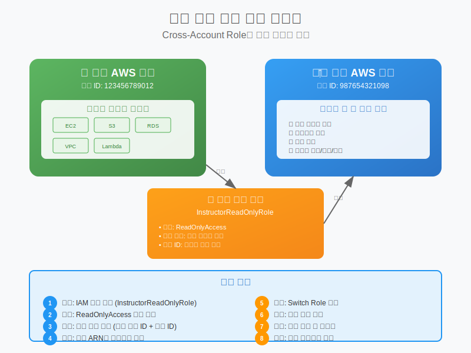

# Day 1-6: 강사 접근 권한 설정 & 일일 정리

## 📚 학습 목표
- 강사가 학생 계정에 접근할 수 있는 ReadOnlyAccess 역할 생성
- SwitchRole 기능을 통한 안전한 계정 접근 방법 이해
- 오늘 학습한 내용 정리 및 퀴즈를 통한 이해도 점검
- 내일 학습할 IAM 기초 개념 예습

---

## 🔐 강사 접근 권한 설정 (30분)



### 왜 ReadOnlyAccess 역할이 필요한가?

#### 과제 평가의 필요성
```
문제 상황:
- 학생이 실습 과제를 완료했다고 보고
- 강사가 실제 구현 상태를 확인해야 함
- 학생 계정에 직접 접근할 방법 필요

해결 방안:
- ReadOnlyAccess 역할 생성
- 강사가 SwitchRole로 안전하게 접근
- 읽기 전용으로 리소스 상태만 확인
```

#### 보안 고려사항
```
안전한 접근:
✅ 읽기 전용 권한만 부여
✅ External ID로 추가 보안
✅ 임시 자격 증명 사용
✅ 접근 로그 기록

위험한 접근:
❌ 관리자 권한 부여
❌ 영구 자격 증명 공유
❌ 비밀번호 공유
❌ 루트 계정 접근
```

---

## 🛠️ ReadOnlyAccess 역할 생성 실습 (45분)

### 1단계: IAM 콘솔 접속
```
경로: AWS 콘솔 → Services → IAM
또는: 검색창에 "IAM" 입력
```

### 2단계: 역할 생성 시작
```
1. 좌측 메뉴에서 "Roles" 클릭
2. "Create role" 버튼 클릭
3. "AWS account" 선택 (다른 AWS 계정에서 접근)
```

### 3단계: 신뢰 관계 설정
```
Account ID 입력:
- 강사 계정 ID: [강사가 제공하는 12자리 숫자]
- 예시: 123456789012

External ID 설정:
- External ID: SAA-Student-[본인이름]
- 예시: SAA-Student-김철수
- 목적: 추가 보안 계층
```

### 4단계: 권한 정책 연결
```
정책 검색 및 선택:
1. 검색창에 "ReadOnlyAccess" 입력
2. "ReadOnlyAccess" 정책 선택 (체크박스)
3. 이 정책의 권한 내용:
   - 모든 AWS 서비스 읽기 권한
   - 생성/수정/삭제 권한 없음
   - 안전한 조회만 가능
```

### 5단계: 역할 이름 및 설명
```
Role name: InstructorReadOnlyRole

Description: 
강사가 학생의 AWS 리소스를 읽기 전용으로 
확인하기 위한 역할입니다.

Tags (선택사항):
- Key: Purpose, Value: Education
- Key: Course, Value: SAA-C03
```

### 6단계: 역할 생성 완료
```
1. "Create role" 버튼 클릭
2. 역할 생성 완료 확인
3. 역할 ARN 복사:
   arn:aws:iam::[본인계정ID]:role/InstructorReadOnlyRole
```

---

## 📋 역할 ARN 공유 및 확인 (15분)

### ARN 정보 수집
```
필요한 정보:
1. 역할 ARN: arn:aws:iam::[계정ID]:role/InstructorReadOnlyRole
2. External ID: SAA-Student-[본인이름]
3. 본인 계정 ID: 12자리 숫자

확인 방법:
- IAM → Roles → InstructorReadOnlyRole 클릭
- Summary 탭에서 Role ARN 확인
```

### 강사에게 정보 전달
```
전달 방법: 이메일 또는 채팅
전달 내용:
---
이름: [본인 이름]
계정 ID: [12자리 계정 ID]
역할 ARN: arn:aws:iam::[계정ID]:role/InstructorReadOnlyRole
External ID: SAA-Student-[본인이름]
---
```

### 접근 테스트 (강사와 함께)
```
강사가 수행할 작업:
1. AWS 콘솔에서 Switch Role 클릭
2. 학생의 계정 ID 입력
3. 역할 이름: InstructorReadOnlyRole
4. External ID: SAA-Student-[학생이름]
5. 접근 성공 확인
```

---

## 🔍 SwitchRole 동작 원리 이해 (15분)

### SwitchRole이란?
```
개념:
- 임시로 다른 역할의 권한을 사용하는 기능
- 원래 권한을 포기하고 새로운 권한 획득
- 세션 종료 시 원래 권한으로 복귀

비유:
- 회사에서 다른 부서 업무 지원
- 임시로 해당 부서 권한 획득
- 업무 완료 후 원래 부서로 복귀
```

### 보안 메커니즘
```
인증 과정:
1. 강사가 자신의 계정으로 로그인
2. SwitchRole 요청 (학생 계정 + 역할)
3. AWS가 신뢰 관계 확인
4. External ID 검증
5. 임시 자격 증명 발급 (1시간 유효)
6. ReadOnly 권한으로 학생 계정 접근
```

### 접근 로그 확인
```
CloudTrail 로그:
- 누가 언제 접근했는지 기록
- 어떤 작업을 수행했는지 추적
- 보안 감사 및 모니터링 가능

확인 방법:
AWS 콘솔 → CloudTrail → Event history
```

---

## 📝 오늘 학습 내용 정리 (20분)

### 1. 클라우드 컴퓨팅 기초
```
핵심 개념:
✅ 온프레미스 vs 클라우드 차이점
✅ 클라우드의 6가지 장점
✅ IaaS, PaaS, SaaS 서비스 모델
✅ 기업들의 클라우드 전환 이유

실무 적용:
- 비즈니스 요구사항에 맞는 클라우드 전략 수립
- 비용 효율성과 기술적 이점 균형
```

### 2. AWS 글로벌 인프라
```
핵심 개념:
✅ 리전, 가용영역, 엣지 로케이션
✅ 고가용성 설계 원칙
✅ 리전 선택 기준
✅ AWS 계정 생성 및 콘솔 사용법

실무 적용:
- 다중 AZ 배포로 고가용성 확보
- 사용자와 가까운 리전 선택
- 프리티어 활용한 비용 관리
```

### 3. 공동 책임 모델
```
핵심 개념:
✅ AWS vs 고객 책임 분담
✅ 서비스별 책임 범위 차이
✅ 보안 사고 사례 분석
✅ 고객 책임 보안 체크리스트

실무 적용:
- 서비스별 보안 책임 이해
- 고객 책임 영역 보안 강화
- 정기적 보안 점검 및 모니터링
```

### 4. 강사 접근 권한 설정
```
핵심 개념:
✅ IAM 역할의 개념과 활용
✅ ReadOnlyAccess 정책
✅ SwitchRole 메커니즘
✅ External ID 보안 강화

실무 적용:
- 안전한 계정 간 접근 방법
- 최소 권한 원칙 적용
- 임시 자격 증명 활용
```

---

## 🧠 이해도 점검 퀴즈 (10문항)

### 1. 클라우드 컴퓨팅의 장점이 아닌 것은?
```
a) 초기 투자 비용 절감
b) 탄력적 확장성
c) 물리적 하드웨어 직접 관리
d) 글로벌 접근성

정답: c) 물리적 하드웨어 직접 관리
```

### 2. AWS 리전에 대한 설명으로 옳은 것은?
```
a) 리전은 단일 데이터센터로 구성됨
b) 모든 리전에서 동일한 서비스 제공
c) 리전은 최소 3개의 가용영역으로 구성
d) 리전 간 데이터는 자동으로 복제됨

정답: c) 리전은 최소 3개의 가용영역으로 구성
```

### 3. 공동 책임 모델에서 고객의 책임이 아닌 것은?
```
a) 데이터 암호화
b) 하이퍼바이저 보안 패치
c) 네트워크 보안 그룹 설정
d) 사용자 접근 권한 관리

정답: b) 하이퍼바이저 보안 패치
```

### 4. ReadOnlyAccess 정책의 특징은?
```
a) 모든 AWS 서비스에 대한 읽기 권한
b) 특정 서비스에만 읽기 권한
c) 읽기와 쓰기 권한 모두 포함
d) 관리자 권한과 동일

정답: a) 모든 AWS 서비스에 대한 읽기 권한
```

### 5. SwitchRole의 장점이 아닌 것은?
```
a) 임시 자격 증명 사용
b) 접근 로그 기록
c) 영구적 권한 부여
d) 최소 권한 원칙 적용

정답: c) 영구적 권한 부여
```

---

## 📚 내일 학습 예고

### IAM 기초 (Identity and Access Management)
```
학습 내용:
- IAM의 핵심 구성 요소 (사용자, 그룹, 역할, 정책)
- 회사 출입카드 시스템으로 이해하는 IAM
- IAM 사용자 및 그룹 생성 실습
- MFA(다중 인증) 설정
- 프로그래밍 방식 접근 vs 콘솔 접근

준비사항:
- 오늘 생성한 AWS 계정으로 로그인 가능한지 확인
- 루트 계정 비밀번호 안전하게 보관
- 휴대폰 (MFA 설정용)
```

### 예습 과제 (선택사항)
```
1. IAM이 무엇의 약자인지 찾아보기
2. 회사에서 사용하는 출입카드 시스템 생각해보기
3. 다중 인증(MFA)이 왜 필요한지 생각해보기
```

---

## 🎯 오늘의 성취

### 완료한 작업들
- ✅ AWS 계정 생성 및 기본 설정
- ✅ 클라우드 컴퓨팅 기본 개념 이해
- ✅ AWS 글로벌 인프라 구조 파악
- ✅ 공동 책임 모델 이해
- ✅ 강사 접근 권한 설정 완료
- ✅ AWS 콘솔 기본 사용법 습득

### 다음 단계 준비
- 📋 IAM 기초 개념 학습 준비
- 🔐 보안 모범 사례 적용 준비
- 💻 실습 환경 구축 완료

---

## 📖 참고 자료

### AWS 공식 문서
- [AWS IAM](https://docs.aws.amazon.com/iam/)
- [IAM 역할](https://docs.aws.amazon.com/iam/latest/userguide/id_roles.html)
- [IAM 모범 사례](https://docs.aws.amazon.com/iam/latest/userguide/best-practices.html)
- [AWS CloudTrail](https://docs.aws.amazon.com/cloudtrail/)

---

> 💡 **오늘의 핵심**: AWS 클라우드의 기본 개념을 이해하고 실습 환경을 구축했습니다. 특히 공동 책임 모델을 통해 클라우드 보안의 기본 원칙을 배웠고, IAM 역할을 통한 안전한 접근 방법을 실습했습니다. 내일부터는 본격적인 AWS 서비스 학습이 시작됩니다!