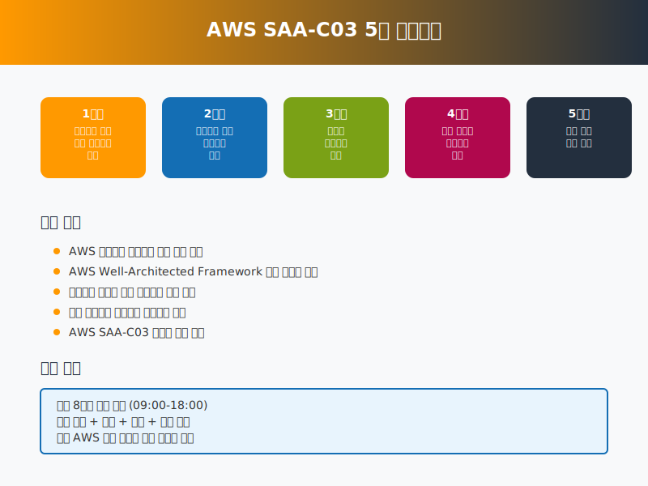
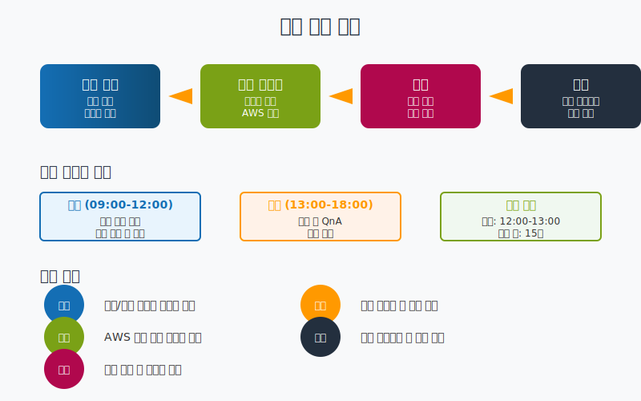

# AWS Solutions Architect Associate (SAA-C03) 과정 오리엔테이션

## 🎯 과정 소개

AWS Solutions Architect Associate (SAA-C03) 자격증 취득을 위한 5주 집중 과정에 오신 것을 환영합니다!

이 과정은 **AWS를 전혀 모르는 대학생 저학년**을 대상으로 설계되었습니다. 전공/비전공에 관계없이 누구나 이해할 수 있도록 **쉬운 비유와 친근한 설명**으로 시작하여, 클라우드 컴퓨팅의 기본 개념부터 실무에서 활용할 수 있는 아키텍처 설계 능력까지 체계적으로 학습할 수 있도록 구성되었습니다.

**"클라우드가 뭔지도 모르겠는데 괜찮을까요?"** → 걱정하지 마세요! 모든 것을 처음부터 차근차근 설명합니다.

## 📚 학습 목표

- **AWS 클라우드 서비스의 핵심 개념 이해**: 클라우드 컴퓨팅의 기본 원리와 AWS의 주요 서비스들을 이해합니다.
- **AWS Well-Architected Framework 기반 솔루션 설계**: 5가지 핵심 원칙을 바탕으로 한 아키텍처 설계 방법을 습득합니다.
- **안전하고 복원력 있는 아키텍처 설계**: 보안과 고가용성을 고려한 시스템 설계 능력을 개발합니다.
- **비용 최적화된 클라우드 아키텍처 구성**: 효율적이고 경제적인 클라우드 솔루션 구성 방법을 학습합니다.
- **AWS SAA-C03 자격증 시험 합격**: 실제 시험에 합격할 수 있는 실력을 갖춥니다.

## 🗓️ 커리큘럼 구성

### 주차별 학습 내용

| 주차 | 주제 | 핵심 내용 | 시험 도메인 |
|------|------|---------|------------|
| **1주차** | **클라우드 기초 및 보안 아키텍처 설계** | 클라우드 컴퓨팅 기초, AWS 글로벌 인프라, IAM, VPC | 보안 아키텍처 설계 (30%) |
| **2주차** | **복원력을 갖춘 아키텍처 설계** | 고가용성, 내결함성, 재해 복구, 서버리스 | 복원력 아키텍처 설계 (26%) |
| **3주차** | **고성능 아키텍처 설계** | 스토리지 최적화, 컴퓨팅 솔루션, 데이터베이스 성능 | 고성능 아키텍처 설계 (24%) |
| **4주차** | **비용에 최적화된 아키텍처 설계** | 비용 효율적인 스토리지, 컴퓨팅 최적화 | 비용 최적화 아키텍처 (20%) |
| **5주차** | **통합 실습 및 시험 준비** | 종합 아키텍처 설계, 모의고사, 시험 전략 | 전체 도메인 통합 |

## 📖 학습 방법 및 구조

### 일일 학습 패턴
- **09:00-12:00**: 이론 강의 (개념 설명, 서비스 소개, 데모)
- **13:00-18:00**: 실습 및 QnA (AWS 콘솔 실습, 문제 해결, 토론)
- **휴식 시간**: 점심시간 1시간, 세션 간 15분 휴식

### 학습 활동 구성
1. **이론 강의**: 핵심 개념 및 AWS 서비스 설명
2. **실습 가이드**: AWS 콘솔에서 직접 실습
3. **퀴즈**: 학습 내용 확인 및 이해도 점검
4. **과제**: 실제 시나리오 기반 문제 해결
5. **챌린지**: 심화 학습을 위한 응용 과제

## 📋 시험 정보

### SAA-C03 시험 개요
- **시험 형식**: 선다형 및 복수 응답형
- **총 문항**: 65문항 (채점 대상 50문항)
- **시험 시간**: 130분
- **합격 기준**: 720점/1000점
- **시험 비용**: $150 USD

### 도메인별 가중치
1. **보안 아키텍처 설계**: 30%
2. **복원력을 갖춘 아키텍처 설계**: 26%
3. **고성능 아키텍처 설계**: 24%
4. **비용에 최적화된 아키텍처 설계**: 20%

## 🛠️ 학습 환경 준비

### 필수 준비사항
- **AWS 계정**: 프리 티어 계정 생성 (첫날 실습에서 진행)
- **컴퓨터**: 인터넷 연결 가능한 PC/Mac
- **브라우저**: Chrome, Firefox, Safari 등 최신 버전
- **GitHub 계정**: 과제 제출용

### 권장 사항 (없어도 괜찮아요!)
- **영어 기초**: AWS 콘솔은 영어지만 한국어로 친절히 설명해드립니다
- **기본 IT 지식**: 컴퓨터, 인터넷 정도만 알면 됩니다 (전문 지식 불필요)
- **학습 의지**: "해보자!"는 마음가짐이면 충분합니다

**💡 "전공자가 아닌데 따라갈 수 있을까요?"**
→ 물론입니다! 비전공자도 충분히 이해할 수 있도록 설계된 과정입니다.

## 📝 평가 방법

### 평가 구성
- **일일 퀴즈**: 20% (매일 학습 내용 확인)
- **실습 완료도**: 30% (AWS 콘솔 실습 수행)
- **주간 과제**: 25% (실제 시나리오 기반 과제)
- **수업 참여도**: 15% (질문, 토론 참여)
- **최종 모의고사**: 10% (실제 시험 형태)

### 과제 제출 방법
- **GitHub 저장소**: 개인 저장소 생성 후 과제 업로드
- **제출 기한**: 각 주차 과제는 다음 주 월요일 오전 9시까지
- **피드백**: 강사가 코드 리뷰 및 아키텍처 검토 제공

## 🎓 수료 기준

### 수료 조건
- **출석률**: 90% 이상 (총 200시간 중 180시간 이상)
- **과제 제출**: 모든 주간 과제 완료
- **최종 평가**: 총점 70점 이상
- **모의고사**: 최소 1회 이상 응시

### 자격증 시험 준비
- **5주차 말**: 실제 시험 등록 및 일정 예약
- **시험 일정**: 과정 종료 후 1-2주 내 응시 권장
- **추가 지원**: 시험 준비를 위한 개별 상담 제공

## 📚 학습 자료

### 주요 참고 자료
- [AWS 공식 문서](https://docs.aws.amazon.com/)
- [AWS Well-Architected Framework](https://aws.amazon.com/architecture/well-architected/)
- [AWS 백서 및 가이드](https://aws.amazon.com/whitepapers/)
- [AWS 공식 교육 자료](https://aws.amazon.com/training/)

### 추천 도서
- "AWS Certified Solutions Architect Official Study Guide"
- "AWS Certified Solutions Architect Practice Tests"

## 🤝 학습 지원

### 강사 지원
- **실시간 질문**: 수업 중 언제든지 질문 가능
- **개별 상담**: 학습 진도나 이해도 관련 상담
- **과제 피드백**: 상세한 코드 리뷰 및 개선 방안 제시

### 동료 학습
- **스터디 그룹**: 자율적인 스터디 그룹 구성 권장
- **토론 세션**: 매일 마지막 시간 Q&A 및 토론
- **경험 공유**: 실습 중 발견한 팁과 노하우 공유

## 📞 연락처 및 지원

### 학습 관련 문의
- **이메일**: [강사 이메일 주소]
- **Slack/Discord**: [채널 정보]
- **GitHub Issues**: 기술적 문제나 과제 관련 질문

### 응급 상황
- **결석 시**: 사전 연락 필수
- **기술적 문제**: 즉시 강사에게 문의
- **AWS 계정 문제**: 별도 지원 채널 제공

---

## 🚀 시작하기

**"AWS가 뭔지도 모르는데 정말 괜찮을까요?"**

걱정하지 마세요! 이 과정은 여러분과 같은 초보자를 위해 만들어졌습니다.

### 🎯 우리의 학습 여정
**1단계**: "클라우드가 뭐지?" → 일상 속 비유로 쉽게 이해
**2단계**: "AWS 계정 만들기" → 오늘 오후 함께 차근차근
**3단계**: "하나씩 배워보기" → 매일 새로운 발견의 재미
**4단계**: "실제로 만들어보기" → 내 손으로 직접 구축
**5단계**: "자격증 도전하기" → 5주 후 당당한 합격!

### 💪 여러분이 얻게 될 것들
- **자신감**: "나도 클라우드 전문가가 될 수 있구나!"
- **실무 능력**: 실제 회사에서 사용하는 기술 습득
- **자격증**: 취업에 도움이 되는 국제 공인 자격증
- **미래 준비**: 4차 산업혁명 시대의 핵심 기술

**질문이나 궁금한 점이 있으시면 언제든지 말씀해 주세요!**
**"이런 것도 물어봐도 되나요?"라는 생각은 금지입니다! 😊**

---

*"클라우드는 단순히 기술이 아닙니다. 비즈니스를 혁신하고 미래를 만들어가는 도구입니다."*