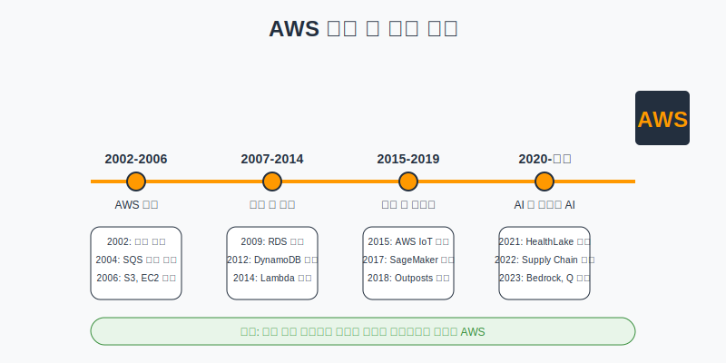
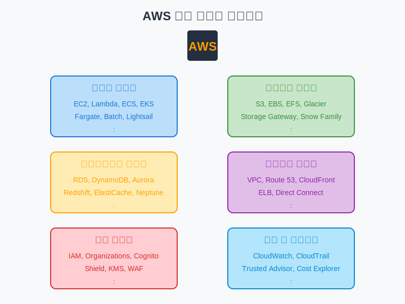

# AWS 소개 및 주요 서비스 개요

## 슬라이드 1: Amazon Web Services(AWS) 소개
- 세계에서 가장 포괄적이고 널리 채택된 클라우드 플랫폼
- 전 세계 데이터 센터에서 200개 이상의 완전 관리형 서비스 제공
- 2006년 출시 이후 클라우드 시장 선도
- 수백만 고객 보유 (스타트업부터 대기업, 정부기관까지)

## 슬라이드 2: AWS의 역사 및 발전 과정

## 슬라이드 3: AWS 탄생 배경
- Amazon.com의 내부 인프라 문제 해결에서 시작
- 크리스마스 시즌에만 서버가 바쁘고 나머지 기간에는 유휴 상태
- "남는 서버를 다른 회사에 빌려주자"는 아이디어
- **비유**: 분식집이 자체 개발한 떡볶이 소스를 다른 분식집에 판매하기 시작한 것과 유사

## 슬라이드 4: AWS 성장 및 확장 (2007-2014)
- 서비스 포트폴리오 확장 및 글로벌 인프라 구축
- 주요 이벤트:
  - 2007년: 유럽 리전 출시
  - 2009년: RDS(Relational Database Service) 출시
  - 2012년: DynamoDB 출시, 첫 re:Invent 컨퍼런스
  - 2014년: Lambda 출시로 서버리스 컴퓨팅 시대 시작

## 슬라이드 5: AWS 혁신 및 산업 리더십 (2015-현재)
- AI, IoT, 서버리스 컴퓨팅 등 새로운 기술 영역 확장
- 주요 이벤트:
  - 2017년: SageMaker 출시로 머신러닝 서비스 강화
  - 2018년: AWS Outposts 출시로 하이브리드 클라우드 지원
  - 2023년: Amazon Bedrock, Amazon Q 출시로 생성형 AI 서비스 강화

## 슬라이드 6: AWS 시장 위치
- 전 세계 클라우드 인프라 시장 약 32% 점유율 (2023년 기준)
- 주요 경쟁사:
  - Microsoft Azure (약 22%)
  - Google Cloud Platform (약 11%)
  - IBM Cloud, Alibaba Cloud 등
- **비유**: 치킨 프랜차이즈 시장에서 교촌치킨 32%, BHC 22%, 굽네치킨 11%의 점유율

## 슬라이드 7: AWS 경쟁 우위 요소
- **서비스 다양성**: 200개 이상의 완전 관리형 서비스
- **글로벌 인프라**: 30개 이상 리전, 100개 이상 가용 영역
- **혁신 속도**: 매년 1,000개 이상의 새로운 기능 및 서비스
- **규모의 경제**: 대규모 운영을 통한 비용 효율성
- **파트너 생태계**: 수만 개의 파트너사와 협력
- **보안 및 규정 준수**: 다양한 산업 표준 및 규정 준수 인증

## 슬라이드 8: AWS 주요 서비스 카테고리

## 슬라이드 9: 컴퓨팅 서비스
- **Amazon EC2**: 크기 조정 가능한 가상 서버
  - 비유: 인터넷으로 빌려 쓰는 컴퓨터
- **AWS Lambda**: 서버리스 컴퓨팅 서비스
  - 비유: 전체 자동차 대신 택시 이용하기
- **Amazon ECS/EKS**: 컨테이너 오케스트레이션 서비스
  - 비유: 표준화된 상자에 애플리케이션 담기
- **AWS Fargate**: 서버리스 컨테이너 실행 환경
  - 비유: 차고 관리 없이 차만 운전하기

## 슬라이드 10: 스토리지 서비스
- **Amazon S3**: 확장 가능한 객체 스토리지
  - 비유: 무제한 용량의 인터넷 창고
- **Amazon EBS**: EC2 인스턴스용 블록 스토리지
  - 비유: 가상 서버에 연결하는 하드 디스크
- **Amazon EFS**: 완전 관리형 파일 시스템
  - 비유: 여러 서버가 접근하는 공유 폴더
- **Amazon S3 Glacier**: 장기 데이터 보관 서비스
  - 비유: 오래된 서류를 보관하는 지하 창고

## 슬라이드 11: 데이터베이스 서비스
- **Amazon RDS**: 관리형 관계형 데이터베이스
  - 비유: 전문 업체가 관리하는 도서관
- **Amazon DynamoDB**: 완전 관리형 NoSQL 데이터베이스
  - 비유: 자유롭게 메모를 정리하는 노트
- **Amazon Aurora**: 고성능 관계형 데이터베이스
  - 비유: 일반 자동차 대신 스포츠카
- **Amazon Redshift**: 데이터 웨어하우징 서비스
  - 비유: 대형 물류 창고

## 슬라이드 12: 네트워킹 서비스
- **Amazon VPC**: 격리된 가상 네트워크
  - 비유: 아파트 단지 내 사설 네트워크
- **Amazon Route 53**: DNS 및 도메인 등록
  - 비유: 인터넷 전화번호부
- **Elastic Load Balancing**: 트래픽 분산 서비스
  - 비유: 은행 번호표 시스템
- **Amazon CloudFront**: 글로벌 콘텐츠 전송 네트워크
  - 비유: 전국 각지에 지점을 둔 편의점 체인

## 슬라이드 13: 보안 서비스
- **AWS IAM**: 사용자 및 권한 관리
  - 비유: 건물 출입 카드 시스템
- **AWS Organizations**: 여러 AWS 계정 관리
  - 비유: 여러 지점을 관리하는 본사
- **Amazon Cognito**: 사용자 인증 및 권한 부여
  - 비유: 회원제 시설의 회원 카드
- **AWS KMS**: 암호화 키 관리
  - 비유: 중요한 금고 열쇠 관리 시스템

## 슬라이드 14: 관리 및 거버넌스
- **Amazon CloudWatch**: 모니터링 및 관찰성
  - 비유: 자동차 대시보드
- **AWS CloudTrail**: 사용자 활동 및 API 사용 추적
  - 비유: 건물 내 CCTV
- **AWS Trusted Advisor**: 성능, 보안, 비용 최적화 권장
  - 비유: 에너지 효율 컨설턴트
- **AWS Cost Explorer**: 비용 분석 및 최적화
  - 비유: 가계부 앱

## 슬라이드 15: AWS 고객 성공 사례 - 넷플릭스
- **도전 과제**: 전 세계 수백만 사용자에게 고품질 스트리밍 제공
- **AWS 솔루션**: EC2, S3, DynamoDB, CloudFront 활용
- **결과**: 99.99% 이상 가용성, 글로벌 확장, 비용 최적화
- **비유**: 자체 배송 차량 대신 글로벌 배송 네트워크 활용

## 슬라이드 16: AWS 고객 성공 사례 - 에어비앤비
- **도전 과제**: 급속한 성장에 따른 확장성 요구
- **AWS 솔루션**: EC2, S3, EMR, RDS 활용
- **결과**: 10배 이상 트래픽 증가 처리, 데이터 기반 의사결정
- **비유**: 작은 가게가 프랜차이즈로 성장하면서도 품질 유지

## 슬라이드 17: AWS 시작하기 - 계정 유형
- **개인 계정**: 개인 사용자 또는 소규모 팀
  - 비유: 개인 은행 계좌
- **AWS Organizations**: 여러 계정 중앙 관리
  - 비유: 여러 계좌를 하나의 인터넷 뱅킹으로 관리
- **AWS 교육 계정**: 학생 및 교육자 특별 혜택
  - 비유: 학생증으로 받는 할인 혜택

## 슬라이드 18: AWS 프리 티어
- **12개월 무료**: EC2, S3, RDS 등 인기 서비스 제한된 사용량
  - 비유: 1년 무료 체험 구독
- **항상 무료**: Lambda, DynamoDB 등 일부 서비스 제한된 사용량
  - 비유: 카페의 무료 와이파이
- **단기 무료 평가판**: 특정 서비스 단기 평가 기간
  - 비유: 새 제품 체험 기간

## 슬라이드 19: AWS 비용 관리
- **AWS Budgets**: 예산 설정 및 알림
  - 비유: 신용카드 한도 알림
- **AWS Cost Explorer**: 비용 분석 및 최적화
  - 비유: 가계부 앱
- **AWS Trusted Advisor**: 비용 최적화 권장사항
  - 비유: 재정 상담사
- **AWS Pricing Calculator**: 예상 비용 계산
  - 비유: 여행 경비 계산기

## 슬라이드 20: 결론 및 Q&A
- AWS는 클라우드 컴퓨팅 시장 선두 주자
- 200개 이상의 서비스로 다양한 비즈니스 요구 충족
- 지속적 혁신과 글로벌 인프라 확장
- **비유**: 현대적인 공공 유틸리티 서비스
- 질문 및 다음 실습 안내