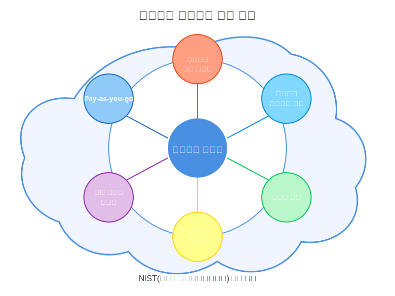
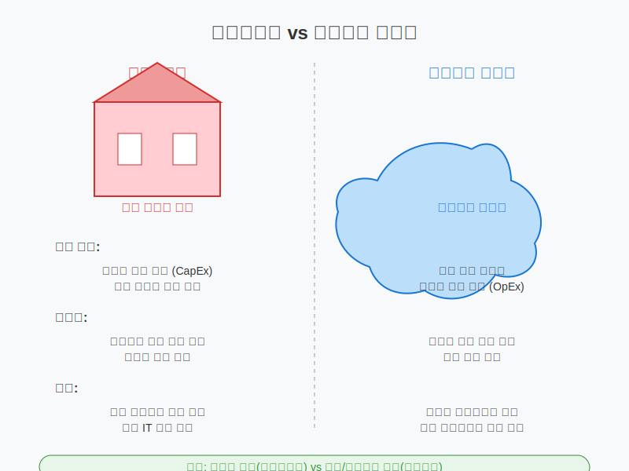

# 클라우드 컴퓨팅 개념 및 발전 과정

## 슬라이드 1: 클라우드 컴퓨팅이란?
- 인터넷을 통해 컴퓨팅 리소스 제공
- 필요한 만큼 사용하고 비용 지불 (Pay-as-you-go)
- 물리적 하드웨어 구매/관리 불필요
- 현대 IT 인프라의 핵심 요소

## 슬라이드 2: 클라우드 컴퓨팅 비유
- **수도 시스템**: 우물 대신 수도꼭지만 틀어 사용
- **스트리밍 서비스**: 영화 파일 다운로드 대신 필요할 때 시청
- **전기 사용**: 발전기 설치 대신 콘센트에 연결해 사용

## 슬라이드 3: NIST 정의 - 클라우드 컴퓨팅 5가지 특성
1. **온디맨드 셀프 서비스**: 필요할 때 즉시 사용
2. **광범위한 네트워크 접근**: 다양한 기기에서 접속
3. **리소스 풀링**: 여러 사용자가 리소스 공유
4. **신속한 탄력성**: 빠른 확장/축소 가능
5. **측정 가능한 서비스**: 사용량 기반 과금

## 슬라이드 4: 온디맨드 셀프 서비스
- 사용자가 직접 리소스 프로비저닝
- 인적 개입 없이 자동화된 서비스
- **비유**: 은행원 대신 ATM 사용하기
- **예시**: AWS 콘솔에서 클릭만으로 서버 생성

## 슬라이드 5: 광범위한 네트워크 접근
- 다양한 기기에서 동일한 서비스 접근
- 표준 프로토콜 사용
- **비유**: 넷플릭스를 TV, 폰, 태블릿에서 시청
- **예시**: 웹 브라우저로 어디서나 AWS 관리

## 슬라이드 6: 리소스 풀링
- 다중 테넌트 모델로 리소스 공유
- 물리적/가상 리소스 동적 할당
- **비유**: 대형 수영장을 여러 사람이 함께 사용
- **예시**: 여러 고객이 같은 서버에서 격리된 VM 운영

## 슬라이드 7: 신속한 탄력성
- 수요에 따라 자동으로 확장/축소
- 무제한 리소스처럼 보이는 경험
- **비유**: 손님 수에 따라 식당 테이블 조정
- **예시**: Auto Scaling으로 트래픽 증가 시 자동 대응

## 슬라이드 8: 측정 가능한 서비스
- 리소스 사용량 자동 모니터링
- 투명한 사용량 보고 및 과금
- **비유**: 택시 미터기처럼 정확한 사용량 측정
- **예시**: CloudWatch로 CPU, 메모리 사용량 추적

## 슬라이드 9: 클라우드 컴퓨팅 발전 역사
- **1960-90년대**: 메인프레임, 그리드 컴퓨팅
- **2002년**: AWS 초기 버전 출시
- **2006년**: Amazon S3, EC2 서비스 시작
- **2008-10년**: Google, Microsoft 클라우드 출시
- **현재**: 멀티 클라우드, 엣지 컴퓨팅, AI 통합

## 슬라이드 10: 아마존 웹 서비스(AWS) 탄생 배경
- 원래 온라인 서점이었던 아마존
- 성수기에만 트래픽 집중, 평소 서버 유휴
- 여유 자원을 다른 회사에 대여하는 아이디어
- 2006년 S3와 EC2 서비스 공식 출시

## 슬라이드 11: 클라우드 컴퓨팅 주요 발전 단계
- **퍼블릭 클라우드 확산**: AWS, Azure, GCP
- **하이브리드 클라우드**: 온프레미스 + 퍼블릭 클라우드
- **컨테이너 기술**: Docker(2013), Kubernetes(2014)
- **서버리스 컴퓨팅**: AWS Lambda(2014)
- **멀티 클라우드**: 여러 클라우드 제공업체 활용

## 슬라이드 12: 온프레미스 vs 클라우드 - 인프라 관리
- **온프레미스**: 모든 하드웨어/소프트웨어 직접 관리
  - 비유: 자가용 소유 (구매, 보험, 정비 직접 관리)
- **클라우드**: 서비스 제공업체가 인프라 관리
  - 비유: 택시/카셰어링 (운전만 하고 나머지는 제공자 관리)

## 슬라이드 13: 온프레미스 vs 클라우드 - 비용 모델
- **온프레미스**: 대규모 초기 자본 지출(CapEx)
  - 비유: 집 구매 (처음에 큰 비용, 이후 관리비)
- **클라우드**: 사용량 기반 운영 비용(OpEx)
  - 비유: 월세 (초기 비용 적음, 지속적 비용 발생)

## 슬라이드 14: 온프레미스 vs 클라우드 - 확장성
- **온프레미스**: 확장 위해 하드웨어 추가 구매/설치
  - 비유: 식당 확장을 위한 공사
- **클라우드**: 필요에 따라 즉시 확장 가능
  - 비유: 옆 건물 빈 공간 즉시 임대

## 슬라이드 15: 온프레미스 vs 클라우드 - 보안
- **온프레미스**: 모든 보안 조치 직접 구현
  - 비유: 집 보안을 위한 도어락, CCTV 직접 설치
- **클라우드**: 공동 책임 모델
  - 비유: 아파트 외부 보안은 경비원, 내부는 거주자 담당

## 슬라이드 16: 클라우드 컴퓨팅의 이점
- **비용 효율성**: 초기 투자 감소, 사용한 만큼 지불
- **확장성**: 수요에 따른 자동 확장/축소
- **성능**: 전 세계 데이터 센터, 지연 시간 감소
- **보안**: 전문적인 보안 팀, 자동화된 업데이트
- **안정성**: 데이터 백업, 재해 복구, 중복성
- **생산성**: 인프라 관리 부담 감소, 혁신에 집중

## 슬라이드 17: 클라우드 컴퓨팅 실생활 사례
- **넷플릭스**: AWS 기반 스트리밍 서비스
- **에어비앤비**: AWS로 전 세계 숙박 예약 처리
- **인스타그램**: 사진/동영상 저장에 클라우드 활용
- **카카오톡**: 메시지 처리 및 저장에 클라우드 사용
- **배달의민족**: 주문 처리 및 결제에 클라우드 활용

## 슬라이드 18: 클라우드 컴퓨팅 미래 트렌드
- **멀티 클라우드**: 여러 클라우드 서비스 조합
- **엣지 컴퓨팅**: 사용자 가까이에서 데이터 처리
- **AI/ML 통합**: 클라우드 기반 인공지능 서비스
- **서버리스 확산**: 인프라 관리 없는 개발 환경
- **지속 가능한 클라우드**: 에너지 효율성, 탄소 중립

## 슬라이드 19: 핵심 요약
- 클라우드 컴퓨팅은 인터넷 통한 컴퓨팅 리소스 제공
- 5가지 핵심 특성: 온디맨드, 네트워크 접근, 리소스 풀링, 탄력성, 측정 가능
- 온프레미스보다 비용 효율적, 확장성 높음
- 공동 책임 모델로 보안 관리
- 현대 IT 인프라의 필수 요소로 자리매김

## 슬라이드 20: Q&A
- 클라우드 컴퓨팅에 대한 질문?
- 다음 강의: 클라우드 서비스 모델 및 배포 모델