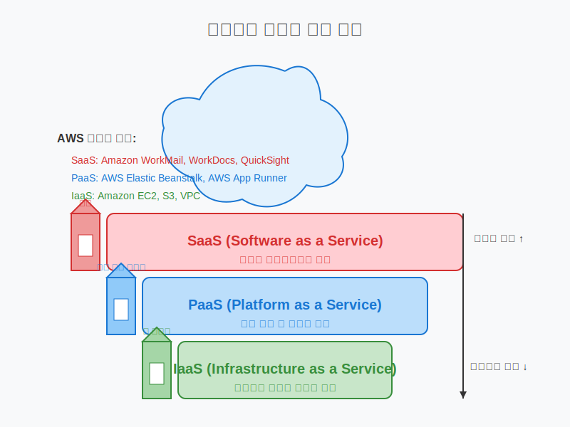

# 클라우드 서비스 모델 및 배포 모델

## 슬라이드 1: 클라우드 서비스 모델 개요
- 다양한 수준의 관리 및 제어 옵션 제공
- 비즈니스 요구사항에 맞는 모델 선택 가능
- 주요 모델: IaaS, PaaS, SaaS
- 책임 범위에 따른 분류

## 슬라이드 2: IaaS (Infrastructure as a Service)
- 가상화된 컴퓨팅 리소스 제공
- 사용자가 OS, 미들웨어, 애플리케이션 관리
- **비유**: 가구 없는 빈 아파트 임대
- **AWS 예시**: EC2, S3, VPC, EBS

## 슬라이드 3: IaaS 특징 및 장단점
- **특징**: 물리적 하드웨어 관리 불필요, 사용량 기반 과금
- **장점**: 높은 제어 수준, 유연성, 빠른 확장
- **단점**: 관리 부담, 전문 지식 필요
- **사용 사례**: 개발/테스트 환경, 웹사이트 호스팅, 빅데이터 분석

## 슬라이드 4: PaaS (Platform as a Service)
- 애플리케이션 개발/실행 환경 제공
- 사용자는 애플리케이션과 데이터만 관리
- **비유**: 기본 가구가 갖춰진 아파트 임대
- **AWS 예시**: Elastic Beanstalk, App Runner, Amplify

## 슬라이드 5: PaaS 특징 및 장단점
- **특징**: 개발 환경, 런타임, 미들웨어 제공
- **장점**: 개발 생산성 향상, 인프라 관리 부담 감소
- **단점**: 플랫폼 종속성, 제한된 커스터마이징
- **사용 사례**: 웹 애플리케이션, API, 모바일 백엔드

## 슬라이드 6: SaaS (Software as a Service)
- 완전한 애플리케이션을 서비스로 제공
- 사용자는 데이터와 액세스만 관리
- **비유**: 모든 것이 완비된 호텔 객실 이용
- **AWS 예시**: WorkMail, WorkDocs, QuickSight

## 슬라이드 7: SaaS 특징 및 장단점
- **특징**: 구독 기반 모델, 웹 브라우저 접근, 자동 업데이트
- **장점**: 최소한의 IT 지식 요구, 빠른 구현
- **단점**: 제한된 커스터마이징, 데이터 제어 우려
- **사용 사례**: 이메일, CRM, 협업 도구, 회계 시스템

## 슬라이드 8: 서비스 모델 비교
| 측면 | IaaS | PaaS | SaaS |
|------|------|------|------|
| 제어 수준 | 높음 | 중간 | 낮음 |
| 유연성 | 높음 | 중간 | 낮음 |
| 관리 부담 | 높음 | 중간 | 낮음 |
| 기술적 전문성 | 높음 | 중간 | 낮음 |
| 시장 출시 시간 | 느림 | 중간 | 빠름 |

## 슬라이드 9: 클라우드 배포 모델 개요
- 클라우드 인프라 배포 방식에 따른 분류
- 주요 모델: 퍼블릭, 프라이빗, 하이브리드, 멀티 클라우드
- 조직의 요구사항에 맞는 모델 선택 중요

## 슬라이드 10: 퍼블릭 클라우드
- 서비스 제공업체가 소유/운영하는 인프라
- 여러 고객이 동일 인프라 공유 (논리적 분리)
- **비유**: 대중교통 이용
- **AWS 예시**: 표준 AWS 서비스

## 슬라이드 11: 퍼블릭 클라우드 장단점
- **장점**: 초기 투자 비용 없음, 빠른 배포/확장
- **단점**: 데이터 위치 우려, 규정 준수 제약
- **사용 사례**: 웹 애플리케이션, 개발/테스트 환경, 이메일

## 슬라이드 12: 프라이빗 클라우드
- 단일 조직을 위한 전용 클라우드 환경
- 온프레미스 또는 호스팅 가능
- **비유**: 개인 차량 소유
- **AWS 예시**: AWS Outposts, VMware Cloud on AWS

## 슬라이드 13: 프라이빗 클라우드 장단점
- **장점**: 향상된 보안/개인정보, 규정 준수, 완전한 제어
- **단점**: 높은 초기 비용, 제한된 확장성, 전문 지식 필요
- **사용 사례**: 금융, 의료, 정부, 민감한 데이터 처리

## 슬라이드 14: 하이브리드 클라우드
- 퍼블릭과 프라이빗 환경 통합
- 데이터/애플리케이션 환경 간 공유
- **비유**: 평일은 대중교통, 주말은 개인차량
- **AWS 예시**: Direct Connect, Storage Gateway, VPN

## 슬라이드 15: 하이브리드 클라우드 장단점
- **장점**: 유연성, 비용 최적화, 점진적 클라우드 도입
- **단점**: 복잡한 아키텍처, 통합 문제, 관리 오버헤드
- **사용 사례**: 클라우드 버스팅, 재해 복구, 레거시 시스템 통합

## 슬라이드 16: 멀티 클라우드
- 여러 클라우드 제공업체 서비스 동시 사용
- 각 제공업체의 강점 활용
- **비유**: 버스, 지하철, 택시 등 상황에 맞게 선택
- **AWS 지원**: CloudFormation, Control Tower

## 슬라이드 17: 멀티 클라우드 장단점
- **장점**: 벤더 종속 방지, 최적 서비스 선택, 협상력 강화
- **단점**: 관리 복잡성, 보안 정책 유지 어려움, 데이터 전송 비용
- **사용 사례**: 글로벌 애플리케이션, 특정 서비스 활용, 규정 준수

## 슬라이드 18: 배포 모델 비교
| 측면 | 퍼블릭 | 프라이빗 | 하이브리드 | 멀티 |
|------|-------|---------|-----------|------|
| 초기 비용 | 낮음 | 높음 | 중간 | 중간 |
| 확장성 | 매우 높음 | 제한적 | 높음 | 매우 높음 |
| 보안 제어 | 제한적 | 높음 | 중간 | 복잡함 |
| 관리 복잡성 | 낮음 | 중간 | 높음 | 매우 높음 |

## 슬라이드 19: 적합한 모델 선택 기준
- 비즈니스 요구사항 (확장성, 비용, 보안)
- 기술적 요구사항 (제어 수준, 커스터마이징)
- 규정 준수 요구사항 (데이터 위치, 감사)
- 기존 인프라 및 투자
- 내부 기술 역량

## 슬라이드 20: Q&A 및 다음 강의 예고
- 클라우드 서비스 및 배포 모델에 대한 질문?
- 다음 강의: AWS 소개 및 주요 서비스 개요