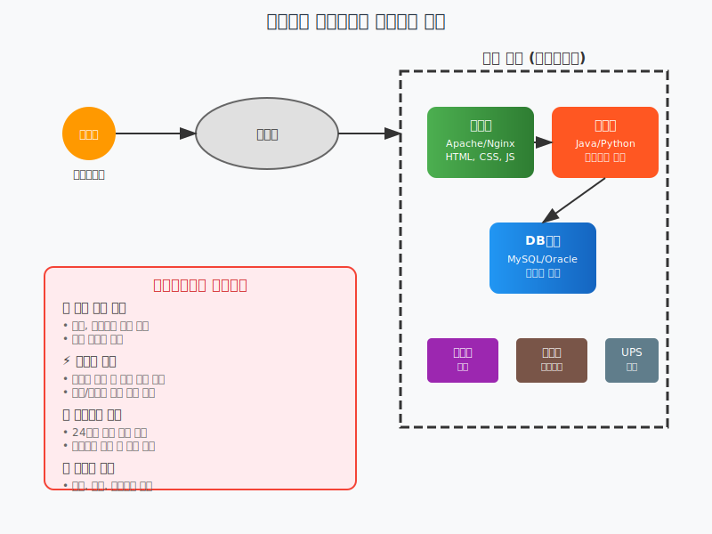

# 전통적인 웹서비스는 어떻게 돌아갈까?

## 🏠 우리가 매일 사용하는 웹사이트의 비밀

여러분이 매일 사용하는 네이버, 구글, 유튜브... 이런 웹사이트들이 어떻게 우리 컴퓨터에 나타나는지 궁금하지 않으셨나요?

**"그냥 주소창에 naver.com 치면 나오는 거 아닌가요?"** 

맞습니다! 하지만 그 뒤에는 정말 복잡하고 흥미로운 이야기가 숨어있어요.

## 🏢 회사 건물 안의 컴퓨터들

### 1. 웹서버 - "안내데스크 직원"
**비유**: 호텔 로비의 안내데스크 직원과 같아요.

- **하는 일**: 방문자(사용자)가 오면 가장 먼저 맞이해주는 역할
- **실제 역할**: HTML, CSS, JavaScript 파일을 사용자에게 전달
- **예시**: "네이버 메인페이지 주세요!" → "여기 있습니다!"

### 2. 애플리케이션 서버 - "실무진"
**비유**: 호텔의 실제 업무를 처리하는 직원들

- **하는 일**: 복잡한 계산이나 업무 처리
- **실제 역할**: 로그인 처리, 검색 기능, 결제 처리 등
- **예시**: "로그인 해주세요" → 아이디/비밀번호 확인 → "로그인 완료!"

### 3. 데이터베이스 서버 - "창고"
**비유**: 호텔의 모든 물건을 보관하는 창고

- **하는 일**: 모든 정보를 안전하게 보관
- **실제 역할**: 사용자 정보, 게시글, 사진 등 모든 데이터 저장
- **예시**: "김철수님 정보 찾아주세요" → "여기 있습니다!"

## 🔌 기타 필수 장비들

### 방화벽 - "경비원"
- **역할**: 나쁜 사람들이 들어오지 못하게 막아주는 보안 장비
- **비유**: 아파트 경비실의 경비아저씨

### 라우터 - "교통정리 경찰"
- **역할**: 인터넷 데이터가 올바른 곳으로 가도록 길을 안내
- **비유**: 교차로에서 교통정리하는 경찰관

### UPS (무정전 전원공급장치) - "비상 발전기"
- **역할**: 정전이 되어도 서버가 꺼지지 않도록 전력 공급
- **비유**: 병원의 비상 발전기

## 🤔 "그런데 이게 왜 문제가 될까요?"

### 💰 돈이 너무 많이 들어요!
**상황**: 작은 카페를 운영한다고 생각해보세요.

- **서버 구매**: 컴퓨터 한 대에 수백만원~수천만원
- **서버실 구축**: 에어컨, 전용 인터넷 회선, 보안 시설
- **관리 인력**: 24시간 지켜볼 사람 고용

**"카페 하나 하려고 했는데 IT 회사가 되어버렸어요!"**

### ⚡ 갑자기 손님이 많이 오면?
**상황**: 여러분의 웹사이트가 TV에 나와서 갑자기 유명해졌어요!

- **기존**: 동시 접속자 100명 처리 가능
- **갑자기**: 동시 접속자 10,000명!
- **결과**: 웹사이트 다운 💥

**해결 방법**: 서버를 더 사야 해요. 하지만...
- 서버 주문 → 배송 → 설치 → 설정 = **최소 1주일**
- 그 사이에 기회는 날아가버려요 😭

### 🔧 밤에 서버가 고장나면?
**상황**: 새벽 3시에 서버가 고장났어요!

- **일반 회사**: "내일 출근해서 고치지 뭐~"
- **웹서비스**: "지금 당장 고쳐야 해! 손님들이 기다리고 있어!"

**결과**: 
- 밤새 회사에 달려가서 수리
- 잠 못 자는 개발자들 😴
- 스트레스 MAX!

### 🏢 자연재해가 일어나면?
**상황**: 태풍, 지진, 화재 등이 발생했어요!

- **서버실 침수**: 모든 데이터 손실 위험
- **정전**: 웹사이트 완전 마비
- **복구**: 몇 주~몇 달 소요

**"백업이 있어도 복구하는 데 시간이 너무 오래 걸려요!"**

## 🌟 "그래서 클라우드가 나타났어요!"

### 클라우드란?
**쉬운 설명**: 내 컴퓨터가 아닌, 인터넷 어딘가에 있는 컴퓨터를 빌려 쓰는 것

**비유**: 
- **기존**: 집에서 직접 빵을 구워서 카페 운영
- **클라우드**: 빵 공장에서 필요한 만큼 빵을 주문해서 카페 운영

### 클라우드의 장점
1. **💰 비용 절약**: 필요한 만큼만 사용하고 돈을 내요
2. **⚡ 빠른 확장**: 클릭 몇 번으로 서버 추가
3. **🔧 관리 편함**: 고장나면 클라우드 회사에서 알아서 고쳐줘요
4. **🌍 안전함**: 전 세계 여러 곳에 백업

## 🎯 오늘 우리가 배울 것

**"온프레미스의 문제점을 클라우드로 어떻게 해결할까?"**

1. **AWS란 무엇인가?** - 세계 최대의 클라우드 서비스
2. **클라우드의 종류들** - IaaS, PaaS, SaaS가 뭔지 알아보기
3. **실제로 해보기** - AWS 계정 만들고 첫 번째 서버 띄워보기

## 💡 "아직도 이해가 안 되시나요?"

**괜찮습니다!** 

- 처음에는 모르는 게 당연해요
- 오늘 하루 종일 천천히 배워갈 거예요
- 궁금한 건 언제든지 질문하세요!

**"이런 것도 물어봐도 되나요?"** → **절대 금지!** 🚫

모든 질문이 소중하고, 여러분의 질문이 다른 사람에게도 도움이 됩니다.

---

## 🚀 다음 단계

이제 **"클라우드 컴퓨팅이 정확히 무엇인지"** 자세히 알아볼 시간입니다!

**준비되셨나요?** 함께 클라우드 세상으로 떠나봅시다! ☁️✨