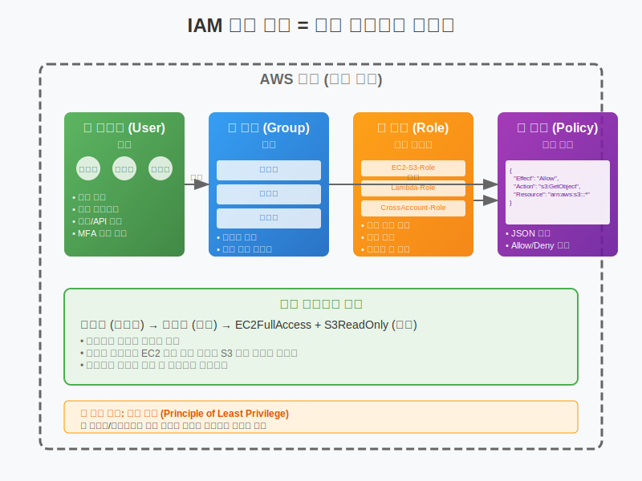

# Day 2-1: IAM 개념 및 구성 요소

## 📚 학습 목표
- IAM(Identity and Access Management)의 핵심 개념 이해
- 사용자, 그룹, 역할, 정책의 관계와 차이점 파악
- 회사 출입카드 시스템으로 IAM 구조 이해
- 루트 사용자와 IAM 사용자의 차이점 습득

---

## 🏢 IAM = 회사 출입카드 시스템 (30분)



### IAM이란?
```
Identity and Access Management
- Identity: 누구인가? (신원 확인)
- Access: 무엇을 할 수 있는가? (권한 관리)
- Management: 어떻게 관리하는가? (정책 수립)
```

### 회사 출입카드 시스템 비유
```
회사 건물 (AWS 계정)
├── 직원 (IAM 사용자)
├── 부서 (IAM 그룹)
├── 임시 방문증 (IAM 역할)
└── 출입 규칙 (IAM 정책)

예시:
- 김개발 (사용자) → 개발팀 (그룹) → 개발실 출입 가능 (정책)
- 박디자인 (사용자) → 디자인팀 (그룹) → 디자인실 출입 가능 (정책)
- 외부 컨설턴트 → 임시 방문증 (역할) → 회의실만 출입 가능
```

---

## 👤 IAM 사용자 (User) (30분)

### 사용자란?
```
정의: AWS 서비스를 사용하는 개별 개체
특징: 
- 고유한 이름과 자격 증명
- 개별적인 권한 설정 가능
- 사람 또는 애플리케이션 대표
```

### 루트 사용자 vs IAM 사용자
```
루트 사용자 (Root User):
- AWS 계정 생성 시 자동 생성
- 모든 권한 보유 (신과 같은 존재)
- 계정 삭제, 결제 정보 변경 가능
- 일상적 사용 금지 (응급상황만)

IAM 사용자:
- 루트 사용자가 생성
- 필요한 권한만 부여
- 일상적 작업용
- 개별 추적 및 관리 가능
```

### 사용자 인증 방법
```
1. 콘솔 액세스 (웹 브라우저):
   - 사용자명 + 비밀번호
   - MFA (다중 인증) 권장

2. 프로그래밍 액세스 (API/CLI):
   - Access Key ID
   - Secret Access Key
   - 코드에서 AWS 서비스 호출 시 사용
```

---

## 👥 IAM 그룹 (Group) (20분)

### 그룹이란?
```
정의: 동일한 권한이 필요한 사용자들의 집합
목적: 권한 관리 효율성 증대
특징: 사용자는 여러 그룹에 속할 수 있음
```

### 그룹 설계 예시
```
회사 조직도 기반:
├── Developers (개발자 그룹)
│   ├── EC2 인스턴스 관리
│   ├── S3 버킷 읽기/쓰기
│   └── CloudWatch 로그 조회
│
├── Administrators (관리자 그룹)
│   ├── 모든 서비스 관리
│   ├── 사용자 계정 관리
│   └── 비용 관리
│
└── ReadOnlyUsers (읽기 전용 그룹)
    ├── 모든 서비스 조회만
    ├── 리소스 생성/수정 불가
    └── 모니터링 대시보드 접근
```

### 그룹 관리 모범 사례
```
✅ 좋은 예:
- 역할 기반 그룹 생성 (개발자, 운영자, 분석가)
- 최소 권한 원칙 적용
- 정기적 그룹 권한 검토

❌ 나쁜 예:
- 개인별 그룹 생성 (김철수그룹, 박영희그룹)
- 과도한 권한 부여
- 그룹 권한 방치
```

---

## 🎭 IAM 역할 (Role) (30분)

### 역할이란?
```
정의: 임시로 권한을 빌려주는 시스템
비유: 회사 방문증, 대리 업무 권한
특징: 
- 영구적인 자격 증명 없음
- 필요할 때만 임시 사용
- 자동으로 권한 만료
```

### 역할 사용 시나리오
```
1. EC2 인스턴스가 S3에 접근:
   EC2 → IAM 역할 → S3 버킷 접근
   (하드코딩된 키 없이 안전한 접근)

2. 다른 AWS 계정에서 접근:
   외부 계정 → 역할 전환 → 우리 계정 리소스 접근
   (어제 실습한 강사 접근 권한)

3. 애플리케이션 간 권한 위임:
   Lambda 함수 → IAM 역할 → DynamoDB 접근
   (서버리스 환경에서 안전한 권한 관리)
```

### 역할 vs 사용자 비교
```
IAM 사용자:
- 영구적 자격 증명 (Access Key)
- 특정 개인/애플리케이션 전용
- 키 관리 부담
- 키 유출 위험

IAM 역할:
- 임시 자격 증명 (STS Token)
- 여러 개체가 공유 가능
- 자동 키 순환
- 보안성 높음
```

---

## 📋 IAM 정책 (Policy) (30분)

### 정책이란?
```
정의: 누가 무엇을 할 수 있는지 정의하는 JSON 문서
구조: 
- Effect: Allow 또는 Deny
- Action: 허용/거부할 작업
- Resource: 대상 리소스
- Condition: 추가 조건 (선택사항)
```

### 정책 예시
```json
{
  "Version": "2012-10-17",
  "Statement": [
    {
      "Effect": "Allow",
      "Action": [
        "s3:GetObject",
        "s3:PutObject"
      ],
      "Resource": "arn:aws:s3:::my-bucket/*"
    }
  ]
}
```

### 정책 유형
```
1. AWS 관리형 정책:
   - AWS에서 미리 만든 정책
   - 일반적인 사용 사례 커버
   - 자동 업데이트
   - 예: ReadOnlyAccess, PowerUserAccess

2. 고객 관리형 정책:
   - 사용자가 직접 생성
   - 특정 요구사항에 맞춤
   - 버전 관리 가능
   - 재사용 가능

3. 인라인 정책:
   - 특정 사용자/그룹/역할에만 직접 연결
   - 일회성 정책
   - 재사용 불가
   - 관리 복잡성 증가
```

---

## 🔗 IAM 구성 요소 관계도 (15분)

### 전체 구조
```
AWS 계정 (Root)
├── IAM 사용자들
│   ├── 김개발 → 개발자그룹 → 개발자정책
│   ├── 박운영 → 운영자그룹 → 운영자정책
│   └── 이분석 → 분석가그룹 → 분석가정책
│
├── IAM 그룹들
│   ├── 개발자그룹 → [개발자정책, 공통정책]
│   ├── 운영자그룹 → [운영자정책, 공통정책]
│   └── 분석가그룹 → [분석가정책, 공통정책]
│
├── IAM 역할들
│   ├── EC2-S3-Role → S3접근정책
│   ├── Lambda-DynamoDB-Role → DynamoDB접근정책
│   └── CrossAccount-Role → 교차계정정책
│
└── IAM 정책들
    ├── AWS 관리형 정책 (ReadOnlyAccess 등)
    ├── 고객 관리형 정책 (회사 맞춤형)
    └── 인라인 정책 (특수 목적)
```

### 권한 상속 및 결합
```
사용자 권한 = 개별 정책 + 그룹 정책들

예시: 김개발 사용자
├── 개인 정책: 특정 S3 버킷 접근
├── 개발자그룹 정책: EC2 관리 권한
├── 전체직원그룹 정책: 기본 조회 권한
└── 최종 권한: 위 모든 정책의 합집합
```

---

## 🔧 실습 준비 (15분)

### 실습 환경 확인
```
1. AWS 콘솔 로그인 확인
2. 현재 루트 계정으로 로그인 상태 확인
3. IAM 서비스 접속 (Services → IAM)
4. IAM 대시보드 확인
```

### IAM 대시보드 둘러보기
```
좌측 메뉴:
├── Users (사용자 관리)
├── Groups (그룹 관리)
├── Roles (역할 관리)
├── Policies (정책 관리)
├── Identity providers (외부 인증)
└── Account settings (계정 설정)

보안 상태 확인:
- Security recommendations
- 루트 계정 MFA 설정 여부
- IAM 사용자 생성 여부
```

---

## 📝 핵심 정리

### IAM 4대 구성 요소
1. **사용자 (User)**: 개별 개체의 신원
2. **그룹 (Group)**: 사용자들의 집합
3. **역할 (Role)**: 임시 권한 위임
4. **정책 (Policy)**: 권한 규칙 정의

### IAM 설계 원칙
- **최소 권한**: 필요한 최소한의 권한만 부여
- **역할 기반**: 업무 역할에 따른 권한 그룹화
- **정기 검토**: 권한의 정기적 점검 및 정리
- **MFA 적용**: 중요 계정에 다중 인증 설정

### 보안 모범 사례
- 루트 계정 일상 사용 금지
- 개별 IAM 사용자 계정 생성
- 강력한 비밀번호 정책 적용
- 정기적 액세스 키 순환

---

## 🤔 토론 주제

1. **회사에서 IAM을 어떻게 설계할까?**
   - 부서별 권한 구조
   - 임시직/인턴 권한 관리

2. **역할과 사용자 중 언제 무엇을 사용할까?**
   - 각각의 장단점과 적용 시나리오

---

## 📚 다음 시간 예고

**IAM 사용자 및 그룹 관리 실습**
- IAM 사용자 생성 및 권한 설정
- 그룹 생성 및 사용자 할당
- MFA(다중 인증) 설정
- 프로그래밍 방식 액세스 설정

---

> 💡 **오늘의 핵심**: IAM은 AWS 보안의 핵심입니다. 회사의 출입카드 시스템처럼 누가 어떤 리소스에 접근할 수 있는지를 체계적으로 관리하는 서비스입니다. 올바른 IAM 설계가 AWS 보안의 첫걸음입니다!