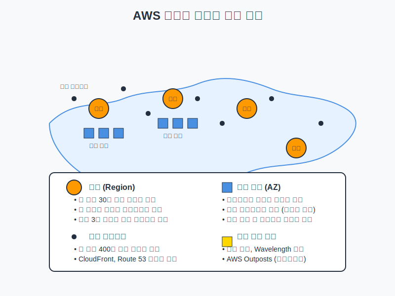

# AWS 글로벌 인프라 개요

## 슬라이드 1: AWS 글로벌 인프라란?
- AWS가 전 세계에 구축한 데이터 센터, 네트워크, 서비스 제공 지점
- 고가용성, 내결함성, 확장성을 제공하는 물리적 인프라
- 전 세계 30개 이상 리전, 100개 이상 가용 영역, 400개 이상 엣지 로케이션
- 지연 시간 최소화, 규정 준수, 재해 복구를 위한 설계

## 슬라이드 2: AWS 글로벌 인프라 주요 구성 요소
- **리전 (Regions)**: 지리적으로 분리된 독립 데이터 센터 집합
- **가용 영역 (Availability Zones)**: 리전 내 물리적으로 분리된 데이터 센터
- **엣지 로케이션 (Edge Locations)**: CloudFront, Route 53을 위한 전 세계 배포 지점
- **로컬 영역 (Local Zones)**: 사용자와 가까운 위치에 배치된 인프라
- **Wavelength 영역**: 5G 네트워크 내 AWS 서비스 배포
- **AWS Outposts**: 온프레미스 데이터 센터에 AWS 인프라 확장

## 슬라이드 3: AWS 리전 (Regions)
- 전 세계 지리적으로 분산된 독립 영역
- 각 리전은 완전히 독립적으로 운영
- 리전 간 데이터 전송은 명시적으로 활성화 필요
- 각 리전은 최소 3개 이상의 가용 영역으로 구성
- 리전별로 제공 서비스와 가격이 다를 수 있음
- **비유**: 각 도시에 있는 대형 백화점 체인점

## 슬라이드 4: 리전 명명 규칙 및 주요 리전
- **형식**: {대륙}-{방향}-{숫자}
- **예시**:
  - us-east-1: 미국 동부 (버지니아 북부)
  - ap-northeast-2: 아시아 태평양 (서울)
  - eu-west-1: 유럽 (아일랜드)
  - sa-east-1: 남미 (상파울루)

## 슬라이드 5: 가용 영역 (Availability Zones)
- 리전 내 물리적으로 분리된 데이터 센터 집합
- 독립적인 전력, 냉각, 물리적 보안 갖춤
- 고속 네트워크로 연결 (밀리초 단위 지연 시간)
- 가용 영역 간 물리적 거리는 수십 킬로미터
- 자연재해로부터 격리되도록 설계
- **비유**: 같은 도시 내 여러 소방서

## 슬라이드 6: 가용 영역 명명 및 설계 원칙
- **형식**: {리전 코드}{문자} (예: ap-northeast-2a)
- **설계 원칙**:
  - 고가용성: 여러 가용 영역에 리소스 배포
  - 내결함성: 자동 장애 조치 구현
  - 확장성: 수평적 확장 가능
  - 데이터 지역성: 가용 영역 간 데이터 복제

## 슬라이드 7: 엣지 로케이션 (Edge Locations)
- CloudFront와 Route 53을 위한 전 세계 배포 지점
- 리전보다 더 많은 위치에 존재 (400개 이상)
- 최종 사용자와 가까운 위치에서 콘텐츠 제공
- 정적 콘텐츠 캐싱 및 빠른 전송
- DDoS 보호 서비스의 첫 방어선 역할
- **비유**: 전국 각지에 있는 편의점

## 슬라이드 8: 엣지 로케이션 사용 서비스
- **Amazon CloudFront**: 글로벌 콘텐츠 전송 네트워크(CDN)
- **AWS Route 53**: 글로벌 DNS 서비스
- **AWS Shield**: DDoS 보호 서비스
- **AWS WAF**: 웹 애플리케이션 방화벽
- **Lambda@Edge**: 엣지에서 코드 실행

## 슬라이드 9: 리전 엣지 캐시
- 엣지 로케이션과 오리진 서버 사이에 위치
- 엣지 로케이션보다 더 큰 캐시 용량 제공
- 자주 액세스하지 않는 콘텐츠도 더 오래 캐시에 유지
- 오리진 서버로의 트래픽 감소
- **비유**: 편의점과 대형 물류 창고 사이의 중간 규모 물류 센터

## 슬라이드 10: 로컬 영역 (Local Zones)
- AWS 리전의 확장으로, 사용자와 더 가까운 위치에 배치
- 지연 시간에 민감한 애플리케이션을 위한 설계
- 특정 대도시 지역에 위치
- 단일 자리 밀리초 지연 시간 제공 (10ms 미만)
- 리전의 일부 핵심 서비스만 제공
- **비유**: 대형 병원의 분원

## 슬라이드 11: 로컬 영역 사용 사례
- **미디어 및 엔터테인먼트**: 비디오 렌더링, 실시간 스트리밍
- **게임**: 낮은 지연 시간이 필요한 게임 서버
- **전자 설계 자동화(EDA)**: 반도체 설계 시뮬레이션
- **실시간 통신**: 화상 회의, 실시간 협업 도구
- **금융 서비스**: 고주파 거래, 실시간 위험 분석

## 슬라이드 12: Wavelength 영역
- 5G 네트워크 내에 AWS 서비스 배포
- 모바일 디바이스 및 최종 사용자에게 초저지연 애플리케이션 제공
- 통신 사업자의 5G 네트워크 에지에 위치
- 모바일 디바이스와 직접 통신
- EC2, EBS, VPC 등 핵심 서비스 지원
- **비유**: 고속도로 휴게소의 응급 의료 시설

## 슬라이드 13: Wavelength 영역 사용 사례
- **자율 주행 차량**: 실시간 데이터 처리 및 의사 결정
- **스마트 시티**: 실시간 센서 데이터 분석
- **증강 현실(AR) 및 가상 현실(VR)**: 실시간 렌더링
- **실시간 게임**: 모바일 게임 지연 시간 최소화
- **산업용 IoT**: 실시간 모니터링 및 제어

## 슬라이드 14: AWS Outposts
- AWS 인프라를 온프레미스 데이터 센터로 확장
- AWS가 설계, 설치, 관리하는 하드웨어
- 온프레미스에서 AWS 서비스 실행
- AWS 리전과 동일한 API, 도구, 인프라 사용
- 지연 시간이 매우 낮은 워크로드에 적합
- **비유**: 집에 설치하는 정수기

## 슬라이드 15: AWS Outposts 사용 사례
- **지연 시간에 민감한 워크로드**: 제조 현장의 기계 제어
- **로컬 데이터 처리**: 현장에서 데이터 처리 후 결과만 클라우드로 전송
- **데이터 상주 요구 사항**: 특정 국가나 지역에 데이터가 물리적으로 위치해야 하는 경우
- **하이브리드 클라우드**: 온프레미스와 클라우드 환경의 일관된 경험
- **마이그레이션**: 단계적 클라우드 마이그레이션

## 슬라이드 16: AWS 리전 선택 전략
- **지연 시간**: 사용자와 지리적 근접성
- **데이터 주권 및 규제**: 데이터 상주 요구사항, 개인정보보호법
- **서비스 가용성**: 필요한 서비스 제공 여부
- **비용 차이**: 리전별 가격, 데이터 전송 비용
- **재해 복구**: 기본 리전과 지리적으로 충분히 떨어진 보조 리전

## 슬라이드 17: AWS 글로벌 인프라 설계 원칙
- **고가용성 설계**: 여러 가용 영역에 리소스 배포
- **내결함성 설계**: 단일 장애 지점 제거
- **확장성 설계**: 수평적 확장, 자동 확장 구현
- **글로벌 배포 전략**: 지리적 라우팅, 글로벌 콘텐츠 전송

## 슬라이드 18: AWS 글로벌 인프라 모니터링 및 관리
- **AWS 서비스 상태 대시보드**: 모든 AWS 서비스의 현재 상태
- **AWS Personal Health Dashboard**: 개인화된 서비스 상태 보기
- **AWS Trusted Advisor**: 환경 최적화 권장사항
- **AWS Config**: 리소스 구성 평가 및 감사

## 슬라이드 19: 실제 사례 - 넷플릭스
- 전 세계 수백만 사용자에게 스트리밍 서비스 제공
- 여러 리전에 걸쳐 서비스 배포
- CloudFront를 통한 콘텐츠 전송
- 가용 영역 간 자동 장애 조치
- 리전 장애에도 서비스 지속 가능

## 슬라이드 20: 핵심 요약 및 Q&A
- AWS 글로벌 인프라는 리전, 가용 영역, 엣지 로케이션 등으로 구성
- 고가용성, 내결함성, 확장성, 낮은 지연 시간 제공
- 리전 선택 시 여러 요소 고려 필요
- 효과적인 활용으로 안정적이고 확장 가능한 아키텍처 구축 가능
- 질문 및 토론