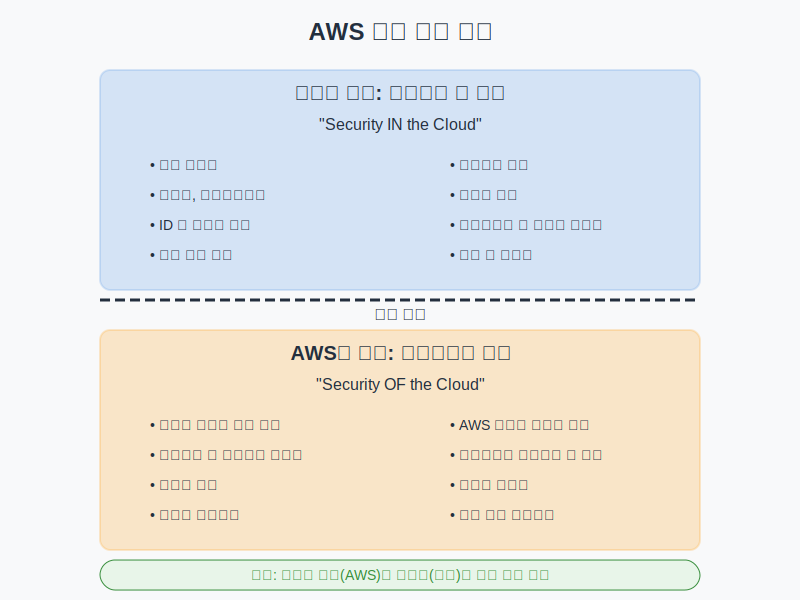
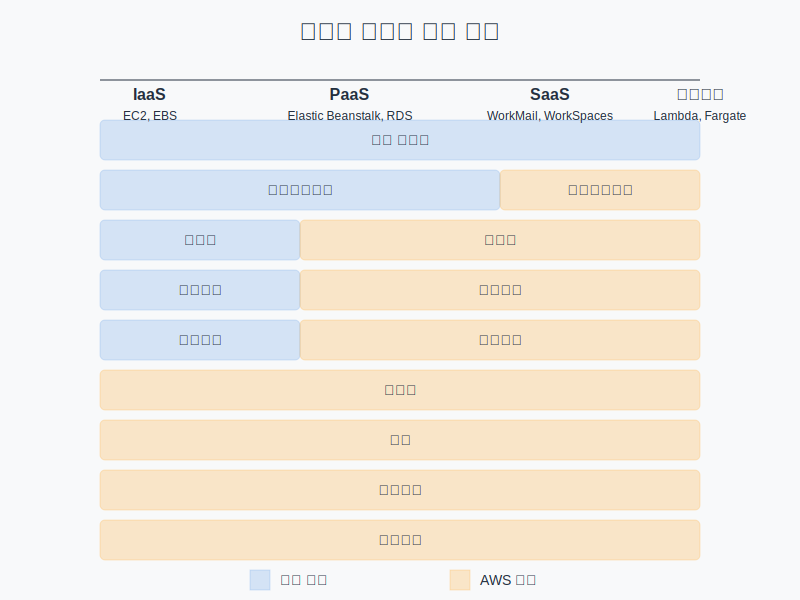

# AWS 공동 책임 모델

## 슬라이드 1: AWS 공동 책임 모델이란?
- 클라우드 보안의 핵심 개념
- AWS와 고객 간의 보안 책임 명확히 구분
- "클라우드 자체의 보안"과 "클라우드 내부의 보안"으로 책임 분담
- 클라우드 서비스를 안전하게 운영하기 위한 기본 원칙

## 슬라이드 2: 공동 책임 모델의 중요성
- 보안 책임의 명확한 구분으로 혼란 방지
- 보안 위험 관리를 위한 체계적인 접근 제공
- 규정 준수 요구사항 충족을 위한 기반 마련
- 효과적인 보안 전략 수립 지원
- 클라우드 도입의 장벽 감소
- **비유**: 아파트 건물과 입주자의 관계

## 슬라이드 3: AWS의 책임 - 클라우드의 보안
- **물리적 인프라 보호**:
  - 데이터 센터 물리적 접근 제어
  - 환경 위험 보호 (화재, 홍수, 정전 등)
  - 물리적 서버, 스토리지, 네트워킹 장비 보안
- **하드웨어 및 소프트웨어 인프라**:
  - 호스트 운영 체제 패치 및 업데이트
  - 하이퍼바이저 보안 및 패치
  - 내부 서비스 소프트웨어 보안

## 슬라이드 4: AWS의 책임 - 계속
- **네트워크 인프라**:
  - 네트워크 디바이스 구성 및 관리
  - 네트워크 트래픽 보호
  - DDoS 방어 인프라
- **가상화 인프라**:
  - 하이퍼바이저 보안
  - 인스턴스 격리
  - 가상 네트워크 격리
- **규정 준수 프로그램**:
  - ISO 27001, SOC, PCI DSS, HIPAA 등

## 슬라이드 5: 고객의 책임 - 클라우드 내 보안
- **데이터 암호화**:
  - 저장 데이터 암호화 구성
  - 전송 중 데이터 암호화 구성
  - 암호화 키 관리
  - 민감한 데이터 식별 및 분류
- **네트워크 트래픽 보호**:
  - VPC 설계 및 구성
  - 보안 그룹 및 NACL 규칙 정의
  - 인터넷 게이트웨이 및 NAT 게이트웨이 관리

## 슬라이드 6: 고객의 책임 - 계속
- **운영 체제, 네트워크, 방화벽 구성**:
  - 운영 체제 패치 및 업데이트
  - 호스트 기반 방화벽 구성
  - 취약점 관리
- **IAM 관리**:
  - IAM 사용자, 그룹, 역할 관리
  - 권한 및 정책 구성
  - 최소 권한 원칙 적용
  - 다중 인증(MFA) 구현
- **고객 데이터**:
  - 데이터 분류 및 처리
  - 데이터 백업 및 복구
  - 데이터 보존 및 삭제

## 슬라이드 7: 서비스 모델별 책임 분담

## 슬라이드 8: IaaS (Infrastructure as a Service)
- **정의**: 가상화된 컴퓨팅 리소스 제공
- **AWS 책임**:
  - 물리적 인프라
  - 네트워크 인프라
  - 가상화 계층
  - 호스트 하드웨어
- **고객 책임**:
  - 게스트 운영 체제
  - 애플리케이션
  - 데이터
  - 네트워크 구성
  - 패치 관리
- **AWS 예시**: EC2, EBS, VPC

## 슬라이드 9: PaaS (Platform as a Service)
- **정의**: 애플리케이션 개발/실행 환경 제공
- **AWS 책임**:
  - IaaS의 모든 책임
  - 운영 체제
  - 애플리케이션 플랫폼
- **고객 책임**:
  - 애플리케이션 코드
  - 데이터
  - 애플리케이션 구성
  - 사용자 인증 및 권한 부여
- **AWS 예시**: Elastic Beanstalk, Lambda, RDS

## 슬라이드 10: SaaS (Software as a Service)
- **정의**: 완전한 애플리케이션을 서비스로 제공
- **AWS/서비스 제공업체 책임**:
  - PaaS의 모든 책임
  - 애플리케이션 소프트웨어
  - 애플리케이션 보안
- **고객 책임**:
  - 데이터
  - 사용자 액세스 관리
  - 클라이언트 디바이스 보안
- **AWS 예시**: WorkMail, WorkSpaces, Chime

## 슬라이드 11: 서버리스 컴퓨팅
- **정의**: 인프라 관리 없이 코드 실행 환경 제공
- **AWS 책임**:
  - 물리적 인프라
  - 운영 체제
  - 런타임 환경
  - 확장성 및 가용성
  - 패치 관리
- **고객 책임**:
  - 함수/코드
  - 데이터
  - 함수 구성
  - 권한 설정
- **AWS 예시**: Lambda, API Gateway, Step Functions

## 슬라이드 12: 웹 애플리케이션 호스팅 사례 (EC2)
- **AWS 책임**:
  - EC2 인스턴스가 실행되는 물리적 서버 보안
  - 하이퍼바이저 보안 및 패치
  - 네트워크 인프라 보안
- **고객 책임**:
  - EC2 인스턴스의 운영 체제 패치
  - 웹 서버 소프트웨어 설치 및 보안 구성
  - 애플리케이션 코드 보안
  - 방화벽 및 보안 그룹 구성
  - SSL/TLS 인증서 관리

## 슬라이드 13: 데이터베이스 관리 사례
- **RDS (관리형 서비스)**:
  - **AWS 책임**: DB 엔진 설치/패치, OS 패치, 백업 자동화, 고가용성 구성
  - **고객 책임**: 스키마 설계, 액세스 제어, 파라미터 구성, 암호화 설정
- **EC2 기반 데이터베이스**:
  - **AWS 책임**: 물리적 인프라, 하이퍼바이저 보안
  - **고객 책임**: OS 설치/패치, DB 소프트웨어 설치/패치, 백업/복구, 고가용성 구성

## 슬라이드 14: 서버리스 애플리케이션 사례 (Lambda)
- **AWS 책임**:
  - 런타임 환경 제공 및 유지 관리
  - 자동 확장 및 고가용성
  - 운영 체제 패치 및 보안
  - 로깅 인프라
- **고객 책임**:
  - 함수 코드 보안
  - 의존성 패키지 관리
  - 함수 구성 (메모리, 시간 제한 등)
  - IAM 역할 및 권한 설정
  - 데이터 암호화

## 슬라이드 15: 컨테이너 워크로드 사례 (ECS/EKS)
- **AWS 책임**:
  - 컨테이너 오케스트레이션 플랫폼 관리
  - 기본 인프라 보안
  - 컨트롤 플레인 보안 (EKS의 경우)
- **고객 책임**:
  - 컨테이너 이미지 보안
  - 애플리케이션 코드 보안
  - 컨테이너 구성
  - 네트워크 정책 및 보안 그룹
  - 비밀 관리

## 슬라이드 16: 보안 평가 및 계획 모범 사례
- 사용 중인 AWS 서비스별 책임 경계 문서화
- 보안 책임 매트릭스 작성
- 정기적인 보안 평가 수행
- 클라우드 보안 프레임워크 채택
- 보안 요구사항을 아키텍처 설계에 통합
- **구현 도구**: AWS Trusted Advisor, Security Hub, Well-Architected Tool

## 슬라이드 17: 지속적인 모니터링 및 감사 모범 사례
- 중앙 집중식 로깅 구현
- 보안 이벤트 모니터링 자동화
- 정기적인 보안 감사 수행
- 취약점 스캔 및 침투 테스트 실시
- 규정 준수 모니터링 자동화
- **구현 도구**: CloudWatch, CloudTrail, Config, GuardDuty, Inspector

## 슬라이드 18: 자동화된 보안 제어 모범 사례
- 인프라를 코드로 관리 (IaC)
- 보안 구성 자동화
- 패치 관리 자동화
- 정책 적용 자동화
- 자동화된 대응 구현
- **구현 도구**: CloudFormation, Systems Manager, Config Rules, Lambda

## 슬라이드 19: 최소 권한 원칙 및 데이터 보호 모범 사례
- **최소 권한 원칙**:
  - 기본적으로 모든 액세스 거부
  - 필요한 최소 권한만 부여
  - 권한 정기적 검토
- **데이터 보호 전략**:
  - 저장 데이터 암호화
  - 전송 중 데이터 암호화
  - 키 관리 전략 수립
  - 데이터 분류 및 처리 정책 구현

## 슬라이드 20: 핵심 요약 및 Q&A
- AWS 공동 책임 모델은 AWS와 고객 간 보안 책임 구분
- AWS: "클라우드 자체의 보안" 담당
- 고객: "클라우드 내부의 보안" 담당
- 서비스 모델에 따라 책임 경계가 달라짐
- 효과적인 구현을 위한 모범 사례 적용 필요
- 질문 및 토론