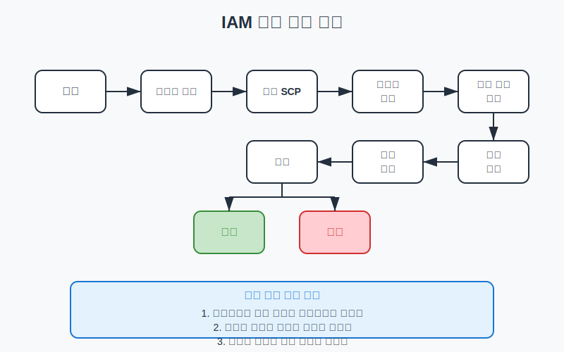

# IAM 개요 및 기본 개념

## 슬라이드 1: IAM이란?
- AWS Identity and Access Management
- AWS 리소스에 대한 액세스를 안전하게 제어하는 서비스
- 사용자, 그룹, 역할 생성 및 관리
- 세밀한 권한 제어 제공
- **비유**: 건물의 보안 시스템과 같음

## 슬라이드 2: IAM의 주요 특징
- **AWS 계정에 기본 포함**: 추가 비용 없음
- **글로벌 서비스**: 리전에 종속되지 않음
- **세분화된 권한**: 특정 리소스에 대한 특정 작업 허용/거부
- **자격 증명 페더레이션**: 외부 자격 증명 공급자와 통합
- **다중 인증(MFA) 지원**: 추가 보안 계층 제공
- **무료 서비스**: IAM 사용에 대한 추가 요금 없음

## 슬라이드 3: IAM의 주요 목적
- **액세스 관리**: AWS 리소스에 대한 액세스 세밀하게 제어
- **최소 권한 원칙 적용**: 필요한 최소한의 권한만 부여
- **자격 증명 관리**: 사용자, 그룹, 역할 관리
- **권한 위임**: 타사 또는 다른 AWS 계정에 제한된 권한 위임
- **중앙 집중식 제어**: 모든 리소스에 대한 액세스 정책 중앙 관리
- **보안 강화**: MFA, 암호 정책 등을 통한 보안 강화

## 슬라이드 4: IAM 핵심 구성 요소


## 슬라이드 5: IAM 사용자
- AWS와 상호작용하는 개인 또는 서비스를 나타내는 자격 증명
- 고유한 이름과 ARN(Amazon Resource Name) 보유
- 장기 자격 증명(암호, 액세스 키) 사용
- 기본적으로 권한 없음 (명시적으로 부여해야 함)
- **사용자 유형**:
  - **인간 사용자**: 콘솔 로그인, 암호 사용, MFA 권장
  - **시스템 사용자**: API 호출, 액세스 키 사용

## 슬라이드 6: IAM 그룹
- IAM 사용자의 모음
- 여러 사용자에 대한 권한 관리 간소화
- 정책을 그룹에 연결하면 모든 사용자가 권한 상속
- 사용자는 여러 그룹에 속할 수 있음
- 그룹은 다른 그룹의 멤버가 될 수 없음
- **일반적인 그룹 예시**:
  - Administrators, Developers, Operations, Security, ReadOnly

## 슬라이드 7: IAM 역할
- 특정 권한을 가진 AWS 자격 증명
- 임시 자격 증명 제공 (장기 자격 증명 사용 안 함)
- 신뢰 정책과 권한 정책으로 구성
- **비유**: 호텔 객실 키카드 (체크인 시 받고 체크아웃 시 반납)
- **주요 사용 사례**:
  - AWS 서비스 역할 (EC2, Lambda 등)
  - 교차 계정 액세스
  - ID 페더레이션
  - 애플리케이션 코드 내 임시 자격 증명

## 슬라이드 8: IAM 정책
- AWS 서비스와 리소스에 대한 권한을 정의하는 JSON 문서
- 사용자, 그룹, 역할에 연결하여 권한 부여
- 기본적으로 모든 액세스 거부
- 명시적 허용 또는 거부 규칙 정의
- **정책 유형**:
  - 자격 증명 기반 정책 (관리형, 인라인)
  - 리소스 기반 정책
  - 권한 경계
  - 서비스 제어 정책(SCP)
  - 세션 정책

## 슬라이드 9: 정책 구조
```json
{
  "Version": "2012-10-17",
  "Statement": [
    {
      "Effect": "Allow",
      "Action": ["s3:GetObject", "s3:ListBucket"],
      "Resource": [
        "arn:aws:s3:::example-bucket",
        "arn:aws:s3:::example-bucket/*"
      ],
      "Condition": {
        "IpAddress": {
          "aws:SourceIp": "192.0.2.0/24"
        }
      }
    }
  ]
}
```

## 슬라이드 10: 정책 구조 요소
- **Version**: 정책 언어 버전 (항상 "2012-10-17" 사용 권장)
- **Statement**: 권한 설명의 배열
  - **Effect**: "Allow" 또는 "Deny"
  - **Action**: 허용/거부할 서비스 작업
  - **Resource**: 작업이 적용되는 AWS 리소스
  - **Principal**: 정책이 적용되는 대상 (리소스 정책에만 사용)
  - **Condition**: 정책이 적용되는 조건 (선택 사항)

## 슬라이드 11: IAM 작동 방식 - 인증 및 권한 부여
- **인증 프로세스**:
  1. 사용자가 AWS에 요청 전송
  2. AWS가 요청자의 자격 증명 확인
  3. 자격 증명이 유효하면 인증 성공
- **권한 부여 프로세스**:
  1. AWS가 요청에 적용되는 모든 정책 평가
  2. 정책 평가 로직에 따라 요청 허용/거부 결정
  3. 결정에 따라 요청 처리 또는 액세스 거부

## 슬라이드 12: 정책 평가 로직



## 슬라이드 13: 정책 평가 기본 규칙
- 기본적으로 모든 요청은 **묵시적으로 거부**됨
- 명시적 허용은 묵시적 거부를 재정의
- 명시적 거부는 모든 허용을 재정의
- 정책 평가는 요청 컨텍스트에 따라 결정됨
- **평가 순서**:
  1. 조직 SCP
  2. 리소스 기반 정책
  3. 자격 증명 기반 정책
  4. IAM 권한 경계
  5. 세션 정책

## 슬라이드 14: ARN(Amazon Resource Name)
- AWS 리소스를 고유하게 식별하는 방법
- IAM 정책에서 리소스 지정 시 사용
- **ARN 형식**: `arn:partition:service:region:account-id:resource-type/resource-id`
- **예시**:
  - IAM 사용자: `arn:aws:iam::123456789012:user/Bob`
  - S3 버킷: `arn:aws:s3:::example-bucket`
  - DynamoDB 테이블: `arn:aws:dynamodb:us-west-2:123456789012:table/MyTable`

## 슬라이드 15: 정책 변수 및 태그
- 동적 권한 구현을 위한 변수 사용
- **정책 변수 예시**:
  - `${aws:username}`: 현재 사용자 이름
  - `${aws:userid}`: 현재 사용자 고유 ID
  - `${aws:PrincipalTag/key-name}`: 주체에 연결된 태그
- **속성 기반 액세스 제어(ABAC)**:
  - 태그를 사용한 동적 권한 제어
  - 사용자와 리소스의 태그 일치 시 액세스 허용

## 슬라이드 16: IAM 보안 모범 사례 - 루트 사용자 및 최소 권한
- **루트 사용자 보호**:
  - 루트 사용자 사용 최소화
  - 강력한 암호 설정
  - MFA 활성화
  - 액세스 키 생성 금지
- **최소 권한 원칙 적용**:
  - 필요한 최소한의 권한만 부여
  - 정기적으로 권한 검토
  - AWS Access Analyzer 활용
  - 권한 경계 사용

## 슬라이드 17: IAM 보안 모범 사례 - 그룹 및 암호 정책
- **그룹을 사용한 권한 관리**:
  - 공통 책임에 따라 그룹 생성
  - 그룹에 정책 연결
  - 개별 사용자에게 직접 권한 할당 지양
- **강력한 암호 정책 적용**:
  - 최소 암호 길이 요구
  - 복잡성 요구사항 적용
  - 암호 재사용 방지
  - 정기적인 암호 변경 요구

## 슬라이드 18: IAM 보안 모범 사례 - MFA 및 액세스 키
- **MFA 활성화**:
  - 모든 IAM 사용자에 대해 MFA 활성화
  - 권한이 높은 사용자에 대해 MFA 필수화
  - 다양한 MFA 옵션 제공
- **액세스 키 보안**:
  - 액세스 키 정기적 교체
  - 사용하지 않는 액세스 키 비활성화
  - 소스 코드에 액세스 키 저장 금지
  - 가능한 경우 역할 사용

## 슬라이드 19: IAM Identity Center (이전 AWS SSO)
- AWS 계정 및 클라우드 애플리케이션에 대한 SSO 액세스 관리
- **주요 기능**:
  - 여러 AWS 계정에 대한 중앙 집중식 액세스 관리
  - 기업 디렉터리 통합 (Active Directory, SAML 2.0 IdP)
  - 세분화된 권한 관리
  - 사용자 포털을 통한 간편한 액세스
  - 다중 계정 권한 세트

## 슬라이드 20: 핵심 요약 및 Q&A
- IAM은 AWS 리소스에 대한 액세스를 안전하게 제어하는 핵심 서비스
- 사용자, 그룹, 역할, 정책을 통한 세밀한 권한 관리
- 최소 권한 원칙, MFA, 강력한 암호 정책 등의 보안 모범 사례 적용
- 임시 자격 증명 사용 권장
- 질문 및 토론