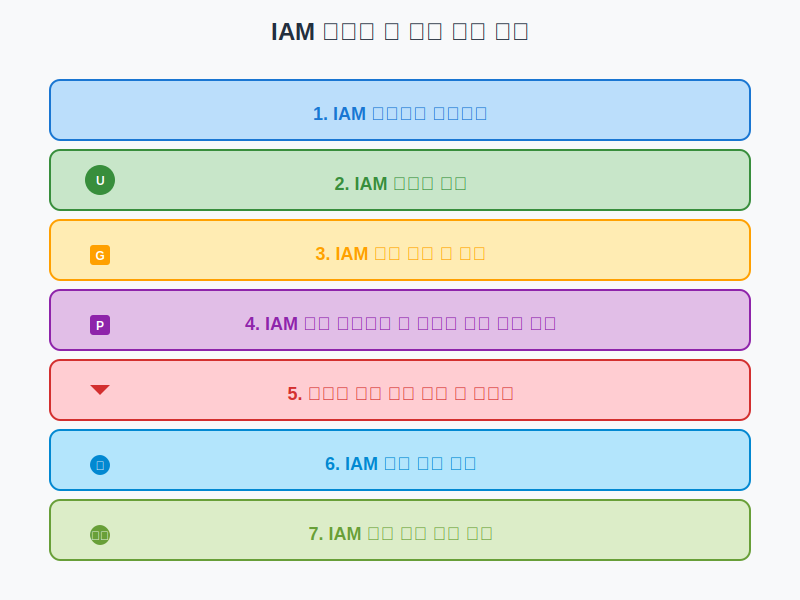

# 실습: IAM 사용자 및 그룹 관리

## 슬라이드 1: 실습 개요
- AWS Identity and Access Management(IAM) 사용자와 그룹 관리
- AWS 리소스에 대한 액세스 안전하게 제어
- 최소 권한 원칙 적용하여 보안 강화
- 실습을 통한 IAM 핵심 기능 학습



## 슬라이드 2: 학습 목표
- IAM 사용자 생성 및 관리 방법 습득
- IAM 그룹 생성 및 관리 방법 습득
- IAM 정책 연결 및 권한 테스트 방법 이해
- IAM 암호 정책 구성 방법 학습
- IAM 보안 모범 사례 적용 방법 습득

## 슬라이드 3: 사전 준비 사항
- AWS 계정 액세스
- AWS Management Console 로그인 정보
- 관리자 권한 (AdministratorAccess 또는 IAM 관련 권한)
- 웹 브라우저 (Chrome, Firefox, Safari, Edge 최신 버전)
- 실습 가이드 문서

## 슬라이드 4: IAM 대시보드 살펴보기
- IAM 대시보드 접근 방법
- 보안 권장 사항 확인
  - 루트 사용자 MFA 활성화 상태
  - 개별 IAM 사용자 생성 상태
  - 그룹을 사용한 권한 관리 상태
- 계정 정보 확인
  - AWS 계정 ID
  - 계정 별칭
  - IAM 사용자 로그인 링크

## 슬라이드 5: IAM 사용자 생성 - 관리자 사용자
- IAM 대시보드 > 사용자 > 사용자 추가
- 사용자 세부 정보 설정
  - 사용자 이름: `admin-user`
  - AWS Management Console 액세스 선택
  - 콘솔 암호 옵션 선택
- 권한 설정
  - "기존 정책 직접 연결" 선택
  - "AdministratorAccess" 정책 연결
- 태그 추가 (선택 사항)
- 사용자 생성 및 자격 증명 다운로드

## 슬라이드 6: IAM 사용자 생성 - 일반 사용자 및 API 사용자
- **일반 사용자**:
  - 사용자 이름: `regular-user`
  - AWS Management Console 액세스 선택
  - 초기에는 권한 없음
- **API 사용자**:
  - 사용자 이름: `api-user`
  - 프로그래밍 방식 액세스 선택
  - "ReadOnlyAccess" 정책 연결
  - 액세스 키 ID와 비밀 액세스 키 저장

## 슬라이드 7: IAM 그룹 생성
- IAM 대시보드 > 사용자 그룹 > 그룹 생성
- **관리자 그룹**:
  - 그룹 이름: `Administrators`
  - "AdministratorAccess" 정책 연결
- **개발자 그룹**:
  - 그룹 이름: `Developers`
  - "PowerUserAccess" 정책 연결
- **읽기 전용 그룹**:
  - 그룹 이름: `ReadOnly`
  - "ReadOnlyAccess" 정책 연결

## 슬라이드 8: 사용자를 그룹에 추가
- 그룹 선택 > 사용자 탭 > 사용자 추가
- `admin-user`를 Administrators 그룹에 추가
- `regular-user`를 ReadOnly 그룹에 추가
- `api-user`를 Developers 그룹에 추가
- 그룹 구성원 확인
- 사용자별 권한 확인

## 슬라이드 9: AWS 관리형 정책 살펴보기
- IAM 대시보드 > 정책
- 주요 AWS 관리형 정책 확인:
  - AdministratorAccess
  - PowerUserAccess
  - ReadOnlyAccess
  - AmazonS3ReadOnlyAccess
  - AmazonEC2FullAccess
- 정책 세부 정보 페이지에서 JSON 문서 확인

## 슬라이드 10: 사용자 지정 정책 생성 (시각적 편집기)
- IAM 대시보드 > 정책 > 정책 생성
- 시각적 편집기 사용:
  - 서비스: "S3"
  - 작업: "GetObject", "ListBucket", "PutObject"
  - 리소스: 모든 버킷 및 객체
  - 조건: aws:PrincipalTag/Department = Development
- 정책 이름: `CustomS3DeveloperAccess`
- 설명: `Allow developers to read and write objects in S3 buckets`

## 슬라이드 11: 사용자 지정 정책 생성 (JSON 편집기)
```json
{
  "Version": "2012-10-17",
  "Statement": [
    {
      "Effect": "Allow",
      "Action": [
        "ec2:Describe*",
        "ec2:Get*",
        "ec2:List*"
      ],
      "Resource": "*"
    },
    {
      "Effect": "Allow",
      "Action": [
        "cloudwatch:GetMetricData",
        "cloudwatch:GetMetricStatistics",
        "cloudwatch:ListMetrics"
      ],
      "Resource": "*"
    }
  ]
}
```

## 슬라이드 12: 사용자 지정 정책 연결
- IAM 대시보드 > 사용자 그룹
- "Developers" 그룹 > 권한 추가 > 정책 연결
  - "CustomS3DeveloperAccess" 정책 선택
- "ReadOnly" 그룹 > 권한 추가 > 정책 연결
  - "EC2MonitoringAccess" 정책 선택
- 그룹 권한 확인

## 슬라이드 13: 정책 시뮬레이터 사용
- IAM 대시보드 > 액세스 분석기 > 정책 검증
- 정책 소스: "사용자" > `regular-user` 선택
- 서비스: "Amazon EC2"
- 작업 선택:
  - DescribeInstances
  - RunInstances
  - TerminateInstances
- 결과 확인:
  - DescribeInstances: 허용됨
  - RunInstances: 거부됨
  - TerminateInstances: 거부됨

## 슬라이드 14: IAM 암호 정책 구성
- IAM 대시보드 > 계정 설정 > 암호 정책
- 암호 정책 강화:
  - 최소 암호 길이: 12
  - 대문자, 소문자, 숫자, 영숫자 외 문자 필요
  - 암호 만료 활성화: 90일
  - 암호 재사용 방지: 이전 5개 암호
- 변경 사항 저장

## 슬라이드 15: MFA 활성화
- IAM 대시보드 > 사용자 > `admin-user`
- 보안 자격 증명 탭 > MFA 디바이스 할당
- 가상 MFA 디바이스 선택
- QR 코드 스캔 또는 비밀 키 수동 입력
- 연속된 두 개의 MFA 코드 입력
- MFA 할당 완료

## 슬라이드 16: 액세스 키 관리
- IAM 대시보드 > 사용자 > `api-user`
- 보안 자격 증명 탭 > 액세스 키 섹션
- 액세스 키 교체 프로세스:
  1. 새 액세스 키 생성
  2. 새 키로 애플리케이션 업데이트
  3. 이전 키 비활성화
  4. 애플리케이션 테스트
  5. 이전 키 삭제

## 슬라이드 17: IAM 자격 증명 보고서
- IAM 대시보드 > 자격 증명 보고서
- 보고서 생성 및 다운로드
- 주요 확인 사항:
  - 사용자 생성 날짜
  - 암호 활성화 상태
  - 암호 마지막 사용 날짜
  - MFA 활성화 상태
  - 액세스 키 상태 및 마지막 사용 날짜

## 슬라이드 18: 정리 (선택 사항)
- 실습 완료 후 리소스 정리
- **사용자 삭제**: 사용자 선택 > 삭제
- **그룹 삭제**: 그룹 선택 > 삭제
- **사용자 지정 정책 삭제**: 정책 선택 > 작업 > 삭제
- 실제 환경에서는 필요한 리소스만 유지

## 슬라이드 19: 문제 해결 가이드
- **권한 오류**: 필요한 권한 확인, 정책 시뮬레이터 사용
- **MFA 설정 문제**: 디바이스 시간 확인, QR 코드 재스캔
- **암호 정책 적용 문제**: 새 암호 또는 변경 시에만 적용
- **액세스 키 문제**: 활성 상태 확인, 올바른 키 사용

## 슬라이드 20: 실습 결과 및 다음 단계
- **실습 결과물**:
  - 다양한 권한을 가진 IAM 사용자
  - 역할 기반 IAM 그룹
  - 사용자 지정 IAM 정책
  - 강화된 암호 정책
  - MFA로 보호된 사용자 계정
- **다음 단계**:
  - IAM 역할 및 임시 자격 증명
  - 다중 계정 관리 전략
  - ID 페더레이션 및 AWS SSO