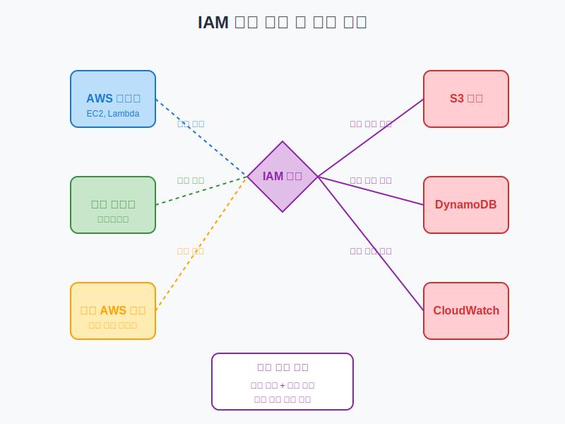
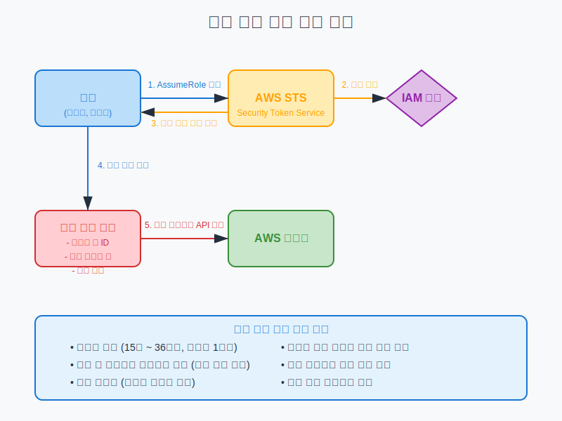

# IAM 역할 및 임시 자격 증명

## 슬라이드 1: IAM 역할 개요
- AWS 리소스에 액세스할 수 있는 권한 세트
- 특정 엔티티에 임시로 권한 부여
- 장기 자격 증명(액세스 키) 대신 임시 자격 증명 사용
- 최소 권한 원칙과 보안 모범 사례 구현에 필수
- **비유**: 호텔 객실 키카드 (체크인 시 받고 체크아웃 시 반납)



## 슬라이드 2: IAM 역할 vs IAM 사용자
- **IAM 사용자**:
  - 특정 개인 또는 서비스를 위한 영구 자격 증명
  - 장기 액세스 키 및 암호 사용
  - 직접 정책 연결 가능
- **IAM 역할**:
  - 임시 자격 증명 제공
  - 특정 시간 후 만료
  - 여러 엔티티가 필요에 따라 수임 가능
  - 자격 증명 교체 관리 불필요

## 슬라이드 3: IAM 역할의 주요 구성 요소
- **신뢰 정책 (Trust Policy)**:
  - 누가 역할을 수임할 수 있는지 정의
  - Principal 요소로 신뢰할 엔티티 지정
  - 조건부 액세스 제한 가능
- **권한 정책 (Permission Policy)**:
  - 역할이 수행할 수 있는 작업 정의
  - 하나 이상의 IAM 정책 연결
  - AWS 관리형, 고객 관리형, 인라인 정책 사용 가능

## 슬라이드 4: 신뢰 정책 예시
```json
{
  "Version": "2012-10-17",
  "Statement": [
    {
      "Effect": "Allow",
      "Principal": {
        "Service": "ec2.amazonaws.com"
      },
      "Action": "sts:AssumeRole"
    }
  ]
}
```
- EC2 서비스가 이 역할을 수임할 수 있도록 허용
- `sts:AssumeRole` 작업을 통해 역할 수임

## 슬라이드 5: 권한 정책 예시
```json
{
  "Version": "2012-10-17",
  "Statement": [
    {
      "Effect": "Allow",
      "Action": [
        "s3:GetObject",
        "s3:ListBucket"
      ],
      "Resource": [
        "arn:aws:s3:::example-bucket",
        "arn:aws:s3:::example-bucket/*"
      ]
    }
  ]
}
```
- 역할이 특정 S3 버킷에서 객체를 읽을 수 있는 권한 부여

## 슬라이드 6: IAM 역할 사용 사례
- **AWS 서비스에 권한 위임**:
  - EC2 인스턴스에 S3 액세스 권한 부여
  - Lambda 함수에 DynamoDB 액세스 권한 부여
- **교차 계정 액세스**:
  - 다른 AWS 계정의 리소스에 안전하게 액세스
  - 중앙 관리 계정에서 여러 계정 관리
- **ID 페더레이션**:
  - 외부 ID 제공업체 사용자에게 AWS 액세스 권한 부여
  - SAML, OIDC, Cognito 등과 통합

## 슬라이드 7: 서비스 역할 (Service Roles)
- AWS 서비스가 사용자를 대신하여 작업 수행
- 서비스가 역할의 신뢰 정책에 포함되어야 함
- **주요 사용 사례**:
  - EC2 인스턴스 프로파일
  - Lambda 실행 역할
  - CloudFormation 서비스 역할
  - AWS Config 서비스 역할
- **장점**: 하드코딩된 자격 증명 불필요, 자동 교체

## 슬라이드 8: EC2 인스턴스 프로파일
- EC2 인스턴스에 IAM 역할 연결하는 메커니즘
- 인스턴스 내 애플리케이션에 임시 자격 증명 제공
- **작동 방식**:
  1. EC2 인스턴스 시작 시 인스턴스 프로파일 연결
  2. 인스턴스 메타데이터 서비스(IMDS)에서 자격 증명 제공
  3. AWS SDK가 자동으로 자격 증명 검색 및 사용
- **장점**: 코드에 자격 증명 저장 불필요, 자동 교체

## 슬라이드 9: Lambda 실행 역할
- Lambda 함수가 다른 AWS 서비스와 상호 작용하는 데 필요한 권한 정의
- 함수 생성/업데이트 시 역할 지정
- **일반적인 권한**:
  - CloudWatch Logs 액세스 (로깅)
  - S3 액세스 (데이터 처리)
  - DynamoDB 액세스 (데이터 저장/검색)
  - SNS/SQS 액세스 (메시지 처리)
- **장점**: 함수별로 최소 권한 적용 가능

## 슬라이드 10: 교차 계정 역할 (Cross-Account Roles)
- 다른 AWS 계정의 사용자에게 액세스 권한 부여
- 계정 간 리소스 공유 및 관리 간소화
- **작동 방식**:
  1. 리소스 소유 계정에서 역할 생성
  2. 신뢰 정책에 액세스할 계정 ID 지정
  3. 액세스 계정의 사용자가 역할 전환
- **장점**: 외부 계정에 IAM 사용자 생성 불필요, 액세스 감사 용이

## 슬라이드 11: 임시 보안 자격 증명
- AWS Security Token Service(STS)에서 발급
- 단기간 유효한 자격 증명 세트
- **구성 요소**:
  - 액세스 키 ID
  - 비밀 액세스 키
  - 세션 토큰
- **특징**: 만료 시간 지정 가능, 취소 불가능



## 슬라이드 12: AWS STS(Security Token Service)
- 임시 보안 자격 증명 발급 서비스
- 글로벌 엔드포인트 및 리전별 엔드포인트 제공
- **주요 API 작업**:
  - `AssumeRole`: IAM 역할 수임
  - `AssumeRoleWithWebIdentity`: 웹 ID 제공업체를 통한 역할 수임
  - `AssumeRoleWithSAML`: SAML 기반 페더레이션을 통한 역할 수임
  - `GetSessionToken`: MFA 인증을 위한 임시 자격 증명 생성

## 슬라이드 13: AssumeRole API 작업
```python
import boto3

# STS 클라이언트 생성
sts_client = boto3.client('sts')

# 역할 수임
response = sts_client.assume_role(
    RoleArn='arn:aws:iam::123456789012:role/example-role',
    RoleSessionName='ExampleSession',
    DurationSeconds=3600
)

# 임시 자격 증명 추출
credentials = response['Credentials']
print(f"Access Key: {credentials['AccessKeyId']}")
print(f"Secret Key: {credentials['SecretAccessKey']}")
print(f"Session Token: {credentials['SessionToken']}")
print(f"Expiration: {credentials['Expiration']}")
```

## 슬라이드 14: 세션 정책 (Session Policies)
- 역할 수임 시 권한을 추가로 제한하는 정책
- 역할의 권한 정책보다 더 많은 권한 부여 불가
- **사용 사례**:
  - 특정 작업에 필요한 최소 권한만 부여
  - 특정 리소스에만 액세스 제한
  - 임시 액세스 범위 좁히기
- **구현 방법**: AssumeRole API 호출 시 Policy 파라미터 전달

## 슬라이드 15: 세션 정책 예시
```json
{
  "Version": "2012-10-17",
  "Statement": [
    {
      "Effect": "Allow",
      "Action": "s3:*",
      "Resource": "arn:aws:s3:::example-bucket/*",
      "Condition": {
        "DateGreaterThan": {"aws:CurrentTime": "2023-01-01T00:00:00Z"},
        "DateLessThan": {"aws:CurrentTime": "2023-01-31T23:59:59Z"}
      }
    }
  ]
}
```
- 특정 기간 동안만 S3 버킷 액세스 허용

## 슬라이드 16: 역할 전환 (Role Switching)
- AWS Management Console에서 다른 역할로 전환
- 현재 권한을 일시적으로 포기하고 새 역할의 권한 획득
- **작동 방식**:
  1. 콘솔에서 "역할 전환" 선택
  2. 계정 ID, 역할 이름 입력
  3. 새 역할 세션으로 작업 수행
  4. 원래 자격 증명으로 복귀
- **장점**: 필요한 경우에만 권한 상승, 작업 분리

## 슬라이드 17: 역할 체이닝 (Role Chaining)
- 하나의 역할을 사용하여 다른 역할 수임
- 최대 체인 길이: 최대 세션 기간 제한으로 인해 제한됨
- **작동 방식**:
  1. 사용자가 역할 A 수임
  2. 역할 A의 자격 증명으로 역할 B 수임
  3. 역할 B의 자격 증명으로 역할 C 수임
- **사용 사례**: 다중 계정 환경에서 권한 위임

## 슬라이드 18: 역할 사용 모범 사례
- **최소 권한 원칙 적용**:
  - 필요한 최소한의 권한만 부여
  - 정기적으로 권한 검토 및 조정
- **역할 세션 기간 제한**:
  - 필요한 최소 시간으로 설정
  - 기본값(1시간) 사용 권장
- **조건부 액세스 구현**:
  - 소스 IP 제한
  - MFA 요구
  - 시간 기반 제한

## 슬라이드 19: 역할 사용 모니터링 및 감사
- **CloudTrail로 역할 사용 추적**:
  - 역할 수임 이벤트 기록
  - 세션 활동 모니터링
- **IAM Access Analyzer 활용**:
  - 외부 엔티티에 부여된 액세스 식별
  - 과도한 권한 탐지
- **CloudWatch Alarms 설정**:
  - 비정상적인 역할 사용 알림
  - 권한 에스컬레이션 시도 탐지

## 슬라이드 20: 핵심 요약 및 Q&A
- IAM 역할은 임시 자격 증명을 통한 안전한 액세스 제공
- 신뢰 정책과 권한 정책으로 구성
- 다양한 사용 사례: 서비스 역할, 교차 계정 액세스, ID 페더레이션
- AWS STS를 통한 임시 자격 증명 발급
- 최소 권한 원칙과 모니터링으로 보안 강화
- 질문 및 토론