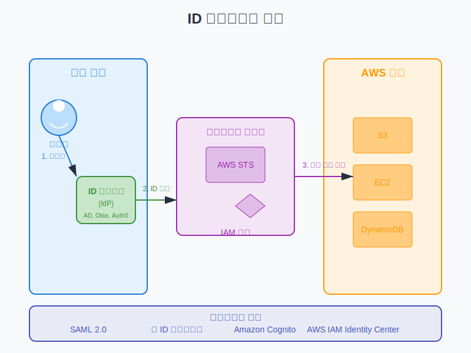

# ID 페더레이션 및 외부 자격 증명 관리

## 슬라이드 1: ID 페더레이션 개요
- 외부 ID 제공업체(IdP)의 사용자에게 AWS 리소스 액세스 권한 부여
- AWS 계정에 개별 IAM 사용자 생성 불필요
- 기존 ID 시스템 활용 (기업 디렉터리, 소셜 로그인 등)
- 중앙 집중식 ID 관리 및 SSO(Single Sign-On) 경험 제공
- 대규모 사용자 관리 간소화



## 슬라이드 2: ID 페더레이션이 필요한 이유
- **IAM 사용자 한계 극복**:
  - 계정당 IAM 사용자 수 제한 (기본 5,000명)
  - 대규모 조직의 사용자 관리 복잡성
- **기존 ID 시스템 활용**:
  - 기업 디렉터리(Active Directory 등) 통합
  - 기존 인증 메커니즘 및 정책 유지
- **보안 강화**:
  - 중앙 집중식 ID 관리 및 감사
  - 사용자별 AWS 자격 증명 관리 불필요
- **사용자 경험 개선**:
  - SSO(Single Sign-On) 경험 제공
  - 여러 자격 증명 기억 불필요

## 슬라이드 3: ID 페더레이션 작동 방식
1. **사용자 인증**:
   - 사용자가 ID 제공업체(IdP)에 로그인
   - IdP가 사용자 ID 확인 및 인증
2. **ID 토큰 발급**:
   - IdP가 인증된 사용자에게 ID 토큰 발급
   - 토큰에 사용자 정보 및 속성 포함
3. **역할 매핑**:
   - 사용자 속성에 따라 적절한 IAM 역할 매핑
   - 역할은 AWS 리소스에 대한 권한 정의
4. **임시 자격 증명 발급**:
   - AWS STS가 IAM 역할 기반 임시 자격 증명 발급
   - 자격 증명은 제한된 시간 동안 유효
5. **AWS 리소스 액세스**:
   - 임시 자격 증명으로 AWS 리소스 액세스
   - 역할의 권한 정책에 따라 액세스 제한

## 슬라이드 4: 페더레이션 유형 비교


## 슬라이드 5: SAML 2.0 페더레이션
- Security Assertion Markup Language 2.0 기반
- 기업 ID 제공업체와 AWS 간 인증 및 권한 부여
- **지원되는 ID 제공업체**:
  - Active Directory Federation Services (AD FS)
  - Okta, OneLogin, Ping Identity
  - Azure AD, Google Workspace
- **주요 특징**:
  - 콘솔 및 API 액세스 지원
  - 기업 사용자에게 적합
  - 기존 기업 디렉터리 활용

## 슬라이드 6: SAML 2.0 페더레이션 작동 방식
1. **IdP 구성**:
   - SAML IdP에 AWS를 서비스 제공자로 등록
   - 사용자 속성과 IAM 역할 매핑 구성
2. **AWS 구성**:
   - IAM에 SAML ID 제공업체 생성
   - IdP 메타데이터 문서 업로드
   - 적절한 권한을 가진 IAM 역할 생성
3. **사용자 인증 흐름**:
   - 사용자가 기업 포털 또는 AWS 콘솔 접근
   - IdP에서 인증 후 SAML 응답 생성
   - AWS가 SAML 응답 처리 및 역할 매핑
   - 사용자에게 임시 자격 증명 발급

## 슬라이드 7: SAML 2.0 구성 예시 - Okta
- **Okta에서 AWS 앱 추가**:
  - AWS 계정 ID 및 역할 정보 구성
  - SAML 속성 매핑 설정
- **AWS에서 SAML IdP 구성**:
  - IAM > ID 제공업체 > 생성
  - 제공업체 유형: SAML
  - Okta 메타데이터 문서 업로드
- **IAM 역할 생성**:
  - 신뢰 관계: SAML 2.0 페더레이션
  - 권한 정책: 필요한 권한 연결

## 슬라이드 8: 웹 ID 페더레이션
- 소셜 ID 제공업체를 통한 AWS 리소스 액세스
- OAuth 2.0 및 OpenID Connect(OIDC) 프로토콜 사용
- **지원되는 ID 제공업체**:
  - Amazon, Facebook, Google
  - OpenID Connect 호환 IdP
- **주요 특징**:
  - 모바일 및 웹 애플리케이션에 적합
  - 공개 사용자 인증에 유용
  - 소셜 로그인 경험 제공

## 슬라이드 9: 웹 ID 페더레이션 작동 방식
1. **앱 등록**:
   - 소셜 IdP에 앱 등록 및 클라이언트 ID 획득
   - 필요한 OAuth 스코프 구성
2. **AWS 구성**:
   - IAM 역할 생성 (웹 ID 제공업체 신뢰)
   - 조건부 액세스 정책 구성
3. **인증 흐름**:
   - 사용자가 소셜 IdP로 로그인
   - 앱이 ID 토큰 수신
   - 앱이 `AssumeRoleWithWebIdentity` API 호출
   - AWS STS가 임시 자격 증명 발급
   - 앱이 자격 증명으로 AWS 리소스 액세스

## 슬라이드 10: Amazon Cognito
- 웹 및 모바일 앱을 위한 완전 관리형 ID 서비스
- 사용자 등록, 로그인, 액세스 제어 기능 제공
- 웹 ID 페더레이션 구현 간소화
- **주요 구성 요소**:
  - **사용자 풀**: 사용자 디렉터리 및 인증 서비스
  - **ID 풀**: AWS 자격 증명 및 액세스 관리

## 슬라이드 11: Amazon Cognito 사용자 풀
- 앱 사용자를 위한 디렉터리 서비스
- 사용자 등록 및 로그인 기능 제공
- **주요 기능**:
  - 사용자 등록 및 계정 확인
  - 다중 인증(MFA)
  - 소셜 ID 제공업체 통합
  - SAML 2.0 IdP 통합
  - 사용자 지정 인증 흐름
  - 토큰 기반 인증(JWT)

## 슬라이드 12: Amazon Cognito ID 풀
- 임시 AWS 자격 증명 제공
- 인증된 및 익명 사용자 지원
- **인증 소스**:
  - Cognito 사용자 풀
  - 소셜 ID 제공업체
  - SAML 2.0 IdP
  - 개발자 인증 ID
- **주요 기능**:
  - 세분화된 역할 기반 액세스 제어
  - 사용자 속성 기반 액세스 제어
  - 역할 선택 규칙 구성

## 슬라이드 13: Cognito 구현 예시
```javascript
// 사용자 풀 인증
const userPool = new AmazonCognitoIdentity.CognitoUserPool(poolData);
const cognitoUser = userPool.getCurrentUser();

// 사용자 세션 가져오기
cognitoUser.getSession((err, session) => {
  if (err) {
    console.error(err);
    return;
  }
  
  // ID 풀 구성
  AWS.config.credentials = new AWS.CognitoIdentityCredentials({
    IdentityPoolId: 'IDENTITY_POOL_ID',
    Logins: {
      'cognito-idp.REGION.amazonaws.com/USER_POOL_ID': session.getIdToken().getJwtToken()
    }
  });
  
  // 자격 증명 새로 고침
  AWS.config.credentials.refresh((error) => {
    if (error) {
      console.error(error);
    } else {
      // AWS 서비스 사용 가능
      const s3 = new AWS.S3();
      // S3 작업 수행
    }
  });
});
```

## 슬라이드 14: AWS IAM Identity Center
- AWS 계정 및 애플리케이션에 대한 SSO 액세스 관리
- 이전 명칭: AWS Single Sign-On (SSO)
- **주요 기능**:
  - 다중 AWS 계정 액세스 관리
  - 비즈니스 애플리케이션 SSO
  - 내장된 자격 증명 스토어
  - 외부 자격 증명 제공자 통합
  - 세분화된 권한 관리
  - 사용자 친화적인 액세스 포털

## 슬라이드 15: IAM Identity Center 설정 및 구성
**설정 단계**:
1. **IAM Identity Center 활성화**:
   - AWS Management Console에서 서비스 활성화
   - Organizations 내 서비스 활성화 확인
2. **자격 증명 소스 선택**:
   - IAM Identity Center 디렉터리
   - Active Directory
   - 외부 자격 증명 제공자
3. **사용자 및 그룹 관리**:
   - 사용자 및 그룹 생성/동기화
   - 속성 및 그룹 멤버십 관리
4. **권한 세트 생성**:
   - 사전 정의된 또는 사용자 지정 권한 세트 구성
   - 권한 정책 및 설정 구성
5. **AWS 계정 액세스 할당**:
   - 사용자/그룹을 권한 세트에 할당
   - 계정별 액세스 구성

## 슬라이드 16: 권한 세트 및 권한 관리
- 사용자가 AWS 계정에서 가질 수 있는 권한 정의
- 여러 계정에 일관되게 적용 가능
- IAM 역할로 프로비저닝
- **권한 세트 유형**:
  - **사전 정의된 권한 세트**: AdministratorAccess, PowerUserAccess, ReadOnlyAccess 등
  - **사용자 지정 권한 세트**: 고객 관리형 정책, 인라인 정책, 권한 경계 등
- **권한 할당 모델**:
  - 사용자 기반 할당
  - 그룹 기반 할당 (권장)
  - 속성 기반 액세스 제어(ABAC)

## 슬라이드 17: Active Directory 통합 옵션
- **AWS Managed Microsoft AD**:
  - AWS에서 완전 관리형 Active Directory
  - 기존 AD와 신뢰 관계 설정 가능
- **AD Connector**:
  - 기존 온프레미스 AD에 대한 프록시
  - 디렉터리 데이터 복제 없음
- **Simple AD**:
  - Samba 4 기반의 기본 AD 호환 서비스
  - 소규모 워크로드에 적합
- **자체 관리형 AD**:
  - EC2 인스턴스에 직접 AD 배포
  - 완전한 제어 및 사용자 지정

## 슬라이드 18: IAM Identity Center와 Active Directory 통합
- **통합 옵션**:
  - AWS Managed Microsoft AD 통합
  - AD Connector를 통한 자체 관리형 디렉터리 통합
- **사용자 및 그룹 동기화**:
  - 동기화할 사용자 및 그룹 범위 정의
  - 속성 매핑 구성
  - 동기화 일정 설정
- **인증 흐름**:
  1. 사용자가 IAM Identity Center 포털에 액세스
  2. 사용자가 AD 자격 증명으로 로그인
  3. IAM Identity Center가 AD에 인증 요청 전송
  4. AD가 인증 확인 및 사용자 속성 반환
  5. IAM Identity Center가 적절한 권한 및 액세스 제공

## 슬라이드 19: ABAC(속성 기반 액세스 제어)
- 사용자 및 리소스 속성을 기반으로 권한을 동적으로 결정
- **ABAC의 이점**:
  - 정책 수 감소
  - 운영 변경 감소
  - 확장성 향상
  - 세분화된 권한
  - 유연한 액세스 제어
- **AWS에서의 ABAC 구현**:
  - IAM 정책의 조건 요소 사용
  - 태그 기반 액세스 제어
  - 세션 태그 및 전이적 태그 활용

## 슬라이드 20: ID 페더레이션 모범 사례 및 Q&A
- **보안 모범 사례**:
  - 최소 권한 원칙 적용
  - MFA 활성화
  - 세션 기간 제한
  - 정기적인 액세스 검토
- **운영 모범 사례**:
  - 자동화된 사용자 프로비저닝/디프로비저닝
  - 그룹 기반 권한 관리
  - 중앙 집중식 로깅 및 모니터링
  - 명확한 ID 수명 주기 프로세스
- **사용자 경험 모범 사례**:
  - 직관적인 액세스 포털 구성
  - 자주 사용하는 애플리케이션 강조
  - 명확한 오류 메시지 및 지원 정보 제공
- 질문 및 토론