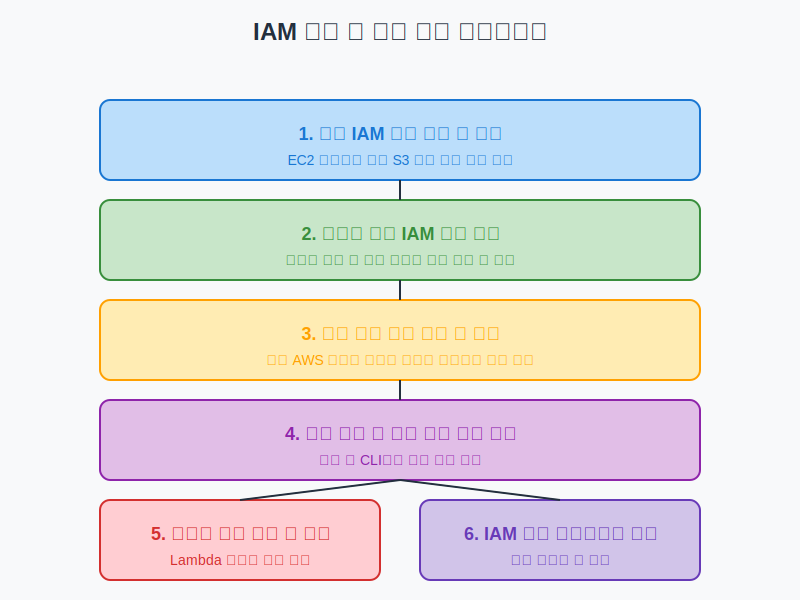

# 실습: IAM 역할 및 정책 구성

## 슬라이드 1: 실습 개요
- IAM 역할 생성 및 구성 방법 학습
- 다양한 권한 수준의 IAM 정책 생성 및 테스트
- 역할 전환 및 임시 자격 증명 사용 방법 이해
- 서비스 역할 구성 및 활용 방법 학습
- IAM 정책 시뮬레이터를 사용한 권한 테스트 방법 습득
- **목표**: AWS 환경에서 안전하게 권한을 위임하고 최소 권한 원칙 적용



## 슬라이드 2: 사전 준비 사항
- AWS 계정 액세스
- 관리자 권한이 있는 IAM 사용자
- AWS Management Console 액세스
- AWS CLI 설치 (선택 사항)
- 실습 환경 확인:
  - 기존 IAM 사용자 및 그룹 확인
  - 필요한 서비스 액세스 권한 확인
  - 실습 리소스 생성을 위한 권한 확인

## 슬라이드 3: 실습 1 - 기본 IAM 역할 생성
1. AWS Management Console에 로그인
2. IAM 서비스로 이동
3. 왼쪽 탐색 창에서 "역할" 선택
4. "역할 생성" 버튼 클릭
5. 신뢰할 수 있는 엔터티 유형으로 "AWS 서비스" 선택
6. 사용 사례로 "EC2" 선택
7. "AmazonS3ReadOnlyAccess" 정책 연결
8. 태그 추가 (선택 사항): 키 = "Purpose", 값 = "Lab"
9. 역할 이름을 "EC2-S3ReadOnly-Role"로 입력
10. "역할 생성" 클릭

## 슬라이드 4: 역할 세부 정보 검토
- 생성된 역할 목록에서 "EC2-S3ReadOnly-Role" 클릭
- "신뢰 관계" 탭에서 신뢰 정책 검토
```json
{
  "Version": "2012-10-17",
  "Statement": [
    {
      "Effect": "Allow",
      "Principal": {
        "Service": "ec2.amazonaws.com"
      },
      "Action": "sts:AssumeRole"
    }
  ]
}
```
- "권한" 탭에서 연결된 "AmazonS3ReadOnlyAccess" 정책 확인
- EC2 인스턴스 프로필 자동 생성 확인

## 슬라이드 5: 실습 2 - 사용자 지정 IAM 정책 생성
### 인라인 정책 생성
1. "EC2-S3ReadOnly-Role" 선택
2. "권한" 탭에서 "인라인 정책 추가" 클릭
3. "JSON" 탭 선택 후 다음 정책 입력:
```json
{
  "Version": "2012-10-17",
  "Statement": [
    {
      "Effect": "Allow",
      "Action": [
        "cloudwatch:PutMetricData",
        "cloudwatch:GetMetricData",
        "cloudwatch:ListMetrics"
      ],
      "Resource": "*"
    }
  ]
}
```
4. 정책 이름을 "CloudWatchMetricsAccess"로 입력
5. "정책 생성" 클릭

## 슬라이드 6: 고객 관리형 정책 생성
1. IAM 콘솔의 "정책" 메뉴로 이동
2. "정책 생성" 버튼 클릭
3. "JSON" 탭 선택 후 다음 정책 입력:
```json
{
  "Version": "2012-10-17",
  "Statement": [
    {
      "Effect": "Allow",
      "Action": [
        "dynamodb:GetItem",
        "dynamodb:BatchGetItem",
        "dynamodb:Query",
        "dynamodb:Scan"
      ],
      "Resource": "arn:aws:dynamodb:*:*:table/Lab-*"
    }
  ]
}
```
4. 정책 이름을 "DynamoDBReadOnlyCustom"으로 입력
5. "정책 생성" 클릭
6. 생성한 정책을 "EC2-S3ReadOnly-Role"에 연결

## 슬라이드 7: 실습 3 - 교차 계정 역할 생성
1. IAM 콘솔에서 "역할 생성" 클릭
2. 신뢰할 수 있는 엔터티 유형으로 "AWS 계정" 선택
3. "다른 AWS 계정" 선택
4. 액세스를 제공할 계정 ID 입력
   - 실습 환경에서는 동일한 계정 ID 또는 강사 제공 ID 사용
5. (선택 사항) "MFA 필요" 옵션 선택
6. "ReadOnlyAccess" 정책 연결
7. 역할 이름을 "CrossAccount-ReadOnly-Role"로 입력
8. "역할 생성" 클릭

## 슬라이드 8: 교차 계정 역할 신뢰 정책 수정
1. "CrossAccount-ReadOnly-Role" 선택
2. "신뢰 관계" 탭 클릭
3. "신뢰 정책 편집" 버튼 클릭
4. 다음과 같이 정책 수정:
```json
{
  "Version": "2012-10-17",
  "Statement": [
    {
      "Effect": "Allow",
      "Principal": {
        "AWS": "arn:aws:iam::ACCOUNT_ID:user/USERNAME"
      },
      "Action": "sts:AssumeRole",
      "Condition": {
        "Bool": {
          "aws:MultiFactorAuthPresent": "true"
        }
      }
    }
  ]
}
```
5. ACCOUNT_ID와 USERNAME을 실제 값으로 변경
6. "정책 업데이트" 클릭

## 슬라이드 9: 역할 전환 권한 구성
1. IAM 콘솔에서 "사용자" 선택
2. 역할을 수임할 사용자 선택
3. "인라인 정책 추가" 클릭
4. 다음 정책 입력:
```json
{
  "Version": "2012-10-17",
  "Statement": [
    {
      "Effect": "Allow",
      "Action": "sts:AssumeRole",
      "Resource": "arn:aws:iam::ACCOUNT_ID:role/CrossAccount-ReadOnly-Role"
    }
  ]
}
```
5. ACCOUNT_ID를 실제 계정 ID로 변경
6. 정책 이름을 "AssumeRolePolicy"로 입력
7. "정책 생성" 클릭

## 슬라이드 10: 실습 4 - 역할 전환 및 임시 자격 증명 사용
### AWS Management Console에서 역할 전환
1. AWS Management Console에 로그인
2. 오른쪽 상단의 계정 이름/번호 클릭
3. "역할 전환" 선택
4. 다음 정보 입력:
   - 계정: 역할이 있는 계정 ID
   - 역할: CrossAccount-ReadOnly-Role
   - 표시 이름: ReadOnly
5. "역할 전환" 버튼 클릭
6. 콘솔 상단에 표시 이름과 색상 확인
7. 다양한 서비스에 액세스하여 읽기 전용 권한 테스트
8. 원래 사용자로 돌아가려면 역할 이름 클릭 후 "돌아가기" 선택

## 슬라이드 11: AWS CLI를 사용한 역할 전환
```bash
# 역할 수임하여 임시 자격 증명 얻기
aws sts assume-role --role-arn "arn:aws:iam::ACCOUNT_ID:role/CrossAccount-ReadOnly-Role" --role-session-name "TestSession"

# 임시 자격 증명으로 프로필 구성
aws configure set aws_access_key_id ASIA... --profile assumed-role
aws configure set aws_secret_access_key wJalr... --profile assumed-role
aws configure set aws_session_token IQoJb... --profile assumed-role

# 임시 자격 증명으로 명령 실행
aws s3 ls --profile assumed-role
```
- 실제 값으로 ACCOUNT_ID 및 자격 증명 값 변경
- 작업 완료 후 환경 변수 지우기

## 슬라이드 12: 실습 5 - 서비스 역할 생성 및 사용
### Lambda 함수용 서비스 역할 생성
1. IAM 콘솔에서 "역할 생성" 클릭
2. 신뢰할 수 있는 엔터티 유형으로 "AWS 서비스" 선택
3. 사용 사례로 "Lambda" 선택
4. 다음 정책 연결:
   - "AWSLambdaBasicExecutionRole"
   - "AmazonS3ReadOnlyAccess"
5. 역할 이름을 "Lambda-S3ReadOnly-Role"로 입력
6. "역할 생성" 클릭

## 슬라이드 13: Lambda 함수 생성 및 역할 연결
1. Lambda 서비스로 이동
2. "함수 생성" 클릭
3. "새로 작성" 선택
4. 함수 이름을 "S3ListFunction"으로 입력
5. 런타임으로 "Python 3.9" 선택
6. "기존 역할 사용"을 선택하고 "Lambda-S3ReadOnly-Role" 선택
7. "함수 생성" 클릭
8. 다음 코드 입력:
```python
import boto3
import json

def lambda_handler(event, context):
    s3 = boto3.client('s3')
    
    # S3 버킷 목록 가져오기
    response = s3.list_buckets()
    
    # 버킷 이름 추출
    buckets = [bucket['Name'] for bucket in response['Buckets']]
    
    return {
        'statusCode': 200,
        'body': json.dumps({
            'message': 'S3 버킷 목록을 성공적으로 가져왔습니다.',
            'buckets': buckets
        })
    }
```
9. "배포" 클릭 후 함수 테스트

## 슬라이드 14: 실습 6 - IAM 정책 시뮬레이터 사용
1. IAM 콘솔에서 "액세스 관리" > "정책" 선택
2. "정책 시뮬레이터" 버튼 클릭
   - 또는 https://policysim.aws.amazon.com 으로 직접 접속
3. "사용자, 그룹 및 역할" 드롭다운에서 "역할" 선택
4. "EC2-S3ReadOnly-Role" 선택
5. "시뮬레이션할 서비스 선택" 드롭다운에서 "S3" 선택
6. 다음 작업 선택:
   - ListBucket
   - GetObject
   - PutObject
7. "시뮬레이션 실행" 클릭
8. 결과 검토:
   - ListBucket, GetObject: 허용됨
   - PutObject: 거부됨

## 슬라이드 15: 정책 수정 및 재시뮬레이션
1. "새 정책 추가" 클릭
2. "JSON" 탭 선택
3. 다음 정책 입력:
```json
{
  "Version": "2012-10-17",
  "Statement": [
    {
      "Effect": "Allow",
      "Action": "s3:PutObject",
      "Resource": "arn:aws:s3:::example-bucket/*"
    }
  ]
}
```
4. "정책 추가" 클릭
5. "시뮬레이션 실행" 클릭
6. 결과 재검토:
   - ListBucket, GetObject: 허용됨
   - PutObject: 특정 버킷에 대해 허용됨
7. 다양한 정책 조합 시뮬레이션

## 슬라이드 16: 실습 결과물 및 검증
- EC2 인스턴스용 IAM 역할 및 인스턴스 프로필
- 사용자 지정 IAM 정책 (인라인 및 고객 관리형)
- 교차 계정 액세스를 위한 IAM 역할
- Lambda 함수용 서비스 역할
- IAM 정책 시뮬레이터를 사용한 권한 테스트 경험
- **검증 방법**:
  - 각 역할의 권한 정책 확인
  - 역할 전환 및 액세스 테스트
  - Lambda 함수 실행 결과 확인
  - 정책 시뮬레이터 결과 분석

## 슬라이드 17: 실습 정리 (선택 사항)
- 생성한 리소스 정리 방법:
  1. Lambda 함수 삭제
  2. IAM 역할 삭제 (연결된 정책 먼저 분리)
  3. 고객 관리형 정책 삭제
- **주의 사항**:
  - 프로덕션 환경에서는 사용 중인 역할 삭제 시 주의
  - 역할 삭제 전 의존성 확인
  - 정책 분리 후 역할 삭제

## 슬라이드 18: 실습 확장 아이디어
- **추가 실습 아이디어**:
  - 다양한 조건을 포함한 정책 생성 및 테스트
  - 역할 체이닝 구현 및 테스트
  - 외부 ID를 사용한 교차 계정 역할 구성
  - 세션 정책을 사용한 권한 제한 테스트
  - AWS CLI를 사용한 자동화된 역할 관리 스크립트 작성
- **실제 시나리오 적용**:
  - 개발, 테스트, 프로덕션 환경을 위한 역할 설계
  - 마이크로서비스 아키텍처를 위한 서비스 역할 구성

## 슬라이드 19: 모범 사례 및 보안 고려 사항
- **IAM 역할 모범 사례**:
  - 최소 권한 원칙 적용
  - 역할 이름에 목적과 권한 수준 포함
  - 정기적인 권한 검토 및 미사용 역할 제거
  - 조건부 액세스 제어 구현
- **보안 고려 사항**:
  - 역할 신뢰 정책 제한
  - 역할 세션 기간 최소화
  - MFA 요구 사항 적용
  - CloudTrail을 통한 역할 사용 모니터링

## 슬라이드 20: 질문 및 토론
- 실습 중 발생한 문제 및 해결 방법
- IAM 역할 및 정책 관련 추가 질문
- 실제 업무 환경에서의 적용 방안
- AWS 보안 모범 사례 관련 토론
- 다음 단계 학습 방향 안내
- 참고 자료 및 추가 학습 리소스 공유