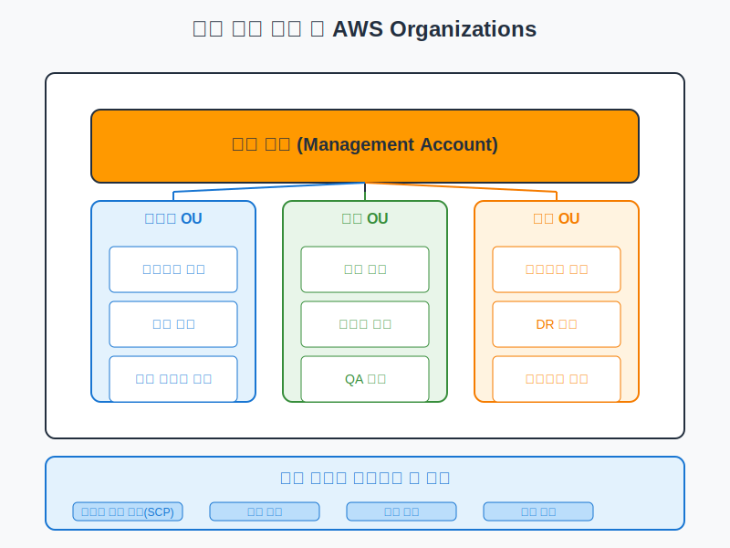
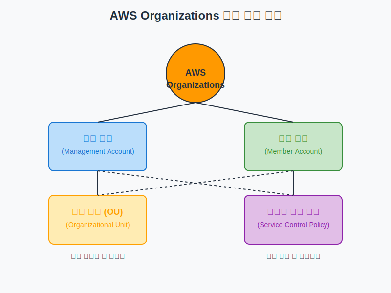
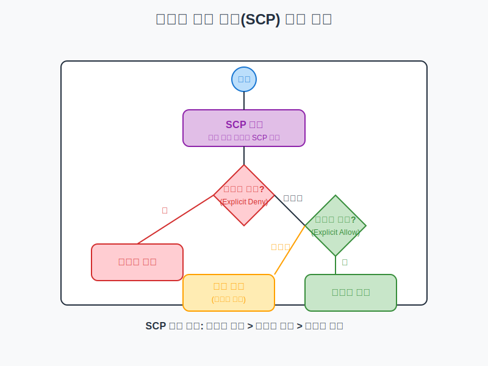

# 다중 계정 관리 전략 및 AWS Organizations

## 슬라이드 1: 다중 계정 전략 개요
- 여러 AWS 계정을 사용하여 워크로드 및 리소스 분리
- 보안, 거버넌스, 비용 관리 개선을 위한 접근 방식
- AWS 환경 확장에 따른 필수적인 전략
- **비유**: 한 집에 모든 가족이 같은 방을 쓰는 것보다 각자 방을 갖는 것이 효율적
- **목표**: 보안 강화, 책임 분리, 비용 추적 개선, 운영 효율성 향상



## 슬라이드 2: 단일 계정 사용의 한계
- **보안 경계 부족**: 모든 리소스가 동일한 보안 경계 내에 있음
- **권한 관리 복잡성**: 다양한 팀과 프로젝트에 대한 세분화된 권한 관리 어려움
- **비용 추적 어려움**: 팀, 프로젝트, 환경별 비용 분리 및 추적 어려움
- **서비스 할당량 제한**: AWS 서비스에는 계정별 할당량이 있어 대규모 워크로드에 제약
- **환경 분리 어려움**: 개발, 테스트, 프로덕션 환경 간 명확한 경계 설정 어려움

## 슬라이드 3: 다중 계정 전략의 이점
- **보안 격리 강화**: 계정 간 자연스러운 보안 경계 제공
- **책임 분리**: 팀, 부서, 프로젝트별로 별도의 계정 할당 가능
- **비용 관리 개선**: 계정별 비용 추적 및 할당 용이
- **서비스 할당량 최적화**: 계정별로 독립적인 서비스 할당량 제공
- **환경 분리**: 개발, 테스트, 스테이징, 프로덕션 환경을 명확히 분리
- **거버넌스 향상**: 조직 전체에 일관된 정책 및 표준 적용 가능

## 슬라이드 4: AWS Organizations 소개
- AWS 계정을 중앙에서 관리하고 통합하기 위한 서비스
- 계정 생성 자동화, 계정 그룹화, 중앙 집중식 정책 적용
- **비유**: 여러 지점을 가진 기업의 본사와 같은 역할
- **주요 기능**:
  - 중앙 집중식 계정 관리
  - 계층적 정책 관리
  - 통합 결제
  - AWS 서비스와의 통합

## 슬라이드 5: AWS Organizations 주요 구성 요소



## 슬라이드 6: 조직 (Organization)
- AWS 계정의 최상위 엔티티
- 관리 계정과 여러 멤버 계정으로 구성
- 계층적 구조로 계정 그룹화 가능
- 중앙 집중식 정책 적용 지원
- **비유**: 회사 전체를 나타내며, 모든 부서와 팀을 포함

## 슬라이드 7: 관리 계정 (Management Account)
- 조직을 생성하고 관리하는 계정 (이전 명칭: 마스터 계정)
- 조직 내 모든 계정에 대한 관리 권한 보유
- 결제 책임 및 비용 지불 담당
- 조직 정책 및 초대 관리
- **주의 사항**: 일상적인 워크로드에는 사용하지 않는 것이 좋음
- **모범 사례**: 관리 계정 액세스 제한 및 MFA 활성화

## 슬라이드 8: 멤버 계정 (Member Account)
- 조직에 속한 일반 AWS 계정
- 관리 계정의 관리를 받음
- 실제 워크로드 및 리소스 호스팅
- 세 가지 방법으로 추가 가능:
  - 기존 계정 초대
  - 조직 내에서 새 계정 생성
  - AWS Control Tower를 통한 계정 프로비저닝
- **비유**: 회사의 각 부서나 팀과 같음

## 슬라이드 9: 조직 단위 (Organizational Unit, OU)
- 계정을 그룹화하는 컨테이너
- 계층적 구조 생성 가능 (최대 5단계 깊이)
- 정책 적용 및 관리 단위
- 유사한 기능 또는 요구 사항을 가진 계정 그룹화
- **비유**: 파일 시스템의 폴더와 유사
- **일반적인 OU 구조**:
  - 기능별 (인프라, 보안, 애플리케이션)
  - 환경별 (개발, 테스트, 프로덕션)
  - 부서별 (마케팅, 재무, IT)

## 슬라이드 10: 서비스 제어 정책 (Service Control Policy, SCP)
- 조직 내 계정에 대한 권한을 중앙에서 제어하는 정책
- 최대 권한 경계 설정 (권한 부여 아님)
- JSON 형식의 정책 문서
- 관리 계정에는 영향을 미치지 않음
- **비유**: 회사의 규정집과 같음
- **주요 특징**:
  - 계정 내 모든 사용자 및 역할에 영향
  - IAM 정책과 함께 작동
  - 거부 목록 또는 허용 목록 전략 사용 가능

## 슬라이드 11: SCP 평가 로직



## 슬라이드 12: SCP 예시
```json
{
  "Version": "2012-10-17",
  "Statement": [
    {
      "Sid": "DenyAllOutsideEURegions",
      "Effect": "Deny",
      "NotAction": [
        "iam:*",
        "organizations:*",
        "route53:*",
        "budgets:*",
        "support:*"
      ],
      "Resource": "*",
      "Condition": {
        "StringNotEquals": {
          "aws:RequestedRegion": [
            "eu-central-1",
            "eu-west-1"
          ]
        }
      }
    }
  ]
}
```
- 유럽 리전 외의 모든 리전에서 글로벌 서비스를 제외한 모든 서비스 사용 금지

## 슬라이드 13: 다중 계정 구조의 일반적인 모델
- **기본 구조**:
  - 관리 계정: 조직 관리 전용
  - 보안 계정: 로그 중앙화, 보안 도구 관리
  - 로그 아카이브 계정: 감사 로그 저장
  - 공유 서비스 계정: 공통 서비스 호스팅
  - 워크로드 계정: 실제 애플리케이션 및 서비스 호스팅

- **환경 기반 구조**: 개발, 테스트, 스테이징, 프로덕션 환경별 계정 분리
- **워크로드 기반 구조**: 애플리케이션이나 서비스별로 계정 분리
- **팀 또는 부서 기반 구조**: 조직 구조를 반영하여 팀이나 부서별로 계정 분리

## 슬라이드 14: 다중 계정 구조 설계 원칙
- **보안 경계 정의**: 보안 요구 사항에 따라 계정 경계 설정
- **책임 분리**: 리소스 소유권과 책임을 명확히 하기 위해 계정 분리
- **비용 추적 최적화**: 비용 할당 및 추적을 용이하게 하는 계정 구조 설계
- **확장성 고려**: 조직의 성장에 따라 쉽게 확장할 수 있는 구조 설계
- **운영 효율성 유지**: 너무 많은 계정으로 인한 관리 복잡성 피하기
- **규정 준수 요구 사항 반영**: 규제 및 규정 준수 요구 사항을 고려한 설계

## 슬라이드 15: AWS Control Tower
- 다중 계정 환경을 설정, 구성 및 관리하기 위한 서비스
- AWS 모범 사례에 따른 랜딩 존 설정 자동화
- **주요 기능**:
  - 계정 프로비저닝 자동화
  - 가드레일(예방 및 탐지 제어)을 통한 규정 준수 보장
  - 대시보드를 통한 규정 준수 모니터링
  - AWS Organizations, IAM Identity Center, Config 등과 통합
- **비유**: 아파트 단지의 건설 및 관리 시스템

## 슬라이드 16: AWS IAM Identity Center
- 다중 계정 환경에서 중앙 집중식 사용자 관리 및 액세스 제어
- 이전 명칭: AWS Single Sign-On (SSO)
- **주요 기능**:
  - 단일 로그인으로 여러 AWS 계정 접근
  - 기존 기업 디렉터리(예: Active Directory)와 통합
  - 권한 세트를 통한 세분화된 액세스 제어
  - 비즈니스 애플리케이션 SSO 지원
- **비유**: 회사의 중앙 출입 카드 시스템

## 슬라이드 17: 중앙 집중식 로깅 및 모니터링
- 모든 계정의 활동을 중앙에서 로깅하고 모니터링
- **주요 구성 요소**:
  - AWS CloudTrail: 모든 계정의 API 활동을 중앙 계정에 로깅
  - Amazon GuardDuty: 여러 계정에 걸친 위협 탐지
  - AWS Security Hub: 보안 상태 중앙 집중식 관리
  - Amazon EventBridge: 계정 간 이벤트 라우팅
- **비유**: 쇼핑몰의 중앙 보안 관제실
- **모범 사례**: 로그 아카이브 계정에 로그 중앙화 및 읽기 전용 액세스 제공

## 슬라이드 18: 통합 결제의 이점
- AWS Organizations의 통합 결제 기능을 통한 중앙 비용 관리
- **주요 이점**:
  - **통합된 청구서**: 모든 계정의 비용을 하나의 청구서로 받음
  - **사용량 집계**: 모든 계정의 사용량을 합산하여 볼륨 할인 적용
  - **예약 인스턴스 및 Savings Plans 공유**: 계정 간 할인 혜택 공유
  - **비용 할당 태그**: 계정 전체에 일관된 태그 정책 적용
- **비유**: 가족 요금제와 같은 개념

## 슬라이드 19: AWS Resource Access Manager (RAM)
- 여러 AWS 계정 간에 특정 AWS 리소스를 안전하게 공유
- **공유 가능한 주요 리소스**:
  - VPC 서브넷
  - Transit Gateway
  - Route 53 Resolver 규칙
  - License Manager 라이선스 구성
  - Aurora DB 클러스터
  - EC2 전용 호스트
- **이점**: 리소스 중복 감소, 중앙 집중식 관리, 비용 절감
- **비유**: 아파트 단지의 공용 시설 이용 시스템

## 슬라이드 20: 다중 계정 전략 모범 사례 및 Q&A
- **보안 모범 사례**:
  - 관리 계정 보호 (MFA, 최소 액세스)
  - 계정 간 명확한 경계 설정
  - 중앙 집중식 로깅 및 모니터링 구현
- **운영 모범 사례**:
  - 계정 생성 및 폐기 프로세스 자동화
  - 일관된 태깅 전략 구현
  - 리소스 공유 전략 수립
- **비용 관리 모범 사례**:
  - 계정별 예산 설정
  - 비용 할당 태그 표준화
  - 정기적인 비용 검토 및 최적화
- 질문 및 토론