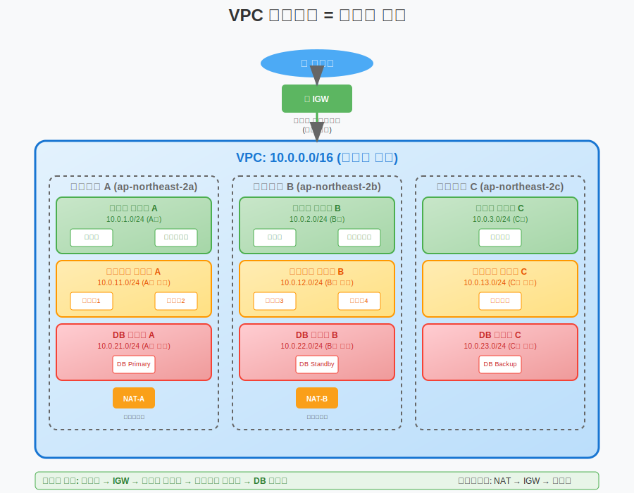
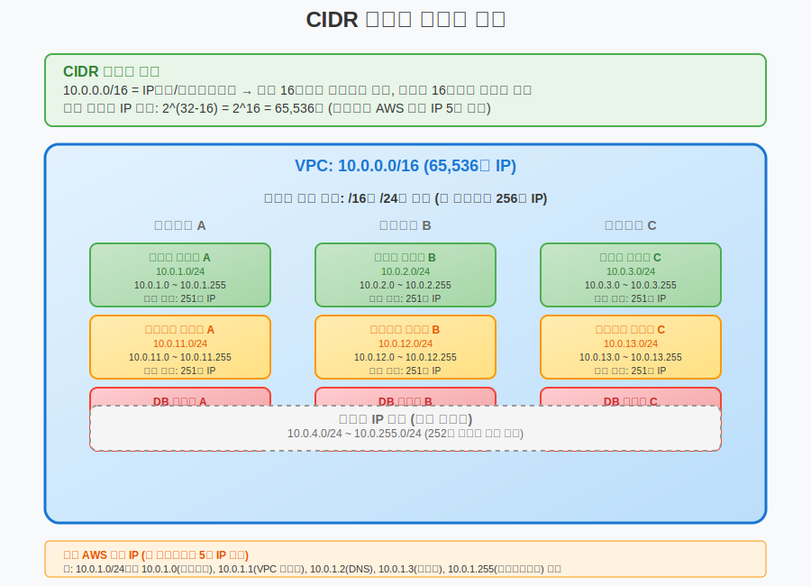
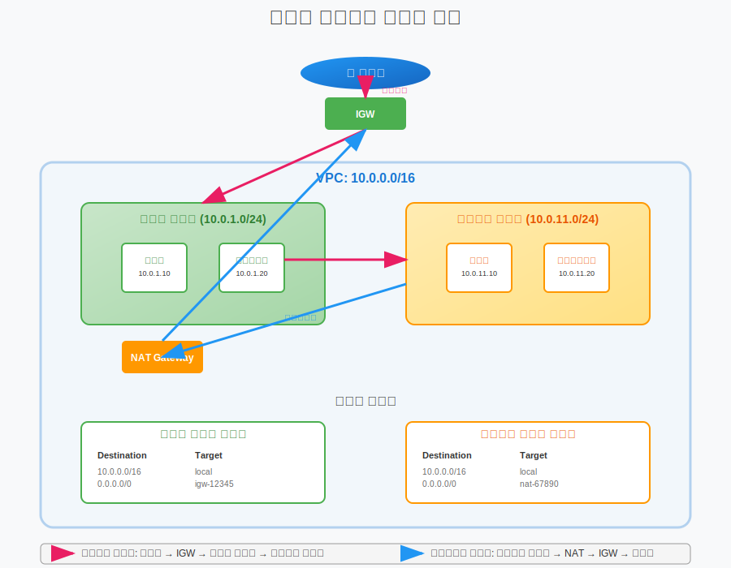

# Day 4-1: VPC 개념 및 구성 요소

## 📚 학습 목표
- VPC(Virtual Private Cloud)의 개념과 필요성 이해
- CIDR 블록, 서브넷, 라우팅 테이블의 관계 파악
- IP 주소 체계와 네트워크 설계 원칙 습득
- VPC 구성 요소 간의 상호작용 이해

---

## 🏢 VPC = 아파트 단지 (30분)



### VPC란 무엇인가?

#### 전통적인 네트워크 vs VPC
```
온프레미스 네트워크:
- 물리적 라우터, 스위치
- 케이블로 연결된 네트워크
- 하드웨어 의존적
- 변경 시 물리적 작업 필요

VPC (Virtual Private Cloud):
- 소프트웨어 정의 네트워크
- 클라우드 상의 가상 네트워크
- 논리적 격리
- 코드로 관리 가능
```

#### 아파트 단지 비유
```
VPC = 아파트 단지 전체
├── 서브넷 = 각 동 (A동, B동, C동)
├── 라우팅 테이블 = 단지 내 도로 안내판
├── 인터넷 게이트웨이 = 단지 정문
├── NAT 게이트웨이 = 택배 보관함 (간접 외부 접근)
└── 보안 그룹 = 각 집 현관문 보안

특징:
- 단지 내부는 자유롭게 이동
- 외부 출입은 정문을 통해서만
- 각 동마다 다른 보안 수준
- 관리사무소에서 중앙 관리
```

### VPC의 핵심 특징

#### 1. 논리적 격리
```
격리 수준:
- 계정별 완전 분리
- 다른 고객과 네트워크 격리
- 내부 트래픽 보안 보장

예시:
회사A의 VPC ←→ 회사B의 VPC
- 서로 접근 불가
- 독립적인 IP 대역
- 별도의 보안 정책
```

#### 2. 완전한 제어권
```
제어 가능한 요소:
- IP 주소 범위 (CIDR 블록)
- 서브넷 구성
- 라우팅 테이블 설정
- 보안 그룹 규칙
- 네트워크 ACL 정책
```

#### 3. 확장성과 유연성
```
확장 가능한 요소:
- 서브넷 추가/삭제
- 보안 규칙 동적 변경
- 다른 VPC와 연결 (피어링)
- 온프레미스와 연결 (VPN, Direct Connect)
```

---

## 🌐 CIDR 블록과 IP 주소 체계 (45분)



### CIDR (Classless Inter-Domain Routing) 이해

#### CIDR 표기법
```
형식: IP주소/서브넷마스크
예시: 10.0.0.0/16

해석:
- 10.0.0.0: 네트워크 주소
- /16: 앞의 16비트가 네트워크 부분
- 나머지 16비트: 호스트 부분
- 사용 가능한 IP: 2^16 = 65,536개
```

#### 주요 사설 IP 대역
```
Class A: 10.0.0.0/8
- 범위: 10.0.0.0 ~ 10.255.255.255
- 사용 가능: 16,777,216개 IP
- 용도: 대규모 네트워크

Class B: 172.16.0.0/12  
- 범위: 172.16.0.0 ~ 172.31.255.255
- 사용 가능: 1,048,576개 IP
- 용도: 중간 규모 네트워크

Class C: 192.168.0.0/16
- 범위: 192.168.0.0 ~ 192.168.255.255
- 사용 가능: 65,536개 IP
- 용도: 소규모 네트워크 (가정, 소규모 사무실)
```

### VPC CIDR 설계 원칙

#### 1. 적절한 크기 선택
```
고려사항:
- 현재 필요한 리소스 수
- 향후 확장 계획
- 서브넷 분할 계획
- 다른 네트워크와의 충돌 방지

권장사항:
- 소규모: /24 (256개 IP)
- 중간규모: /20 (4,096개 IP)  
- 대규모: /16 (65,536개 IP)
```

#### 2. 서브넷 분할 전략
```
예시: 10.0.0.0/16 VPC

퍼블릭 서브넷:
- 10.0.1.0/24 (AZ-a)
- 10.0.2.0/24 (AZ-b)
- 10.0.3.0/24 (AZ-c)

프라이빗 서브넷:
- 10.0.11.0/24 (AZ-a)
- 10.0.12.0/24 (AZ-b)
- 10.0.13.0/24 (AZ-c)

데이터베이스 서브넷:
- 10.0.21.0/24 (AZ-a)
- 10.0.22.0/24 (AZ-b)
- 10.0.23.0/24 (AZ-c)
```

### 실습: CIDR 계산기 활용

#### 온라인 도구 활용
```
추천 도구:
- https://www.subnet-calculator.com/
- https://www.calculator.net/ip-subnet-calculator.html

실습 과제:
1. 10.0.0.0/16을 8개 서브넷으로 분할
2. 각 서브넷의 네트워크 주소 계산
3. 각 서브넷의 사용 가능한 IP 개수 확인
4. 브로드캐스트 주소 확인
```

---

## 🏗️ 서브넷 설계 전략 (30분)

### 서브넷 = 아파트 동

#### 서브넷 유형별 특징

##### 1. 퍼블릭 서브넷
```
특징:
- 인터넷 게이트웨이로 직접 라우팅
- 인터넷에서 직접 접근 가능
- 퍼블릭 IP 자동 할당 가능

용도:
- 웹 서버
- 로드 밸런서
- NAT 게이트웨이
- 점프 서버 (Bastion Host)

보안 고려사항:
- 최소한의 포트만 개방
- 강력한 보안 그룹 설정
- 정기적 보안 업데이트
```

##### 2. 프라이빗 서브넷
```
특징:
- 인터넷 게이트웨이로 직접 라우팅 없음
- 인터넷에서 직접 접근 불가
- NAT를 통해서만 외부 통신

용도:
- 애플리케이션 서버
- 내부 API 서버
- 배치 처리 서버
- 캐시 서버

보안 장점:
- 외부 공격 표면 최소화
- 내부 네트워크 보안 강화
- 민감한 데이터 보호
```

##### 3. 데이터베이스 서브넷
```
특징:
- 가장 제한적인 접근
- 애플리케이션 서브넷에서만 접근
- 인터넷 접근 완전 차단

용도:
- RDS 데이터베이스
- ElastiCache
- 내부 데이터 저장소

보안 강화:
- DB 서브넷 그룹 활용
- 포트 3306, 5432 등만 개방
- 소스 IP 엄격 제한
```

### 다중 AZ 설계

#### 고가용성을 위한 서브넷 배치
```
설계 원칙:
- 각 AZ마다 동일한 서브넷 유형 배치
- 로드 밸런서를 통한 트래픽 분산
- 데이터베이스 Multi-AZ 구성

예시 구조:
AZ-a (ap-northeast-2a):
├── 퍼블릭 서브넷: 10.0.1.0/24
├── 프라이빗 서브넷: 10.0.11.0/24
└── DB 서브넷: 10.0.21.0/24

AZ-b (ap-northeast-2b):
├── 퍼블릭 서브넷: 10.0.2.0/24
├── 프라이빗 서브넷: 10.0.12.0/24
└── DB 서브넷: 10.0.22.0/24

AZ-c (ap-northeast-2c):
├── 퍼블릭 서브넷: 10.0.3.0/24
├── 프라이빗 서브넷: 10.0.13.0/24
└── DB 서브넷: 10.0.23.0/24
```

---

## 🛣️ 라우팅 테이블 이해 (30분)



### 라우팅 테이블 = 도로 안내판

#### 라우팅의 기본 개념
```
라우팅이란?
- 패킷이 목적지까지 가는 경로 결정
- 네트워크 간 통신을 가능하게 하는 핵심

라우팅 테이블 구성:
- Destination: 목적지 네트워크
- Target: 다음 홉 (게이트웨이)
- 우선순위: 더 구체적인 경로가 우선
```

#### 기본 라우팅 규칙
```
VPC 내부 통신:
Destination: 10.0.0.0/16
Target: local
설명: VPC 내부 트래픽은 로컬 라우팅

인터넷 통신 (퍼블릭 서브넷):
Destination: 0.0.0.0/0
Target: igw-xxxxxxxxx
설명: 모든 외부 트래픽을 인터넷 게이트웨이로

NAT 통신 (프라이빗 서브넷):
Destination: 0.0.0.0/0
Target: nat-xxxxxxxxx
설명: 외부 트래픽을 NAT 게이트웨이로
```

### 라우팅 테이블 설계 패턴

#### 1. 퍼블릭 서브넷 라우팅 테이블
```
Route Table: Public-RT
Associated Subnets: 퍼블릭 서브넷들

Routes:
10.0.0.0/16    → local
0.0.0.0/0      → igw-12345678

의미:
- VPC 내부: 직접 통신
- 외부: 인터넷 게이트웨이 경유
```

#### 2. 프라이빗 서브넷 라우팅 테이블
```
Route Table: Private-RT-AZ-A
Associated Subnets: AZ-A 프라이빗 서브넷

Routes:
10.0.0.0/16    → local
0.0.0.0/0      → nat-12345678

의미:
- VPC 내부: 직접 통신
- 외부: NAT 게이트웨이 경유 (단방향)
```

#### 3. 데이터베이스 서브넷 라우팅 테이블
```
Route Table: DB-RT
Associated Subnets: DB 서브넷들

Routes:
10.0.0.0/16    → local

의미:
- VPC 내부만 통신 가능
- 외부 인터넷 접근 완전 차단
```

---

## 🔧 VPC 구성 요소 상호작용 (30분)

### 전체 아키텍처 흐름

#### 인바운드 트래픽 흐름
```
인터넷 사용자 요청:
1. 인터넷 → 인터넷 게이트웨이
2. 인터넷 게이트웨이 → 퍼블릭 서브넷 (로드 밸런서)
3. 로드 밸런서 → 프라이빗 서브넷 (웹 서버)
4. 웹 서버 → DB 서브넷 (데이터베이스)
5. 응답은 역순으로 전달
```

#### 아웃바운드 트래픽 흐름
```
프라이빗 서브넷에서 외부 API 호출:
1. 프라이빗 서브넷 → 라우팅 테이블 확인
2. 라우팅 테이블 → NAT 게이트웨이로 전달
3. NAT 게이트웨이 → 인터넷 게이트웨이
4. 인터넷 게이트웨이 → 외부 인터넷
5. 응답은 NAT를 통해 원래 서버로
```

### 보안 계층 구조

#### 다층 보안 모델
```
Layer 1: 네트워크 ACL (서브넷 레벨)
- 서브넷 전체에 적용
- Stateless (상태 비저장)
- Allow/Deny 규칙 모두 가능

Layer 2: 보안 그룹 (인스턴스 레벨)
- 개별 인스턴스에 적용
- Stateful (상태 저장)
- Allow 규칙만 가능

Layer 3: 인스턴스 내부 방화벽
- OS 레벨 보안 설정
- iptables, Windows Firewall 등
```

### 네트워크 성능 최적화

#### 배치 그룹 활용
```
클러스터 배치 그룹:
- 동일 AZ 내 고성능 네트워킹
- 10Gbps 네트워크 성능
- HPC 워크로드에 적합

파티션 배치 그룹:
- 서로 다른 하드웨어에 분산
- 대규모 분산 워크로드
- Hadoop, Cassandra 등에 적합

스프레드 배치 그룹:
- 각각 다른 하드웨어에 배치
- 최대 가용성 확보
- 중요한 인스턴스들 분산
```

---

## 📝 핵심 정리

### VPC 핵심 개념
1. **논리적 격리**: 클라우드 상의 가상 네트워크
2. **CIDR 블록**: IP 주소 범위 정의
3. **서브넷**: 네트워크 세분화 및 용도별 분리
4. **라우팅**: 트래픽 경로 제어

### 설계 원칙
- **계층적 구조**: 퍼블릭 → 프라이빗 → DB 서브넷
- **다중 AZ**: 고가용성을 위한 분산 배치
- **보안 심화**: 다층 보안 모델 적용
- **확장성**: 미래 성장을 고려한 CIDR 설계

### 네트워크 흐름 이해
- **인바운드**: 인터넷 → IGW → 퍼블릭 → 프라이빗 → DB
- **아웃바운드**: 프라이빗 → NAT → IGW → 인터넷
- **내부 통신**: VPC 내부는 로컬 라우팅

---

## 🤔 토론 주제

1. **CIDR 블록 크기를 어떻게 결정할까?**
   - 현재 요구사항 vs 미래 확장성

2. **서브넷을 얼마나 세분화해야 할까?**
   - 보안 vs 관리 복잡성의 균형점

---

## 📚 다음 시간 예고

**VPC 생성 및 서브넷 설계**
- 사용자 정의 VPC 생성 실습
- 퍼블릭/프라이빗 서브넷 구성
- 인터넷 게이트웨이 연결
- 라우팅 테이블 설정

---

> 💡 **오늘의 핵심**: VPC는 클라우드의 네트워크 기반입니다. 아파트 단지처럼 논리적으로 격리된 공간에서 서브넷으로 용도를 나누고, 라우팅 테이블로 트래픽 흐름을 제어합니다. CIDR 설계가 모든 것의 시작점입니다!