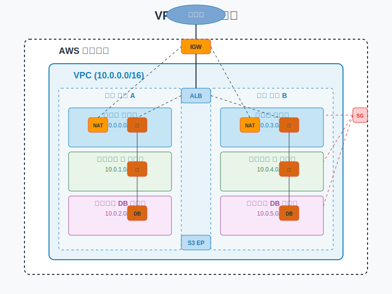

# 실습: VPC 설계 및 구성

## 슬라이드 1: 실습 개요
- AWS VPC 환경 설계 및 구축 실습
- 다중 계층 아키텍처 구현
- 네트워크 보안 구성 및 테스트
- 서브넷, 라우팅, 보안 그룹 등 VPC 구성 요소 실습
- **목표**: 실제 환경과 유사한 안전하고 확장 가능한 VPC 아키텍처 구현
- **소요 시간**: 약 2시간



## 슬라이드 2: 사전 준비 사항
- AWS 계정 액세스
- 관리자 권한이 있는 IAM 사용자
- AWS Management Console 액세스
- 기본 네트워킹 개념 이해
- 실습 환경 확인:
  - 기존 VPC 및 리소스 확인
  - 서비스 할당량 확인
  - 리전 선택 (실습에서는 ap-northeast-2 사용)

## 슬라이드 3: 실습 아키텍처 개요
- **VPC 구성**:
  - CIDR 블록: 10.0.0.0/16
  - 2개의 가용 영역(AZ) 사용
  - 각 AZ에 3개의 서브넷 (퍼블릭, 프라이빗 앱, 프라이빗 DB)
- **네트워크 구성 요소**:
  - 인터넷 게이트웨이
  - NAT 게이트웨이
  - 라우팅 테이블
  - 보안 그룹
  - 네트워크 ACL
- **컴퓨팅 리소스**:
  - 퍼블릭 서브넷의 웹 서버
  - 프라이빗 서브넷의 애플리케이션 서버
  - 프라이빗 서브넷의 데이터베이스 서버

## 슬라이드 4: 실습 1 - VPC 생성
1. AWS Management Console에 로그인
2. VPC 서비스로 이동
3. "VPC 생성" 버튼 클릭
4. "VPC 등" 옵션 선택
5. 다음 설정 구성:
   - 이름 태그 자동 생성: lab-vpc
   - IPv4 CIDR 블록: 10.0.0.0/16
   - 가용 영역 수: 2
   - 퍼블릭 서브넷 수: 2
   - 프라이빗 서브넷 수: 4
   - NAT 게이트웨이: 각 AZ에 하나씩
   - VPC 엔드포인트: 없음
6. "VPC 생성" 버튼 클릭
7. 생성된 리소스 확인

## 슬라이드 5: 실습 2 - 서브넷 구성 검토
- **퍼블릭 서브넷**:
  - 퍼블릭 서브넷 1: 10.0.0.0/24 (AZ-a)
  - 퍼블릭 서브넷 2: 10.0.1.0/24 (AZ-b)
  - 인터넷 게이트웨이로 라우팅
  - 자동 퍼블릭 IP 할당 활성화
- **프라이빗 앱 서브넷**:
  - 프라이빗 앱 서브넷 1: 10.0.2.0/24 (AZ-a)
  - 프라이빗 앱 서브넷 2: 10.0.3.0/24 (AZ-b)
  - NAT 게이트웨이로 라우팅
- **프라이빗 DB 서브넷**:
  - 프라이빗 DB 서브넷 1: 10.0.4.0/24 (AZ-a)
  - 프라이빗 DB 서브넷 2: 10.0.5.0/24 (AZ-b)
  - 로컬 VPC 트래픽만 허용

## 슬라이드 6: 실습 3 - 라우팅 테이블 검토 및 수정
- **퍼블릭 라우팅 테이블**:
  - 로컬 트래픽: 10.0.0.0/16 → local
  - 인터넷 트래픽: 0.0.0.0/0 → igw-xxx
  - 연결된 서브넷 확인: 퍼블릭 서브넷 1, 2
- **프라이빗 라우팅 테이블 (AZ-a)**:
  - 로컬 트래픽: 10.0.0.0/16 → local
  - 인터넷 트래픽: 0.0.0.0/0 → nat-xxx (AZ-a)
  - 연결된 서브넷 확인: 프라이빗 앱 서브넷 1, 프라이빗 DB 서브넷 1
- **프라이빗 라우팅 테이블 (AZ-b)**:
  - 로컬 트래픽: 10.0.0.0/16 → local
  - 인터넷 트래픽: 0.0.0.0/0 → nat-xxx (AZ-b)
  - 연결된 서브넷 확인: 프라이빗 앱 서브넷 2, 프라이빗 DB 서브넷 2

## 슬라이드 7: 실습 4 - 보안 그룹 생성
1. **웹 서버 보안 그룹 생성**:
   - 이름: web-sg
   - 설명: Web servers security group
   - VPC: lab-vpc
   - 인바운드 규칙:
     - HTTP(80): 0.0.0.0/0
     - HTTPS(443): 0.0.0.0/0
     - SSH(22): 내 IP

2. **애플리케이션 서버 보안 그룹 생성**:
   - 이름: app-sg
   - 설명: Application servers security group
   - VPC: lab-vpc
   - 인바운드 규칙:
     - 사용자 지정 TCP(8080): web-sg
     - SSH(22): 내 IP

3. **데이터베이스 보안 그룹 생성**:
   - 이름: db-sg
   - 설명: Database servers security group
   - VPC: lab-vpc
   - 인바운드 규칙:
     - MySQL/Aurora(3306): app-sg
     - SSH(22): 내 IP

## 슬라이드 8: 실습 5 - 네트워크 ACL 구성
1. **퍼블릭 서브넷 NACL 생성**:
   - 이름: public-nacl
   - VPC: lab-vpc
   - 인바운드 규칙:
     - 100: HTTP(80) 허용 - 0.0.0.0/0
     - 110: HTTPS(443) 허용 - 0.0.0.0/0
     - 120: SSH(22) 허용 - 내 IP
     - 130: 임시 포트(1024-65535) 허용 - 0.0.0.0/0
   - 아웃바운드 규칙:
     - 100: HTTP(80) 허용 - 0.0.0.0/0
     - 110: HTTPS(443) 허용 - 0.0.0.0/0
     - 120: 임시 포트(1024-65535) 허용 - 0.0.0.0/0

2. **프라이빗 서브넷 NACL 생성**:
   - 이름: private-nacl
   - VPC: lab-vpc
   - 인바운드 규칙:
     - 100: 모든 트래픽 허용 - 10.0.0.0/16
     - 110: SSH(22) 허용 - 내 IP
     - 120: 임시 포트(1024-65535) 허용 - 0.0.0.0/0
   - 아웃바운드 규칙:
     - 100: 모든 트래픽 허용 - 0.0.0.0/0

## 슬라이드 9: 실습 6 - EC2 인스턴스 배포
1. **웹 서버 인스턴스 생성**:
   - AMI: Amazon Linux 2
   - 인스턴스 유형: t2.micro
   - 네트워크: lab-vpc
   - 서브넷: 퍼블릭 서브넷 1
   - 자동 할당 퍼블릭 IP: 활성화
   - 보안 그룹: web-sg
   - 사용자 데이터:
   ```bash
   #!/bin/bash
   yum update -y
   yum install -y httpd
   systemctl start httpd
   systemctl enable httpd
   echo "<h1>Hello from Web Server</h1>" > /var/www/html/index.html
   ```

2. **애플리케이션 서버 인스턴스 생성**:
   - AMI: Amazon Linux 2
   - 인스턴스 유형: t2.micro
   - 네트워크: lab-vpc
   - 서브넷: 프라이빗 앱 서브넷 1
   - 보안 그룹: app-sg
   - 사용자 데이터:
   ```bash
   #!/bin/bash
   yum update -y
   amazon-linux-extras install -y java-openjdk11
   ```

## 슬라이드 10: 실습 7 - RDS 데이터베이스 배포
1. RDS 서비스로 이동
2. "데이터베이스 생성" 클릭
3. 다음 설정 구성:
   - 데이터베이스 생성 방법: 표준 생성
   - 엔진 유형: MySQL
   - 템플릿: 개발/테스트
   - DB 인스턴스 식별자: lab-db
   - 마스터 사용자 이름: admin
   - 마스터 암호: 안전한 암호 설정
   - DB 인스턴스 클래스: db.t3.micro
   - 스토리지 유형: 범용 SSD
   - 할당된 스토리지: 20 GiB
   - VPC: lab-vpc
   - 서브넷 그룹: 새 DB 서브넷 그룹 생성
     - 이름: lab-db-subnet-group
     - 서브넷: 프라이빗 DB 서브넷 1, 2 선택
   - 퍼블릭 액세스: 아니요
   - VPC 보안 그룹: db-sg
   - 가용 영역: ap-northeast-2a
   - 초기 데이터베이스 이름: labdb
4. "데이터베이스 생성" 클릭

## 슬라이드 11: 실습 8 - 로드 밸런서 구성
1. EC2 서비스로 이동 후 "로드 밸런서" 선택
2. "로드 밸런서 생성" 클릭
3. "Application Load Balancer" 선택
4. 다음 설정 구성:
   - 이름: lab-alb
   - 체계: 인터넷 연결
   - IP 주소 유형: IPv4
   - VPC: lab-vpc
   - 매핑: 두 가용 영역 모두 선택 (퍼블릭 서브넷)
   - 보안 그룹: 새 보안 그룹 생성
     - 이름: alb-sg
     - 인바운드 규칙: HTTP(80) - 0.0.0.0/0
   - 대상 그룹: 새 대상 그룹 생성
     - 이름: web-tg
     - 대상 유형: 인스턴스
     - 프로토콜: HTTP, 포트: 80
     - 상태 확인 경로: /
     - 대상 등록: 웹 서버 인스턴스 선택
5. "로드 밸런서 생성" 클릭

## 슬라이드 12: 실습 9 - 웹 서버 확장
1. EC2 서비스로 이동
2. "시작 템플릿" 선택 후 "시작 템플릿 생성" 클릭
3. 다음 설정 구성:
   - 이름: web-server-template
   - AMI: Amazon Linux 2
   - 인스턴스 유형: t2.micro
   - 보안 그룹: web-sg
   - 사용자 데이터:
   ```bash
   #!/bin/bash
   yum update -y
   yum install -y httpd
   systemctl start httpd
   systemctl enable httpd
   echo "<h1>Hello from Auto Scaling Web Server</h1>" > /var/www/html/index.html
   ```
4. "시작 템플릿 생성" 클릭
5. "Auto Scaling 그룹" 선택 후 "Auto Scaling 그룹 생성" 클릭
6. 다음 설정 구성:
   - 이름: web-asg
   - 시작 템플릿: web-server-template
   - VPC: lab-vpc
   - 서브넷: 퍼블릭 서브넷 1, 2
   - 로드 밸런싱: 기존 로드 밸런서에 연결
   - 대상 그룹 선택: web-tg
   - 그룹 크기: 최소 2, 최대 4, 원하는 용량 2
   - 조정 정책: 대상 추적 조정
   - 지표 유형: 평균 CPU 사용률
   - 대상 값: 50%
7. "Auto Scaling 그룹 생성" 클릭

## 슬라이드 13: 실습 10 - VPC 엔드포인트 구성
1. VPC 서비스로 이동
2. "엔드포인트" 선택 후 "엔드포인트 생성" 클릭
3. 다음 설정 구성:
   - 서비스 범주: AWS 서비스
   - 서비스 이름: com.amazonaws.ap-northeast-2.s3
   - 유형: 게이트웨이
   - VPC: lab-vpc
   - 라우팅 테이블: 프라이빗 라우팅 테이블 선택
   - 정책: 전체 액세스
4. "엔드포인트 생성" 클릭
5. 생성된 엔드포인트 확인
6. 프라이빗 서브넷의 인스턴스에서 S3 액세스 테스트:
   ```bash
   aws s3 ls
   ```

## 슬라이드 14: 실습 11 - VPC 흐름 로그 구성
1. VPC 서비스로 이동
2. lab-vpc 선택 후 "작업" 메뉴에서 "흐름 로그 생성" 클릭
3. 다음 설정 구성:
   - 이름: vpc-flow-logs
   - 필터: 모든 트래픽
   - 최대 집계 간격: 1분
   - 대상: CloudWatch Logs에 게시
   - 대상 로그 그룹: 새 로그 그룹 생성
     - 이름: /aws/vpc/flowlogs
   - IAM 역할: 새 역할 생성
4. "흐름 로그 생성" 클릭
5. CloudWatch 서비스로 이동하여 로그 확인

## 슬라이드 15: 실습 12 - 연결 테스트
1. **웹 서버 연결 테스트**:
   - 웹 브라우저에서 로드 밸런서 DNS 이름 접속
   - 웹 페이지 표시 확인

2. **웹 서버에서 애플리케이션 서버 연결 테스트**:
   - 웹 서버에 SSH 연결
   - 애플리케이션 서버로 연결 테스트:
   ```bash
   ping <app-server-private-ip>
   telnet <app-server-private-ip> 8080
   ```

3. **애플리케이션 서버에서 데이터베이스 연결 테스트**:
   - 애플리케이션 서버에 SSH 연결 (웹 서버를 통해 점프)
   - 데이터베이스 연결 테스트:
   ```bash
   sudo yum install -y mysql
   mysql -h <rds-endpoint> -u admin -p
   ```

4. **인터넷 연결 테스트**:
   - 각 서버에서 인터넷 연결 테스트:
   ```bash
   ping google.com
   curl ifconfig.me
   ```

## 슬라이드 16: 실습 13 - 보안 테스트
1. **보안 그룹 규칙 테스트**:
   - 웹 서버 보안 그룹에서 HTTP 규칙 임시 제거
   - 웹 사이트 접속 불가 확인
   - 규칙 복원

2. **네트워크 ACL 규칙 테스트**:
   - 퍼블릭 NACL에서 HTTP 인바운드 규칙 임시 제거
   - 웹 사이트 접속 불가 확인
   - 규칙 복원

3. **VPC 엔드포인트 테스트**:
   - 프라이빗 서브넷의 인스턴스에서 S3 액세스 확인
   - VPC 엔드포인트 삭제
   - S3 액세스 불가 확인
   - 엔드포인트 복원

## 슬라이드 17: 실습 14 - 모니터링 및 로깅
1. **VPC 흐름 로그 분석**:
   - CloudWatch Logs에서 흐름 로그 확인
   - 특정 IP 또는 포트에 대한 트래픽 필터링:
   ```
   [version, account, interface-id, srcaddr, dstaddr, srcport, dstport, protocol, packets, bytes, start, end, action, log-status]
   ```

2. **CloudWatch 지표 확인**:
   - EC2 인스턴스 지표 (CPU, 네트워크 등)
   - RDS 데이터베이스 지표
   - 로드 밸런서 지표

3. **CloudTrail 이벤트 확인**:
   - VPC 구성 변경 이벤트
   - 보안 그룹 및 NACL 변경 이벤트

## 슬라이드 18: 실습 정리
1. **생성한 리소스 삭제**:
   - Auto Scaling 그룹 삭제
   - 로드 밸런서 삭제
   - EC2 인스턴스 종료
   - RDS 데이터베이스 삭제
   - VPC 엔드포인트 삭제
   - NAT 게이트웨이 삭제
   - VPC 및 관련 리소스 삭제

2. **삭제 확인**:
   - 각 서비스 콘솔에서 리소스 삭제 확인
   - 요금 발생 가능한 리소스 중점 확인 (NAT 게이트웨이, RDS 등)

## 슬라이드 19: 실습 확장 아이디어
- **추가 실습 아이디어**:
  - Transit Gateway를 사용한 여러 VPC 연결
  - VPN 연결 구성
  - 다중 리전 VPC 피어링
  - AWS Network Firewall 구현
  - 중앙 집중식 로깅 및 모니터링 구성
  - CloudFormation 또는 Terraform을 사용한 인프라 자동화

- **실제 시나리오 적용**:
  - 마이크로서비스 아키텍처를 위한 네트워크 설계
  - 하이브리드 클라우드 환경 구성
  - 규정 준수 요구 사항을 충족하는 네트워크 설계

## 슬라이드 20: 핵심 요약 및 Q&A
- VPC는 AWS 클라우드 내 논리적으로 격리된 가상 네트워크
- 다중 계층 아키텍처를 위한 서브넷 설계 및 구성
- 보안 그룹과 네트워크 ACL을 통한 심층 방어 구현
- 고가용성을 위한 다중 가용 영역 설계
- 확장성을 위한 Auto Scaling 및 로드 밸런싱
- 모니터링 및 로깅을 통한 네트워크 가시성 확보
- 질문 및 토론