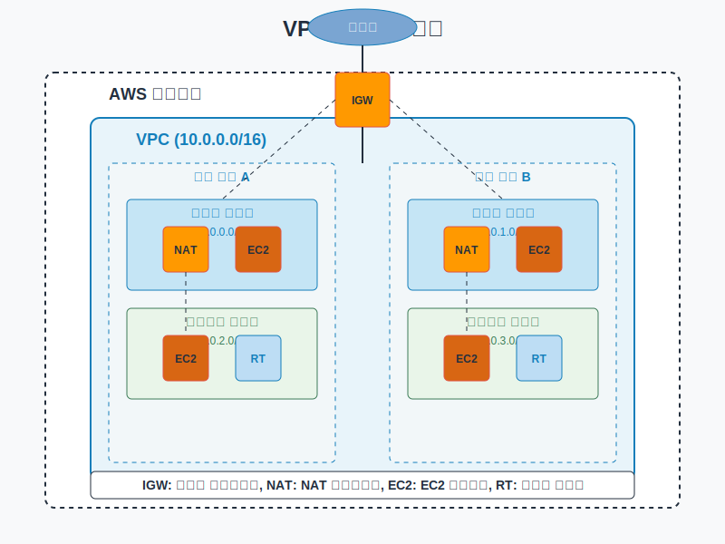
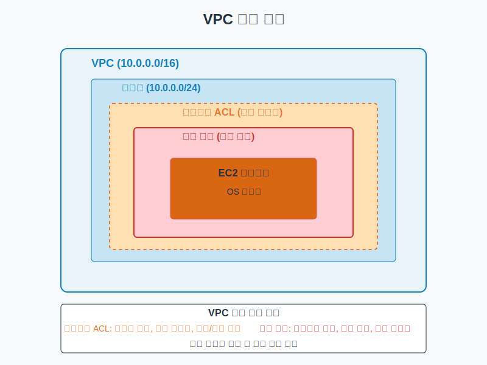
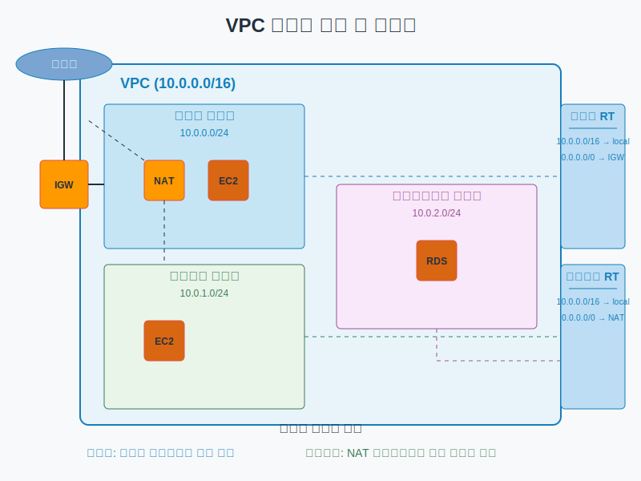
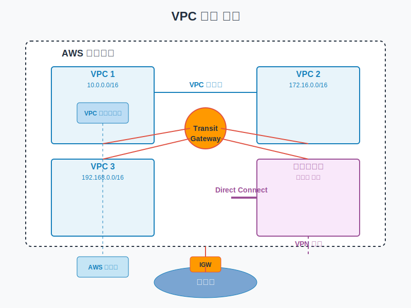

# VPC 개념 및 설계 원칙

## 슬라이드 1: VPC란?
- Amazon Virtual Private Cloud(VPC)
- AWS 클라우드 내 논리적으로 격리된 가상 네트워크
- 사용자가 정의한 가상 네트워크 환경
- IP 주소 범위, 서브넷, 라우팅 테이블, 네트워크 게이트웨이 등 제어 가능
- **비유**: 대형 건물 내 특정 회사를 위해 할당된 전용 사무 공간
- **목적**: 보안 격리, 네트워크 제어, 하이브리드 클라우드 지원

## 슬라이드 2: VPC의 주요 특징
- **리전 기반 서비스**: 각 VPC는 특정 AWS 리전 내에 존재
- **다중 AZ 지원**: 여러 가용 영역에 걸쳐 리소스 배포 가능
- **사용자 정의 IP 주소 범위**: RFC 1918에 정의된 프라이빗 IP 주소 범위 사용
- **서브넷 구성**: 다양한 목적에 맞게 서브넷 구성 가능
- **라우팅 제어**: 사용자 정의 라우팅 테이블 구성
- **다양한 연결 옵션**: 인터넷, VPN, Direct Connect 등을 통한 연결
- **무료 서비스**: VPC 자체는 추가 비용 없이 사용 가능 (연결 옵션은 비용 발생 가능)

## 슬라이드 3: VPC 주요 구성 요소

## 슬라이드 4: VPC 기본 구성 요소
- **VPC**: AWS 계정 내의 논리적으로 격리된 가상 네트워크
  - CIDR 블록으로 정의된 IP 주소 범위 (예: 10.0.0.0/16)
  - 리전 내에서 여러 가용 영역에 걸쳐 있음
  
- **서브넷**: VPC 내의 IP 주소 범위 세그먼트
  - 단일 가용 영역 내에 존재
  - 퍼블릭 또는 프라이빗으로 구성 가능
  - CIDR 블록으로 정의 (예: 10.0.1.0/24)
  
- **라우팅 테이블**: 네트워크 트래픽의 경로를 결정하는 규칙 집합
  - 각 서브넷은 하나의 라우팅 테이블과 연결
  - 기본적으로 로컬 VPC 트래픽을 허용하는 규칙 포함

## 슬라이드 5: VPC 연결 구성 요소
- **인터넷 게이트웨이 (IGW)**:
  - VPC와 인터넷 간의 통신을 가능하게 하는 게이트웨이
  - 수평적으로 확장 가능하고 가용성이 높은 중복 구성 요소
  - 퍼블릭 서브넷의 리소스에 인터넷 액세스 제공
  
- **NAT 게이트웨이/인스턴스**:
  - 프라이빗 서브넷의 리소스에 아웃바운드 인터넷 액세스 제공
  - 인바운드 인터넷 트래픽 차단
  - NAT 게이트웨이: AWS 관리형 서비스, 고가용성
  - NAT 인스턴스: 사용자 관리형, 직접 구성 및 관리 필요

## 슬라이드 6: VPC 보안 구성 요소
- **보안 그룹**:
  - 인스턴스 수준의 가상 방화벽
  - 상태 저장(Stateful) 패킷 필터링
  - 허용 규칙만 지정 가능 (기본적으로 모든 트래픽 거부)
  - 인스턴스별로 여러 보안 그룹 할당 가능
  
- **네트워크 ACL (NACL)**:
  - 서브넷 수준의 가상 방화벽
  - 상태 비저장(Stateless) 패킷 필터링
  - 허용 및 거부 규칙 모두 지정 가능
  - 규칙 번호에 따라 순서대로 평가

## 슬라이드 7: VPC 보안 계층

## 슬라이드 8: VPC 고급 구성 요소
- **VPC 엔드포인트**:
  - AWS 서비스에 대한 프라이빗 연결 제공
  - 인터넷 게이트웨이, NAT, VPN 또는 Direct Connect 없이 접근 가능
  - 유형: 인터페이스 엔드포인트, 게이트웨이 엔드포인트
  
- **VPC 피어링**:
  - 두 VPC 간의 직접적인 네트워크 연결
  - 동일 계정 또는 다른 계정의 VPC 연결 가능
  - 동일 리전 또는 다른 리전의 VPC 연결 가능
  
- **Transit Gateway**:
  - 여러 VPC 및 온프레미스 네트워크를 연결하는 중앙 허브
  - 스타형(hub-and-spoke) 아키텍처 구현
  - 복잡한 피어링 관계 단순화

## 슬라이드 9: VPC 서브넷 유형 및 라우팅

## 슬라이드 10: IP 주소 계획
- **CIDR 블록 선택**:
  - VPC CIDR 크기: 일반적으로 /16 ~ /20 범위 사용
  - 프라이빗 IP 주소 범위 (RFC 1918):
    - 10.0.0.0/8 (10.0.0.0 - 10.255.255.255)
    - 172.16.0.0/12 (172.16.0.0 - 172.31.255.255)
    - 192.168.0.0/16 (192.168.0.0 - 192.168.255.255)
  
- **서브넷 설계**:
  - 서브넷 크기: 일반적으로 /24 ~ /27 범위 사용
  - 가용 영역별 동일한 유형의 서브넷 배치
  - 각 서브넷의 처음 4개와 마지막 1개 IP 주소는 AWS에서 예약

## 슬라이드 11: 가용성 및 내결함성 설계
- **다중 가용 영역 설계**:
  - 최소 2개 이상의 가용 영역 사용
  - 각 가용 영역에 동일한 구성 배포
  - 가용 영역 간 리소스 균형 유지
  
- **중복 네트워크 경로**:
  - 다중 NAT 게이트웨이 (가용 영역별)
  - 다중 VPN 연결 또는 Direct Connect
  - 다중 Transit Gateway 연결
  
- **고가용성 네트워크 서비스**:
  - 로드 밸런서를 통한 트래픽 분산
  - 자동 확장 그룹을 통한 용량 관리
  - 상태 확인 및 자동 복구 메커니즘

## 슬라이드 12: 보안 설계
- **심층 방어 전략**:
  - 여러 보안 계층 구현
  - 네트워크 세분화 및 격리
  - 최소 권한 원칙 적용
  
- **네트워크 세분화**:
  - 기능별 서브넷 분리
  - 보안 요구 사항에 따른 네트워크 분리
  - 마이크로 세분화를 통한 세밀한 액세스 제어
  
- **트래픽 제어**:
  - 인바운드/아웃바운드 트래픽 필터링
  - 계층적 보안 그룹 설계
  - 세분화된 NACL 규칙

## 슬라이드 13: 확장성 설계
- **미래 성장 고려**:
  - 충분히 큰 CIDR 블록 선택
  - 확장을 위한 IP 주소 공간 예약
  - 모듈식 설계로 쉬운 확장 가능
  
- **수평적 확장**:
  - 여러 가용 영역에 걸친 리소스 배포
  - 자동 확장 그룹 활용
  - 로드 밸런서를 통한 트래픽 분산
  
- **리소스 제한 관리**:
  - VPC 및 서브넷 제한 이해
  - 서비스 할당량 모니터링
  - 필요 시 할당량 증가 요청

## 슬라이드 14: VPC 연결 옵션

## 슬라이드 15: VPC 설계 패턴 - 기본 VPC 설계
- **구성 요소**:
  - 단일 VPC (예: 10.0.0.0/16)
  - 여러 가용 영역에 걸친 퍼블릭 및 프라이빗 서브넷
  - 인터넷 게이트웨이
  - NAT 게이트웨이 (각 가용 영역에 하나씩)
  - 적절한 라우팅 테이블
  
- **사용 사례**:
  - 대부분의 웹 애플리케이션
  - 3계층 아키텍처 (웹, 애플리케이션, 데이터베이스)
  - 중소 규모 워크로드

## 슬라이드 16: VPC 설계 패턴 - 격리된 서브넷 설계
- **구성 요소**:
  - 기본 VPC 설계의 모든 구성 요소
  - 추가 격리된 서브넷 (데이터베이스, 규제 대상 워크로드 등)
  - 세분화된 라우팅 및 보안 제어
  
- **사용 사례**:
  - 금융 서비스 애플리케이션
  - 의료 데이터 처리 시스템
  - PCI DSS 규정 준수 워크로드
  - 다중 테넌트 애플리케이션

## 슬라이드 17: VPC 설계 패턴 - 트랜짓 VPC 설계
- **구성 요소**:
  - 중앙 트랜짓 VPC
  - 여러 스포크 VPC (워크로드별)
  - Transit Gateway 또는 VPC 피어링
  - 중앙 집중식 보안 및 모니터링
  
- **사용 사례**:
  - 대규모 조직의 다중 환경 (개발, 테스트, 프로덕션)
  - 하이브리드 클라우드 아키텍처
  - 중앙 집중식 네트워크 제어가 필요한 경우

## 슬라이드 18: VPC 설계 패턴 - 다중 VPC 설계
- **구성 요소**:
  - 환경별 또는 워크로드별 전용 VPC
  - VPC 간 연결 (필요한 경우)
  - 환경별 격리 및 제어
  - 중앙 집중식 관리 (AWS Organizations, Control Tower 등)
  
- **사용 사례**:
  - 환경 간 완전한 격리 필요
  - 다양한 규정 준수 요구 사항
  - 다중 테넌트 SaaS 애플리케이션
  - 서로 다른 팀이 관리하는 워크로드

## 슬라이드 19: VPC 설계 모범 사례
- **네트워크 설계**:
  - 충분한 IP 주소 공간 할당
  - 일관된 서브넷 크기 사용
  - 다중 가용 영역 설계
  - 서브넷 목적 분리
  
- **보안**:
  - 최소 권한 원칙 적용
  - 다중 보안 계층 구현
  - 기본 거부 정책 사용
  - 트래픽 암호화
  
- **확장성**:
  - 모듈식 설계
  - 자동화된 인프라
  - 서비스 할당량 모니터링
  - 미래 성장 계획

## 슬라이드 20: 핵심 요약 및 Q&A
- VPC는 AWS 클라우드 내 논리적으로 격리된 가상 네트워크
- 서브넷, 라우팅 테이블, 게이트웨이 등 다양한 구성 요소로 구성
- 보안, 가용성, 확장성을 고려한 설계 필요
- 다양한 설계 패턴을 통해 요구 사항에 맞는 네트워크 아키텍처 구현 가능
- 모범 사례를 따라 안전하고 효율적인 VPC 구성
- 질문 및 토론